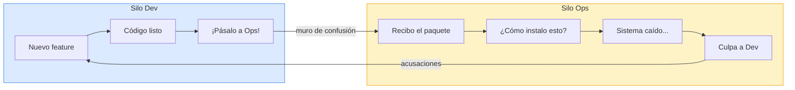
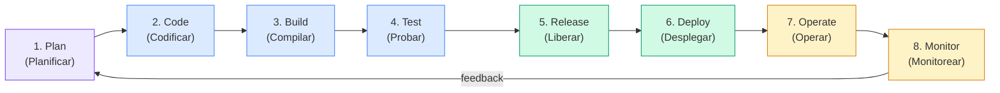
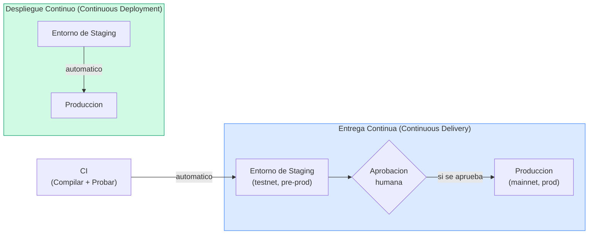
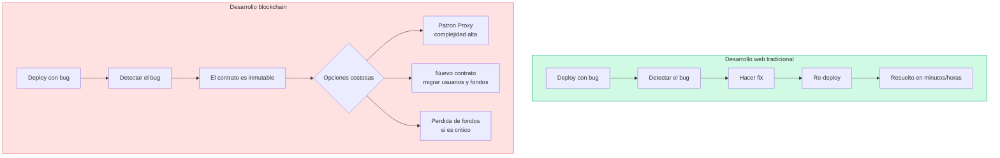

# 1.1 Fundamentos de DevOps

> **Módulo:** [Marco Teórico](./README.md) · Tema 1 de 2
> **Prerrequisitos:** ninguno — este es el punto de partida conceptual.

---

## Tabla de contenidos

1. [El problema que DevOps resuelve](#1-el-problema-que-devops-resuelve)
2. [¿Qué es DevOps?](#2-qué-es-devops)
3. [El modelo CALMS](#3-el-modelo-calms)
4. [El ciclo de vida DevOps: el "infinity loop"](#4-el-ciclo-de-vida-devops-el-infinity-loop)
5. [Conceptos clave: CI, CD, IaC y control de versiones](#5-conceptos-clave-ci-cd-iac-y-control-de-versiones)
6. [Métricas DORA: midiendo el rendimiento DevOps](#6-métricas-dora-midiendo-el-rendimiento-devops)
7. [DevOps en proyectos blockchain](#7-devops-en-proyectos-blockchain)
8. [Para reflexionar](#8-para-reflexionar)

---

## 1. El problema que DevOps resuelve

Durante décadas, el desarrollo de software organizó su trabajo en dos grandes silos:

- **Desarrollo (Dev):** equipos centrados en crear nuevas funcionalidades lo más rápido posible.
- **Operaciones (Ops):** equipos responsables de mantener los sistemas estables y disponibles.

Estos dos grupos tenían incentivos contradictorios. Los desarrolladores querían cambiar el código con frecuencia; los operadores querían que el código no cambiara. El resultado era predecible: lanzamientos poco frecuentes, altamente estresantes, llenos de errores y seguidos de noches de emergencia para solucionar problemas.

Este fenómeno se describe brillantemente en la novela *The Phoenix Project* (Kim, Behr y Spafford, 2013): un proyecto de TI que acumula deuda técnica, conflictos entre equipos y despliegues caóticos hasta que un cambio cultural lo transforma. La novela, aunque de ficción, describe situaciones que cualquier profesional de TI reconocerá.

**El "muro de confusión"** es la metáfora que DevOps usa para describir este punto de transferencia caótico entre Dev y Ops. DevOps nace precisamente para derribar ese muro.

---

## 2. ¿Qué es DevOps?

> "DevOps es la unión de personas, procesos y productos para habilitar la entrega continua de valor a los usuarios finales."
> — Donovan Brown, Microsoft

DevOps no es un conjunto de herramientas, ni un cargo en una empresa, ni un certificado. Es principalmente una **filosofía cultural** que busca:

1. **Colaboración** entre Dev, Ops (y, en DevSecOps, también Seguridad).
2. **Automatización** de todas las tareas repetibles: compilación, pruebas, despliegues.
3. **Feedback rápido**: detectar problemas minutos después de que ocurren, no días después.
4. **Mejora continua**: reflexionar regularmente sobre el proceso y optimizarlo.

El término fue acuñado alrededor de 2009 por Patrick Debois, quien organizó la primera conferencia "DevOpsDays" en Bélgica. Desde entonces, organizaciones como Amazon, Netflix y Etsy demostraron que es posible desplegar código decenas o cientos de veces al día con alta confiabilidad.

---

## 3. El modelo CALMS

CALMS es un acrónimo que resume los cinco pilares fundamentales de DevOps. Fue popularizado por Jez Humble y es ampliamente usado en la literatura técnica (ver *The DevOps Handbook*):

| Pilar | Nombre completo | Descripción |
|-------|----------------|-------------|
| **C** | Culture (Cultura) | El pilar más importante. Todos los equipos comparten la responsabilidad del producto completo, desde el código hasta la experiencia del usuario en producción. Se abandona la mentalidad de "no es mi problema". |
| **A** | Automation (Automatización) | Todo lo que se puede automatizar, se automatiza: compilación, pruebas, análisis de seguridad, despliegues. El objetivo es eliminar el trabajo manual repetitivo y propenso a errores. |
| **L** | Lean (Flujo delgado) | Aplicar principios de manufactura Lean al software: reducir el trabajo en progreso, identificar y eliminar cuellos de botella, entregar en lotes pequeños y frecuentes. |
| **M** | Measurement (Medición) | No se puede mejorar lo que no se mide. DevOps define métricas claras sobre velocidad, calidad y disponibilidad del sistema (ver sección de métricas DORA). |
| **S** | Sharing (Compartir) | El conocimiento, las herramientas y las lecciones aprendidas (incluyendo los fallos) se comparten abiertamente dentro y entre equipos. Las "post-mortems sin culpables" son un ejemplo típico. |

> **Aplicación en el repositorio:** En este proyecto, la Automatización (A) es visible en el pipeline de GitHub Actions que compila el contrato, ejecuta las 12 pruebas y analiza la seguridad automáticamente con cada `git push`. La Medición (M) se refleja en el reporte de cobertura de pruebas que el pipeline genera.

---

## 4. El ciclo de vida DevOps: el "infinity loop"

El ciclo de vida DevOps se representa habitualmente como un lazo infinito (∞) que une dos fases grandes: **desarrollo** y **operaciones**. Las ocho etapas son continuas y se retroalimentan:

### Descripción de cada etapa

| Etapa | Qué ocurre | Herramienta típica |
|-------|-----------|-------------------|
| **Plan** | El equipo define tareas, historias de usuario y prioridades del sprint. | Jira, GitHub Issues, Trello |
| **Code** | Los desarrolladores escriben el código en ramas cortas; se revisan los cambios con pull requests. | Git, GitHub, GitLab |
| **Build** | El código fuente se compila y transforma en un artefacto ejecutable. En Solidity: el compilador genera el ABI y el bytecode. | Hardhat compile, Maven, npm build |
| **Test** | Se ejecutan pruebas unitarias, de integración y de humo de forma automática. | Mocha + Chai, Jest, Pytest |
| **Release** | El artefacto aprobado queda listo para ser promovido a producción (puede requerir aprobación manual). | GitHub Releases, semantic-release |
| **Deploy** | El artefacto se instala en el entorno objetivo (testnet, mainnet, servidor). | Hardhat scripts, Ansible, Terraform |
| **Operate** | El sistema está en marcha y se atienden incidentes si ocurren. | PagerDuty, Grafana Oncall |
| **Monitor** | Se recolectan métricas, logs y alertas del sistema en producción para detectar anomalías. | Grafana, Datadog, The Graph (en blockchain) |

> **Ejemplo concreto:** cuando un estudiante hace `git push` en este repositorio, GitHub Actions inicia automáticamente las etapas Build (`npx hardhat compile`) y Test (`npx hardhat test`). Si el pipeline pasa, el código puede avanzar hacia Release y Deploy en una testnet.

---

## 5. Conceptos clave: CI, CD, IaC y control de versiones

### 5.1 Control de versiones (Version Control)

Es la base de todo: cada cambio en el código queda registrado con autor, fecha y mensaje descriptivo. Git es el estándar de facto. En este repositorio, **todo** está versionado: el contrato Solidity, las pruebas, el frontend, los pipelines de CI/CD y hasta la documentación que estás leyendo.

La convención de ramas más usada es **GitFlow** o una variante simplificada:
- `main` — código listo para producción.
- `develop` — integración de nuevas funcionalidades.
- `feature/xyz` — desarrollo de una funcionalidad concreta.

### 5.2 Integración Continua (CI — Continuous Integration)

> "La práctica de integrar el código de todos los desarrolladores en un repositorio central varias veces al día, con verificación automática."
> — Martin Fowler

Cuando un desarrollador hace `git push`, el servidor de CI automáticamente:
1. Clona el repositorio.
2. Instala las dependencias.
3. Compila el código.
4. Ejecuta todas las pruebas.
5. Reporta el resultado (verde ✅ o rojo ❌).

Si algo falla, el desarrollador recibe retroalimentación en minutos, no días. En este repositorio, el archivo `.github/workflows/ci.yml` implementa esta práctica.

### 5.3 Entrega Continua vs. Despliegue Continuo (CD)

Estos dos conceptos se confunden frecuentemente. La diferencia clave es si el despliegue a producción es **automático o requiere aprobación humana**:

| Concepto | Automatización hasta... | Cuándo usarlo |
|----------|------------------------|---------------|
| **Entrega Continua** | Staging (pre-producción) | Cuando producción requiere aprobación (ej. contratos de alto valor, regulaciones) |
| **Despliegue Continuo** | Producción | Cuando el riesgo es bajo y las pruebas son muy confiables |

> **Nota para blockchain:** dado que un contrato desplegado en mainnet es **inmutable**, en proyectos blockchain es casi siempre preferible la **Entrega Continua** con una aprobación humana explícita antes del despliegue a mainnet.

### 5.4 Infraestructura como Código (IaC — Infrastructure as Code)

La idea central es que la infraestructura (servidores, redes, bases de datos, configuración de entornos) se describe en archivos de texto versionados, igual que el código de la aplicación. Esto garantiza:

- **Reproducibilidad:** cualquiera puede recrear el entorno exacto.
- **Auditabilidad:** todos los cambios de infraestructura quedan en el historial de Git.
- **Consistencia:** dev, staging y producción usan exactamente la misma configuración.

Herramientas populares: Terraform (multi-nube), Ansible (configuración de servidores), Pulumi (IaC en lenguajes de programación).

En este repositorio, el archivo `hardhat.config.js` actúa como IaC ligero: define las redes (local, testnets), el compilador de Solidity y sus optimizaciones. Es la fuente de verdad sobre cómo se construye y despliega el contrato.

---

## 6. Métricas DORA: midiendo el rendimiento DevOps

El programa **DORA** (DevOps Research and Assessment), liderado por Nicole Forsgren y documentado en el libro *Accelerate* (2018), estudió a más de 30.000 profesionales de TI y identificó cuatro métricas que distinguen a los equipos de alto rendimiento:

| Métrica | Qué mide | Equipos élite | Equipos de bajo rendimiento |
|---------|---------|---------------|-----------------------------|
| **Deployment Frequency** (Frecuencia de despliegue) | ¿Con qué frecuencia se despliega a producción? | Múltiples veces al día | Menos de una vez al mes |
| **Lead Time for Changes** (Tiempo de ciclo) | Desde que el código se confirma hasta que está en producción | Menos de 1 hora | Entre 6 meses y 1 año |
| **Mean Time to Recovery (MTTR)** (Tiempo medio de recuperación) | Tiempo medio para restaurar el servicio tras un fallo | Menos de 1 hora | Entre 1 semana y 1 mes |
| **Change Failure Rate** (Tasa de fallo de cambios) | Porcentaje de despliegues que causan un incidente | 0–15% | 46–60% |

> **Perspectiva de blockchain:** en contratos inteligentes, la "Change Failure Rate" tiene un impacto radicalmente diferente que en aplicaciones web. Un bug en producción no se puede simplemente revertir con un `git revert`: el contrato está desplegado de forma permanente. Por eso, el **Lead Time** en blockchain debe incluir obligatoriamente una auditoría de seguridad, lo que incrementa el tiempo pero reduce drásticamente la probabilidad de fallos críticos.

---

## 7. DevOps en proyectos blockchain

### 7.1 La diferencia fundamental: la inmutabilidad

En el desarrollo de aplicaciones web tradicionales, un bug en producción puede corregirse con un nuevo despliegue en minutos. En blockchain, **un contrato desplegado es permanente**. No existe el `git push --force` para producción en Ethereum. Esta característica cambia profundamente las prioridades del ciclo DevOps:

### 7.2 Consecuencias prácticas para el pipeline

| Etapa del ciclo | Ajuste específico para blockchain |
|----------------|----------------------------------|
| **Plan** | Definir explícitamente qué puede cambiar y qué es permanente; considerar patrones de actualización (proxy) desde el diseño. |
| **Code** | Seguir guías de seguridad (SWC Registry, OpenZeppelin); usar versión fija de Solidity (`pragma solidity 0.8.24`). |
| **Build** | Verificar que el compilador genera bytecode determinista; guardar el ABI en artefactos para el frontend. |
| **Test** | Las pruebas deben ser **exhaustivas** antes de cualquier despliegue; incluir casos de fallo, no solo caminos felices. En este repo: 12 pruebas cubren emisión, revocación, control de acceso y errores personalizados. |
| **Release** | El proceso de auditoría de seguridad forma parte del pipeline (Slither, Solhint). |
| **Deploy** | El despliegue a mainnet requiere **aprobación manual explícita**; el script de despliegue guarda la dirección del contrato para no perderla. |
| **Operate** | Los eventos del contrato (`CertificadoEmitido`, `CertificadoRevocado`) son la fuente principal de observabilidad on-chain. Indexadores como The Graph los hacen consultables. |
| **Monitor** | Monitorear el balance de la wallet del deployer (para cubrir gas), el precio del gas y los eventos anómalos. |

### 7.3 Redes como entornos de desarrollo

En DevOps tradicional se habla de entornos: dev, staging, producción. En blockchain, los equivalentes son:

| Entorno DevOps | Equivalente blockchain | Características |
|---------------|----------------------|-----------------|
| **Local** (dev) | Red local Hardhat (`npx hardhat node`) | Sin costo, reiniciable, miles de cuentas con ETH de prueba. Ideal para desarrollo rápido. |
| **Staging** | Testnet (Sepolia, Holesky) | Red pública real pero con ETH sin valor monetario. Las transacciones tardan segundos; simula producción. |
| **Producción** | Mainnet Ethereum | ETH real, costos reales. Cada transacción tiene un costo económico y es permanente. |

### 7.4 Gestión de claves privadas: el secreto más importante

En blockchain, la **clave privada** de la wallet del deployer es equivalente a las credenciales de administrador de toda la infraestructura. Un pipeline DevOps mal configurado que exponga esta clave puede resultar en pérdida total de fondos y comprometer el control del contrato.

Buenas prácticas aplicadas en este repositorio:
- La clave privada **nunca** se escribe directamente en el código ni en archivos de configuración.
- Se usa una variable de entorno (`PRIVATE_KEY`) que se configura como **GitHub Secret**.
- El archivo `.gitignore` excluye `.env` para evitar que credenciales lleguen al repositorio.

> Recuerda: incluso si borras un commit con credenciales, Git guarda el historial. Si accidentalmente subiste una clave privada, considérala comprometida y genera una nueva inmediatamente.

---

## 8. Para reflexionar

1. **El modelo CALMS sitúa la Cultura (C) como el primer pilar.** ¿Por qué crees que la adopción de herramientas de automatización fracasa cuando no va acompañada de un cambio cultural en el equipo? Piensa en algún ejemplo real o imaginado donde la tecnología estuvo disponible pero la organización no cambió.

2. **La inmutabilidad de los contratos inteligentes invierte las prioridades del ciclo DevOps.** En desarrollo web, los equipos de alto rendimiento despliegan múltiples veces al día. ¿Es eso deseable en blockchain? Argumenta tu respuesta considerando las métricas DORA y las características de Ethereum.

3. **Las claves privadas son el "talón de Aquiles" de DevOps en blockchain.** Busca al menos un caso real en que una clave privada fue expuesta en un repositorio de código abierto y describe las consecuencias. ¿Qué mecanismo del pipeline podría haber prevenido ese incidente?

---

*Siguiente documento: [1.2 Fundamentos de DevSecOps](./1.2-fundamentos-devsecops.md) · Volver al [índice del módulo](./README.md)*
