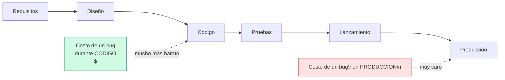
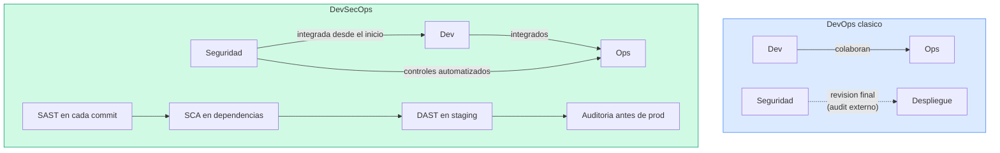
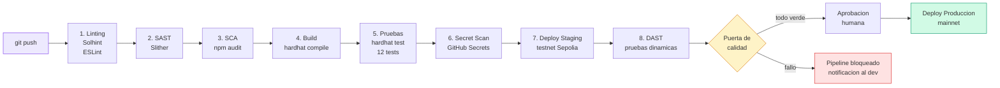

# 1.2 Fundamentos de DevSecOps

> **Módulo:** [Marco Teórico](./README.md) · Tema 2 de 2
> **Prerrequisito recomendado:** [1.1 Fundamentos de DevOps](./1.1-fundamentos-devops.md)

---

## Tabla de contenidos

1. [¿Qué es DevSecOps?](#1-qué-es-devsecops)
2. [Shift-left security: mover la seguridad hacia la izquierda](#2-shift-left-security-mover-la-seguridad-hacia-la-izquierda)
3. [DevOps vs. DevSecOps: la seguridad como responsabilidad compartida](#3-devops-vs-devsecops-la-seguridad-como-responsabilidad-compartida)
4. [Tipos de análisis de seguridad](#4-tipos-de-análisis-de-seguridad)
5. [El pipeline seguro: integrar controles en el ciclo de vida](#5-el-pipeline-seguro-integrar-controles-en-el-ciclo-de-vida)
6. [Vulnerabilidades clásicas de smart contracts](#6-vulnerabilidades-clásicas-de-smart-contracts)
7. [Cómo RegistroCertificados.sol mitiga estas vulnerabilidades](#7-cómo-registrocertificadossol-mitiga-estas-vulnerabilidades)
8. [Herramientas de seguridad en el repositorio](#8-herramientas-de-seguridad-en-el-repositorio)
9. [Para reflexionar](#9-para-reflexionar)

---

## 1. ¿Qué es DevSecOps?

DevSecOps es la evolución natural de DevOps que **integra la seguridad como parte integral del ciclo de desarrollo**, en lugar de tratarla como una actividad separada que ocurre al final del proceso o a cargo de un equipo externo.

El término surge de reconocer que DevOps, en su forma original, aceleraba la entrega de software pero podía dejar la seguridad rezagada. Equipos que desplegaban docenas de veces al día no podían esperar a una revisión de seguridad trimestral.

> "DevSecOps significa pensar en la seguridad de las aplicaciones y la infraestructura desde el principio... Significa automatizar las puertas de seguridad para impedir que el flujo de trabajo de DevOps se ralentice."
> — Red Hat

La definición práctica: **"Security as Code"** — los controles de seguridad se codifican, se versionan y se ejecutan automáticamente en el pipeline, igual que las pruebas funcionales.

---

## 2. Shift-left security: mover la seguridad hacia la izquierda

"Shift-left" (desplazar hacia la izquierda) hace referencia al diagrama temporal del ciclo de desarrollo, donde las fases tempranas están a la izquierda y las tardías (producción) a la derecha.



El principio central: **el costo de encontrar y corregir una vulnerabilidad crece exponencialmente con el tiempo**. Un bug de seguridad detectado durante la escritura del código cuesta una fracción de lo que cuesta si se detecta después del despliegue.

El Instituto Nacional de Estándares y Tecnología (NIST, EE.UU.) estimó que el costo relativo de corregir un bug es:
- **x1** si se detecta en la fase de diseño.
- **x6** si se detecta en pruebas.
- **x100** si se detecta en producción.

En blockchain, donde la producción es inmutable, ese factor de x100 puede convertirse en x∞ si el bug resulta en pérdida de fondos o compromiso del sistema.

---

## 3. DevOps vs. DevSecOps: la seguridad como responsabilidad compartida



| Aspecto | DevOps (sin seguridad integrada) | DevSecOps |
|---------|----------------------------------|-----------|
| ¿Cuándo se revisa la seguridad? | Al final del ciclo, antes del lanzamiento | En cada etapa del ciclo |
| ¿Quién es responsable? | Equipo de seguridad (externo) | Todos los miembros del equipo |
| Herramientas de seguridad | Externas al pipeline, manuales | Integradas en el pipeline, automáticas |
| Tiempo de respuesta a vulnerabilidades | Días o semanas | Minutos u horas |
| Velocidad de entrega | Alta (pero con deuda de seguridad) | Alta (seguridad no bloquea si se automatiza) |
| Costo de corrección | Alto (tarde en el ciclo) | Bajo (detección temprana) |

La clave es que en DevSecOps **la seguridad no bloquea la velocidad**: los controles se automatizan y se ejecutan en paralelo con el resto del pipeline.

---

## 4. Tipos de análisis de seguridad

### 4.1 SAST — Static Application Security Testing (Análisis estático)

Analiza el **código fuente** sin ejecutarlo. Busca patrones conocidos de vulnerabilidades: uso inseguro de funciones, flujos de datos peligrosos, configuraciones incorrectas.

- **Cuándo se ejecuta:** en la etapa de Build/Code (muy temprano).
- **Ventaja:** no requiere un entorno en ejecución; es muy rápido.
- **Limitación:** puede producir falsos positivos; no detecta vulnerabilidades que solo aparecen en tiempo de ejecución.
- **Ejemplo en este repositorio:** **Slither** analiza `RegistroCertificados.sol` sin necesidad de desplegarlo.

### 4.2 DAST — Dynamic Application Security Testing (Análisis dinámico)

Analiza la **aplicación en ejecución**, enviando entradas maliciosas y observando las respuestas. Equivale a las pruebas de penetración automatizadas.

- **Cuándo se ejecuta:** en el entorno de staging (después del despliegue en una red de prueba).
- **Ventaja:** detecta vulnerabilidades que solo aparecen en tiempo de ejecución.
- **Limitación:** requiere que la aplicación esté desplegada y en ejecución.
- **Ejemplo en blockchain:** ejecutar ataques simulados de reentrancia o front-running contra el contrato en una testnet.

### 4.3 SCA — Software Composition Analysis (Análisis de composición)

Analiza las **dependencias de terceros** (librerías, paquetes npm, contratos importados) en busca de vulnerabilidades conocidas publicadas en bases de datos como NVD (National Vulnerability Database) o CVE.

- **Cuándo se ejecuta:** en la etapa de Build, al instalar dependencias.
- **Ventaja:** detecta automáticamente cuando una librería que usas tiene un CVE publicado.
- **Ejemplo en este repositorio:** `npm audit` escanea las dependencias de Hardhat y ethers.js.

### 4.4 Secret Scanning (Escaneo de secretos)

Detecta **credenciales, claves API y claves privadas** que hayan sido accidentalmente incluidas en el código o en el historial de Git.

- **Cuándo se ejecuta:** en cada `git push`, antes de que el código llegue al repositorio remoto.
- **Herramientas:** GitHub Secret Scanning (incorporado en GitHub), git-secrets, truffleHog.
- **Relevancia en blockchain:** una clave privada expuesta en un repositorio es una emergencia inmediata.

### 4.5 Análisis de linting y estilo seguro

No es estrictamente un análisis de seguridad, pero los linters configurados con reglas de seguridad detectan malas prácticas antes de que se conviertan en vulnerabilidades.

- **Ejemplo en este repositorio:** **Solhint** con reglas de seguridad verifica el estilo y las convenciones del código Solidity.

### Resumen comparativo

| Tipo | Qué analiza | Cuándo | Velocidad | Ejemplos |
|------|------------|--------|-----------|---------|
| SAST | Código fuente | Build / commit | Muy rápida | Slither, SonarQube, Semgrep |
| DAST | App en ejecución | Staging | Lenta | OWASP ZAP, Echidna (fuzzing) |
| SCA | Dependencias | Build / install | Rápida | npm audit, Dependabot, Snyk |
| Secret Scanning | Repositorio Git | Push / pre-commit | Muy rápida | GitHub Secret Scanning, truffleHog |
| Linting | Código fuente | Pre-commit / Build | Instantánea | Solhint, ESLint |

---

## 5. El pipeline seguro: integrar controles en el ciclo de vida

Un pipeline DevSecOps bien diseñado integra controles de seguridad en cada puerta de calidad, sin reemplazar las pruebas funcionales sino complementándolas:



**Principio de las "puertas de calidad":** si cualquier etapa falla (un análisis de Slither detecta una vulnerabilidad crítica, o `npm audit` encuentra una dependencia comprometida), el pipeline se detiene y notifica al desarrollador. El código no puede avanzar hacia producción hasta que el problema se resuelva.

---

## 6. Vulnerabilidades clásicas de smart contracts

El **SWC Registry** (Smart Contract Weakness Classification and Test Cases) es el equivalente al CWE (Common Weakness Enumeration) para smart contracts. Documenta las vulnerabilidades más comunes en Solidity. Las más importantes son:

### 6.1 Reentrancia (Reentrancy) — SWC-107

**¿Qué es?** Un contrato malintencionado llama de vuelta al contrato víctima antes de que este termine de actualizar su estado. La vulnerabilidad más famosa: el hack del DAO en 2016 drenó 3.6 millones de ETH (~50 millones USD de la época).

```solidity
// EJEMPLO VULNERABLE (NO usar):
mapping(address => uint256) public balances;

function retirar() external {
    uint256 monto = balances[msg.sender];
    // 1. Transfiere primero...
    (bool ok, ) = msg.sender.call{value: monto}("");
    require(ok);
    // 2. ...actualiza el estado DESPUES (PELIGRO: el atacante reingresa aqui)
    balances[msg.sender] = 0;
}
```

**Mitigación:** patrón **Checks-Effects-Interactions** (CEI): primero las validaciones, luego los cambios de estado, finalmente las llamadas externas. También: usar `ReentrancyGuard` de OpenZeppelin.

### 6.2 Control de acceso defectuoso — SWC-105

**¿Qué es?** Funciones sensibles (como transferir fondos o modificar datos críticos) no verifican correctamente quién las llama. Resultado: cualquier cuenta puede ejecutarlas.

```solidity
// EJEMPLO VULNERABLE (NO usar):
function emitirCertificado(string calldata nombre) external {
    // Sin verificacion de quien llama: CUALQUIERA puede emitir
    certificados[nombre] = true;
}
```

**Mitigación:** modificadores de acceso (`onlyOwner`, roles personalizados), validar explícitamente `msg.sender`.

### 6.3 Overflow y underflow de enteros — SWC-101

**¿Qué es?** En Solidity anterior a la versión 0.8.0, los enteros podían "dar la vuelta": un `uint8` con valor 255 al sumarle 1 se convertía en 0. Esto podía usarse para manipular balances, contadores y condiciones de acceso.

**Mitigación:** Solidity 0.8+ incluye protección nativa contra overflow/underflow. Las versiones anteriores requerían la librería SafeMath de OpenZeppelin. **Este repositorio usa `pragma solidity ^0.8.24`, que incluye la protección de forma nativa.**

### 6.4 Uso de tx.origin para autenticación — SWC-115

**¿Qué es?** `tx.origin` es la dirección que originó la transacción (el usuario final), mientras que `msg.sender` es quien llamó directamente al contrato. Si un contrato usa `tx.origin` para autenticar, un contrato intermediario malintencionado puede suplantar al usuario.

```solidity
// VULNERABLE:
if (tx.origin == propietario) { ... }  // Un contrato intermediario puede enganar esto

// CORRECTO:
if (msg.sender == propietario) { ... }  // Solo quien llama directamente
```

**Mitigación:** nunca usar `tx.origin` para autenticación; siempre usar `msg.sender`.

### 6.5 Front-running (adelantamiento de transacciones) — SWC-114

**¿Qué es?** En Ethereum, las transacciones esperan en la "mempool" (pool de transacciones pendientes) antes de ser incluidas en un bloque. Un atacante puede ver una transacción pendiente y pagar más gas para que la suya se procese primero, obteniendo una ventaja.

**Mitigación:** usar esquemas commit-reveal, mecanismos de privacidad como Flashbots, o diseñar el contrato de forma que el orden de las transacciones no importe para la seguridad.

### 6.6 Manejo inadecuado de errores y revert

**¿Qué es?** No verificar si una llamada externa falló, o capturar los errores de forma incorrecta, puede dejar el contrato en un estado inconsistente.

**Mitigación:** siempre verificar el retorno de llamadas externas; usar `revert` con errores personalizados para mayor claridad y eficiencia en gas.

### Resumen de vulnerabilidades

| Vulnerabilidad | SWC | Gravedad típica | Mitigación principal |
|---------------|-----|----------------|---------------------|
| Reentrancia | SWC-107 | Crítica | Patrón CEI, ReentrancyGuard |
| Control de acceso | SWC-105 | Crítica | Modificadores de acceso, roles |
| Overflow/Underflow | SWC-101 | Alta | Solidity 0.8+, SafeMath |
| tx.origin auth | SWC-115 | Alta | Usar msg.sender |
| Front-running | SWC-114 | Media-Alta | Commit-reveal, diseño robusto |
| Secretos en código | — | Crítica | Variables de entorno, gestión de secretos |

---

## 7. Cómo RegistroCertificados.sol mitiga estas vulnerabilidades

El contrato del repositorio fue diseñado explícitamente para ilustrar buenas prácticas de seguridad. A continuación, un análisis punto a punto:

### 7.1 Control de acceso robusto

El contrato implementa dos niveles de acceso con verificación explícita en cada función sensible:

```solidity
// Dos niveles de control de acceso bien definidos:
modifier soloPropietario() {
    if (msg.sender != propietario) revert NoEsPropietario();
    _;
}

modifier soloEmisor() {
    if (!emisorAutorizado[msg.sender]) revert NoAutorizado();
    _;
}
```

- `emitirCertificado` y `revocarCertificado` requieren `soloEmisor`.
- `autorizarEmisor` y `revocarEmisor` requieren `soloPropietario`.
- `verificarCertificado` es pública (sin restricción), lo que habilita la verificación descentralizada.

### 7.2 Patrón Checks-Effects-Interactions

La función `emitirCertificado` sigue el patrón CEI rigurosamente:

```solidity
function emitirCertificado(...) external soloEmisor returns (bytes32 hashCertificado) {
    // 1. CHECKS: calcula el hash y verifica que no existe
    hashCertificado = keccak256(...);
    if (certificados[hashCertificado].existe) revert CertificadoYaExiste();

    // 2. EFFECTS: actualiza el estado antes de cualquier llamada externa
    certificados[hashCertificado] = Certificado({...});
    totalCertificados++;

    // 3. INTERACTIONS: emite el evento (no hay llamadas externas en este contrato)
    emit CertificadoEmitido(...);
}
```

### 7.3 Protección nativa contra overflow

Al declarar `pragma solidity ^0.8.24`, el compilador genera instrucciones que revierten automáticamente si `totalCertificados++` causara un overflow. No es necesario importar SafeMath.

### 7.4 Uso correcto de msg.sender

El contrato usa exclusivamente `msg.sender` para todas las verificaciones de identidad, evitando la vulnerabilidad de `tx.origin`.

### 7.5 Errores personalizados (eficiencia y claridad)

```solidity
error NoEsPropietario();
error NoAutorizado();
error CertificadoYaExiste();
// ...
```

Los errores personalizados (introducidos en Solidity 0.8.4) son más baratos en gas que los strings de `require` y proporcionan información estructurada sobre el fallo. También facilitan el análisis de Slither, ya que cada condición de error es explícita.

### 7.6 Inmutabilidad del registro (revocación en lugar de eliminación)

Los certificados no se pueden eliminar del estado del contrato; solo se pueden marcar como revocados. Esto garantiza la trazabilidad completa: un auditor siempre puede ver el historial completo de certificados, incluyendo los revocados, a través de los eventos.

```solidity
// No existe ninguna funcion "delete" o "eliminar":
// Solo se puede revocar (flag revocado = true)
cert.revocado = true;
emit CertificadoRevocado(hashCertificado, msg.sender);
```

---

## 8. Herramientas de seguridad en el repositorio

### 8.1 Slither — SAST para Solidity

**Slither** es un framework de análisis estático para contratos Solidity desarrollado por Trail of Bits, una de las principales firmas de auditoría de smart contracts del mundo. Está disponible como herramienta de código abierto.

**¿Qué detecta?**
- Reentrancia.
- Variables de estado no inicializadas.
- Funciones con visibilidad incorrecta.
- Uso inseguro de operaciones aritméticas (en versiones antiguas de Solidity).
- Llamadas a direcciones arbitrarias.
- Más de 90 detectores de vulnerabilidades.

**Cómo se usa en el pipeline:**
```bash
slither contracts/RegistroCertificados.sol
```

Slither devuelve un informe con hallazgos clasificados por severidad (High, Medium, Low, Informational). En el pipeline de GitHub Actions, si Slither reporta hallazgos de alta severidad, el pipeline se detiene.

### 8.2 Solhint — Linter de Solidity

**Solhint** es el linter estándar para Solidity, equivalente a ESLint para JavaScript. Verifica:
- Convenciones de estilo (naming, sangría, orden de funciones).
- Buenas prácticas de seguridad (visibilidad explícita en funciones, uso de `immutable` cuando corresponde).
- Reglas configurables mediante `.solhint.json`.

```bash
npx solhint 'contracts/**/*.sol'
```

### 8.3 npm audit — SCA para dependencias JavaScript

`npm audit` consulta la base de datos de vulnerabilidades de npm y reporta si alguna de las dependencias del proyecto (Hardhat, ethers.js y sus dependencias transitivas) tiene una vulnerabilidad conocida.

```bash
npm audit
# Para instalar versiones con parches aplicados:
npm audit fix
```

**Importante:** `npm audit` analiza las dependencias del **entorno de desarrollo** (Hardhat, plugins). El contrato Solidity en sí no tiene dependencias npm directas en este repositorio, pero proyectos que importan OpenZeppelin u otras librerías de contratos sí deben auditar esas dependencias.

### Cuadro resumen de herramientas

| Herramienta | Tipo | Lenguaje | Integración en pipeline | Etapa del pipeline |
|------------|------|---------|------------------------|-------------------|
| Slither | SAST | Solidity | GitHub Actions | Build / Security |
| Solhint | Linting | Solidity | GitHub Actions | Build / Security |
| npm audit | SCA | JavaScript | GitHub Actions | Build |
| GitHub Secret Scanning | Secret Scan | Todos | GitHub (automático) | Push |
| Mocha + Chai | Pruebas funcionales | JavaScript | GitHub Actions | Test |

---

## 9. Para reflexionar

1. **El costo de la seguridad versus el costo de la inseguridad.** Busca información sobre el hack del contrato Poly Network (agosto 2021, más de 600 millones USD) o el hack de Ronin Network (2022, 625 millones USD). ¿En qué etapa del ciclo de desarrollo crees que un análisis SAST con Slither podría haber detectado la vulnerabilidad? ¿Por qué la inmutabilidad de blockchain amplifica el impacto de estos fallos de seguridad?

2. **Shift-left en el contexto universitario.** En el desarrollo del contrato `RegistroCertificados.sol`, ¿en qué etapa exacta del pipeline se detectaría un error de control de acceso (por ejemplo, si olvidamos el modificador `soloEmisor` en `emitirCertificado`)? ¿Sería el SAST (Slither), las pruebas funcionales (Mocha), o ninguno de los dos? Explica por qué es importante tener múltiples capas de detección.

3. **Responsabilidad compartida.** DevSecOps propone que la seguridad es responsabilidad de todo el equipo, no solo del equipo de seguridad. ¿Qué habilidades mínimas de seguridad debería tener un desarrollador de smart contracts que trabaja en un equipo DevSecOps? ¿Y un ingeniero de operaciones (DevOps) que despliega contratos? Diseña una lista de verificación de seguridad (checklist) para antes de hacer `git push`.

---

*Volver al inicio: [1.1 Fundamentos de DevOps](./1.1-fundamentos-devops.md) · [Índice del módulo](./README.md) · Consultar: [Glosario](./glosario.md) · [Referencias](./referencias.md)*
