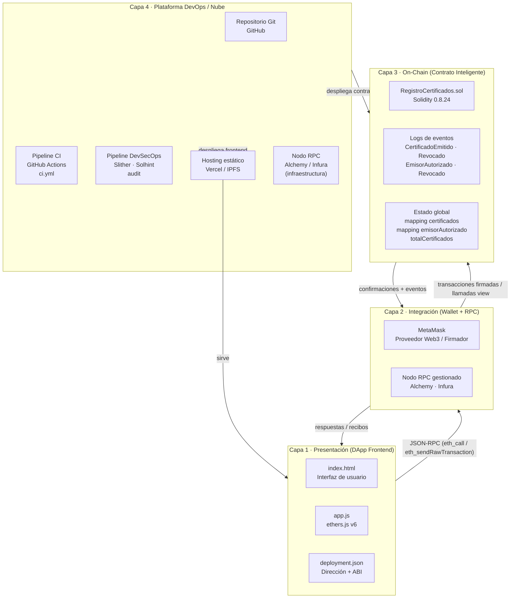
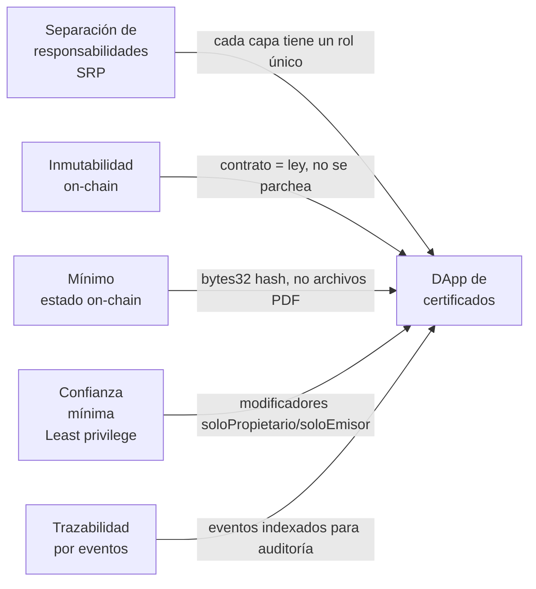

# 01 — Arquitectura en Capas

> **Módulo:** Modelado y Arquitectura · Unidad 1 Blockchain DevOps · UTPL

---

## ¿Qué es la arquitectura en capas?

Una arquitectura en capas organiza un sistema en niveles con responsabilidades bien definidas,
de modo que cada capa solo se comunica con la inmediatamente adyacente.
En una DApp (aplicación descentralizada) esta separación tiene una dimensión extra:
la frontera entre lo que vive en la blockchain (on-chain) y lo que vive fuera de ella (off-chain)
no es solo organizativa, es **física y económica**: cruzar esa frontera cuesta gas.

---

## Diagrama de bloques — Cuatro capas de la DApp

---

## Responsabilidades de cada capa

### Capa 1 — Presentación (DApp Frontend)

Es la única parte del sistema que el usuario final ve y toca directamente.

| Componente | Responsabilidad |
|---|---|
| `index.html` | Estructura HTML de la interfaz: formularios de emisión, verificación y gestión de emisores |
| `app.js` | Lógica de interacción: inicializa ethers.js, detecta MetaMask, construye llamadas al contrato, muestra resultados |
| `deployment.json` | Configuración en tiempo de ejecución: contiene la dirección del contrato desplegado y el ABI; lo genera `scripts/deploy.js` automáticamente |

**Por qué importa:** el frontend es completamente reemplazable sin tocar el contrato.
Si mañana se quiere una interfaz React o una app móvil, el contrato no cambia.
Esto ilustra el principio de **desacoplamiento** de DevOps.

---

### Capa 2 — Integración (Wallet + RPC)

Esta capa actúa como puente entre el mundo off-chain (JavaScript en el navegador)
y el mundo on-chain (la blockchain de Ethereum).

| Componente | Responsabilidad |
|---|---|
| **MetaMask** | Gestiona las claves privadas del usuario; firma transacciones sin exponer la clave; inyecta el proveedor `window.ethereum` |
| **Nodo RPC** | Recibe las transacciones firmadas, las difunde a la red Ethereum, y responde a las consultas view; en producción es un servicio gestionado (Alchemy/Infura) |

**Flujo de una transacción:** `app.js` construye la transacción → MetaMask la firma → el nodo RPC la difunde a la red → el contrato ejecuta la lógica → el nodo RPC devuelve el recibo.

**Flujo de una lectura view:** `app.js` construye la llamada → el nodo RPC la ejecuta localmente → devuelve el resultado sin gas ni firma.

---

### Capa 3 — On-Chain (Contrato Inteligente)

Es el corazón inmutable del sistema.
Una vez desplegado en la red, nadie —ni siquiera el propietario— puede modificar el código.

| Elemento | Responsabilidad |
|---|---|
| `RegistroCertificados.sol` | Lógica de negocio: emitir, revocar, verificar certificados; control de acceso por roles |
| **Estado global** | `mapping(bytes32 => Certificado)` almacena cada certificado; `mapping(address => bool)` controla emisores; `totalCertificados` lleva el conteo |
| **Logs de eventos** | Historial inmutable y eficiente en gas: `CertificadoEmitido`, `CertificadoRevocado`, `EmisorAutorizado`, `EmisorRevocado` |

**Principio clave:** el estado on-chain es la **única fuente de verdad** del sistema.
El frontend puede fallar, el hosting puede cambiar, los nodos RPC pueden rotar —
pero los certificados registrados en la blockchain son permanentes.

---

### Capa 4 — Plataforma DevOps / Nube

Esta capa no interactúa con los usuarios finales; su cliente es el **equipo de desarrollo**.

| Componente | Responsabilidad |
|---|---|
| **GitHub** | Versionado del código, revisión de código, gestión de ramas (GitFlow) |
| **GitHub Actions (`ci.yml`)** | Automatiza compilación, pruebas y análisis de seguridad en cada `push` o PR. Ver [`../03-devops/`](../03-devops/) |
| **GitHub Actions (`devsecops.yml`)** | Ejecuta Slither (análisis estático de Solidity), Solhint (linting), `npm audit`. Ver [`../04-devsecops/`](../04-devsecops/) |
| **Vercel / IPFS** | Hosting del frontend estático; Vercel ofrece previsualizaciones por PR; IPFS ofrece descentralización |
| **Alchemy / Infura** | Nodo RPC gestionado: acceso a Sepolia/mainnet sin operar hardware propio. Ver [`../05-nube/`](../05-nube/) |

---

## Principios arquitectónicos aplicados

| Principio | Aplicación concreta en esta DApp |
|---|---|
| Separación de responsabilidades | Frontend, wallet, contrato y CI/CD son componentes independientes |
| Inmutabilidad on-chain | El código del contrato no se modifica post-despliegue; las decisiones de diseño son permanentes |
| Mínimo estado on-chain | Se almacena el `bytes32` hash, no el PDF del certificado (ahorro masivo de gas) |
| Mínimo privilegio | Solo emisores autorizados pueden emitir; solo el propietario puede autorizar emisores |
| Trazabilidad por eventos | Cada acción relevante emite un evento indexado, consultable desde cualquier cliente |

---

## Navegación del módulo

- Siguiente: [02-modelo-c4.md](02-modelo-c4.md) — Modelo C4 con zoom progresivo
- Ver también: [../03-devops/](../03-devops/) para el detalle del pipeline de Capa 4
