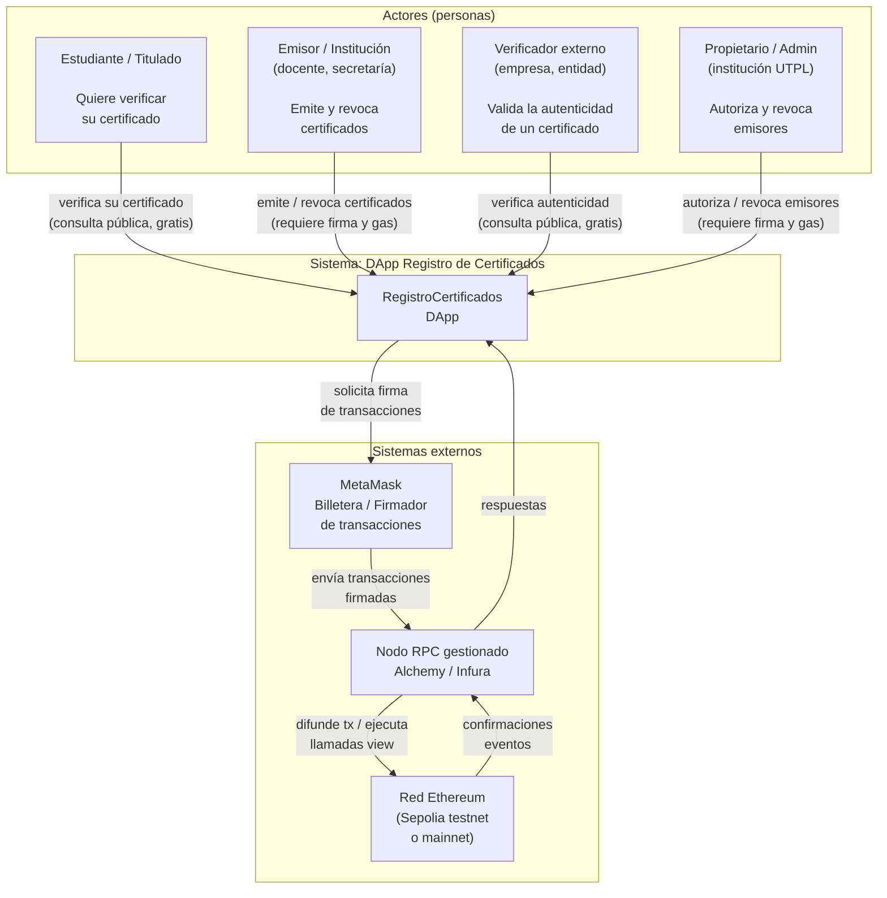
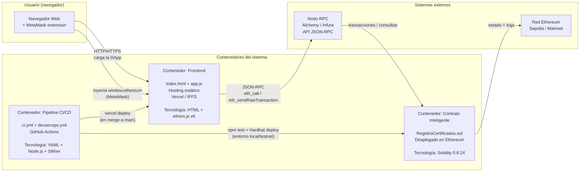
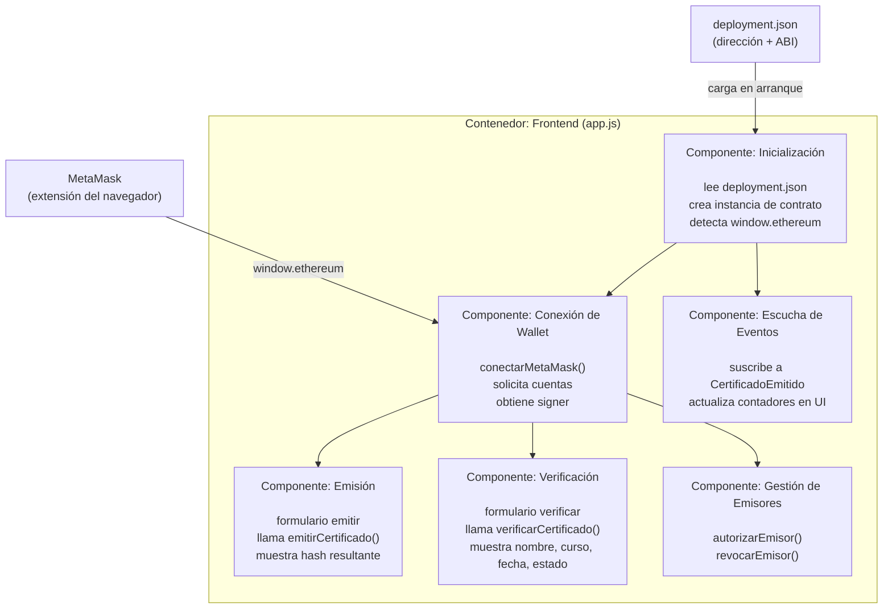
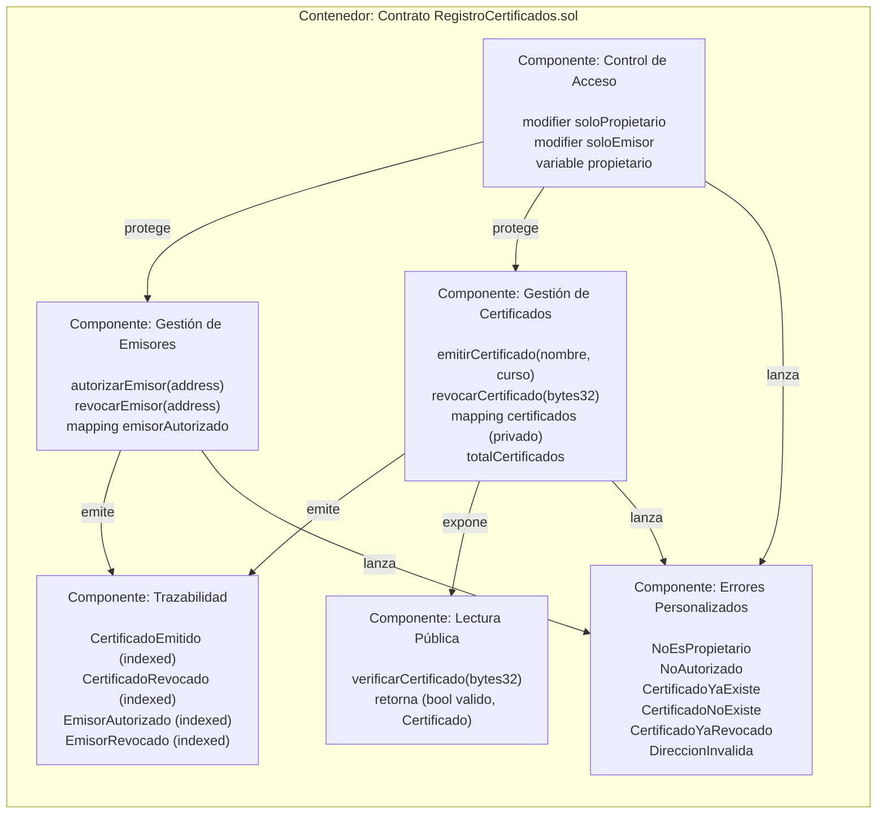
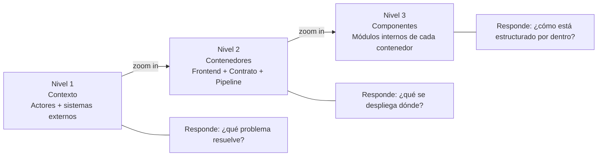

# 02 — Modelo C4 de la DApp

> **Módulo:** Modelado y Arquitectura · Unidad 1 Blockchain DevOps · UTPL

---

## ¿Qué es el modelo C4?

El modelo C4 (Context, Containers, Components, Code) es una forma sistemática de documentar la arquitectura de software con cuatro niveles de zoom progresivo.
No es una notación estricta como UML; es más bien una forma estructurada de **pensar y comunicar** la arquitectura.
En este módulo usamos los tres primeros niveles, que son los más útiles para un equipo de desarrollo.

```
Nivel 1 – Contexto  →  ¿Quién usa el sistema y con qué sistemas se relaciona?
Nivel 2 – Contenedores →  ¿Qué piezas desplegables conforman el sistema?
Nivel 3 – Componentes  →  ¿Qué módulos internos tiene cada contenedor?
```

---

## Nivel 1 — Diagrama de Contexto

**Pregunta central:** ¿Quiénes interactúan con la DApp y qué sistemas externos están involucrados?



### Observaciones del Nivel 1

- **Tres tipos de actores** con permisos distintos: el verificador no necesita MetaMask (solo lee), el emisor sí (escribe), el propietario tiene el nivel máximo de privilegio.
- **MetaMask** es un sistema externo, no parte de la DApp: su comportamiento no está bajo control del equipo de desarrollo.
- La **red Ethereum** es también un sistema externo; la DApp confía en su correcto funcionamiento pero no lo controla.
- El **nodo RPC** es la única puerta de entrada programática a Ethereum; en producción se usa un servicio gestionado para garantizar disponibilidad (SLA).

---

## Nivel 2 — Diagrama de Contenedores

**Pregunta central:** ¿Qué piezas desplegables (contenedores) forman el sistema y cómo se comunican?

> En el modelo C4, "contenedor" no significa Docker; significa cualquier unidad ejecutable desplegable de forma independiente (aplicación web, proceso, base de datos, etc.).



### Observaciones del Nivel 2

| Contenedor | Tecnología | ¿Dónde vive? | ¿Quién lo despliega? |
|---|---|---|---|
| Frontend | HTML + ethers.js v6 | Vercel / IPFS | Pipeline CI (GitHub Actions) |
| Contrato inteligente | Solidity 0.8.24 | Red Ethereum (Sepolia / mainnet) | Pipeline CI (`scripts/deploy.js`) |
| Pipeline CI/CD | YAML + Node.js + Slither | GitHub Actions (nube de GitHub) | Se activa automáticamente con cada push |

**Punto pedagógico clave:** el contrato y el frontend son **contenedores independientes**.
El frontend puede redesplegarse en cualquier momento (por ejemplo, para corregir un error de UI),
mientras que el contrato —una vez en mainnet— no puede modificarse.

---

## Nivel 3 — Diagrama de Componentes

### Componentes del Frontend

**Pregunta central:** ¿Qué módulos lógicos componen `app.js`?



### Componentes del Contrato

**Pregunta central:** ¿Qué módulos lógicos componen `RegistroCertificados.sol`?



### Observaciones del Nivel 3

- El **componente de control de acceso** es transversal: protege tanto la gestión de emisores como la de certificados a través de modificadores.
- El **componente de lectura pública** (`verificarCertificado`) no está protegido por ningún modificador: cualquier dirección puede llamarlo, lo que implementa el valor de confianza descentralizada de blockchain.
- Los **errores personalizados** son más baratos en gas que `require(condicion, "mensaje string")` porque no almacenan el string en la transacción. Este es un ejemplo de decisión de diseño motivada por el costo on-chain.

---

## Resumen pedagógico: C4 y blockchain



El modelo C4 es especialmente valioso en blockchain porque obliga a explicitar,
ya en el Nivel 2, **qué vive on-chain y qué vive off-chain**:
una decisión que en sistemas tradicionales es reversible, pero en blockchain es permanente.

---

## Navegación del módulo

- Anterior: [01-vista-general.md](01-vista-general.md)
- Siguiente: [03-modelo-de-datos.md](03-modelo-de-datos.md)
