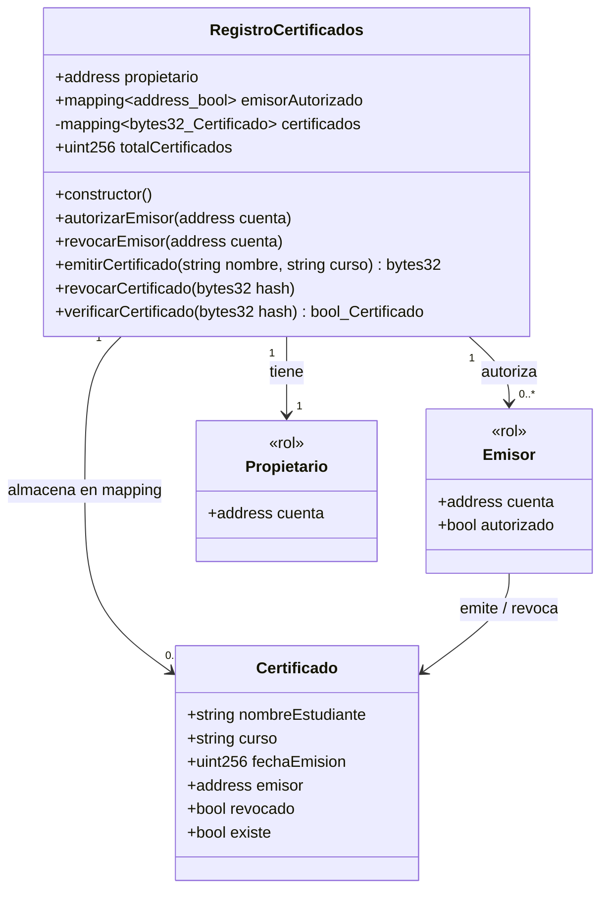
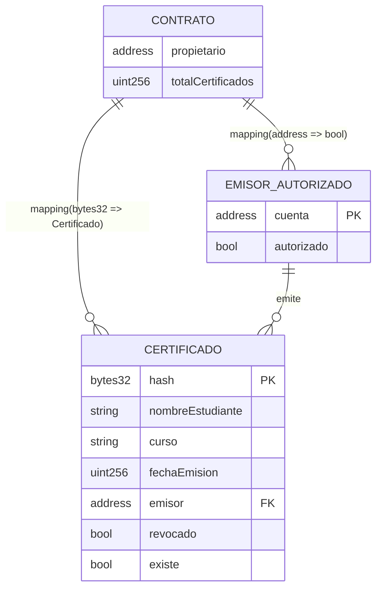
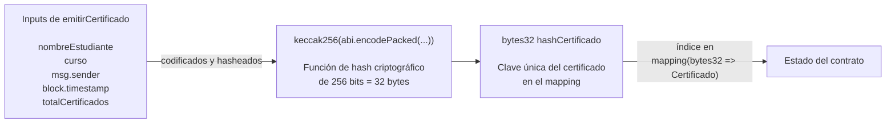
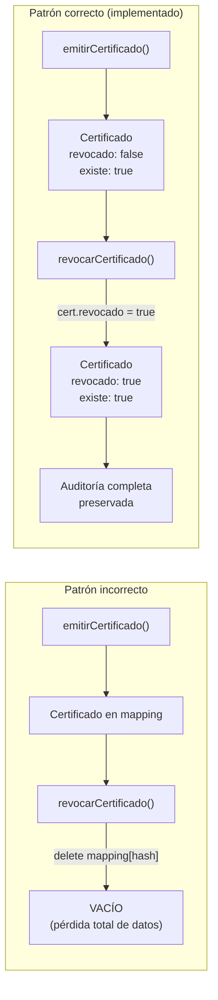
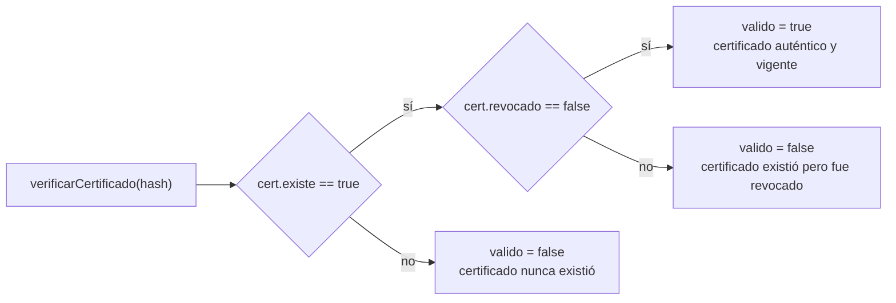

# 03 — Modelo de Datos On-Chain

> **Módulo:** Modelado y Arquitectura · Unidad 1 Blockchain DevOps · UTPL

---

## Introducción: el almacenamiento on-chain es diferente

En una base de datos relacional tradicional, el almacenamiento es barato y flexible: se pueden
agregar columnas, crear índices, cambiar tipos de datos y borrar filas.

En Ethereum, **cada byte almacenado en el estado del contrato tiene un costo monetario** medido en gas.
El costo de escribir un slot de 32 bytes por primera vez es de 20 000 gas (`SSTORE` fría);
a un precio de gas de 10 gwei y ETH a 3 000 USD, eso equivale a aproximadamente **0.60 USD por slot**.
Esto hace que el diseño del modelo de datos sea una decisión de ingeniería y de economía al mismo tiempo.

---

## Diagrama de clases / entidad-relación



---

## Diagrama ER simplificado (vista de mappings)



---

## Anatomía del struct `Certificado`

```solidity
struct Certificado {
    string  nombreEstudiante; // nombre del titular
    string  curso;            // programa o curso académico
    uint256 fechaEmision;     // block.timestamp al momento de emisión
    address emisor;           // quien emitió (20 bytes, 1 slot*)
    bool    revocado;         // estado de revocación (1 byte, comparte slot*)
    bool    existe;           // centinela de existencia (1 byte, comparte slot*)
}
// * Solidity empaqueta bool + address en el mismo slot de 32 bytes si se declaran juntos.
```

### Costo de almacenamiento por campo

| Campo | Tipo | Slots de 32 bytes | Observaciones |
|---|---|---|---|
| `nombreEstudiante` | `string` | Variable (≥1) | Los strings de hasta 31 bytes usan 1 slot; los más largos usan slots adicionales |
| `curso` | `string` | Variable (≥1) | Igual que `nombreEstudiante` |
| `fechaEmision` | `uint256` | 1 | Ocupa exactamente 1 slot |
| `emisor` + `revocado` + `existe` | `address` + 2×`bool` | 1 | Solidity los empaqueta en un solo slot de 32 bytes (optimización automática) |
| **Total mínimo** | | **4 slots** | Para nombres y cursos cortos (< 32 bytes cada uno) |

A un precio de gas conservador, **emitir un certificado cuesta entre 100 000 y 150 000 gas**,
lo que incluye la escritura del struct, la actualización del contador y la emisión del evento.

---

## ¿Por qué `bytes32` como clave del mapping?



### Ventajas del diseño de clave con `bytes32`

| Criterio | `bytes32` (elegido) | Alternativa: `uint256` autoincremental |
|---|---|---|
| **Unicidad** | Garantizada criptográficamente por keccak256 | Depende del orden; colisiones posibles con IDs paralelos |
| **Verificabilidad off-chain** | El verificador recalcula el hash con los datos públicos | El verificador necesita conocer el ID numérico |
| **Tamaño en el mapping** | 32 bytes = 1 slot (óptimo) | 32 bytes (igual) |
| **Indexable en eventos** | Sí (`indexed` en `CertificadoEmitido`) | También indexable |
| **Predecible antes de emitir** | No (incluye `block.timestamp` y `totalCertificados`) | Sí (siguiente ID) |

El diseño `bytes32` fue elegido porque **combina unicidad fuerte con verificabilidad pública**:
cualquier tercero con los datos en texto plano puede recalcular el hash y verificar la autenticidad
sin necesidad de consultar ninguna base de datos central.

---

## Patrón "No borrar, revocar" — Inmutabilidad y auditabilidad

Este es uno de los patrones de diseño más importantes en blockchain.
En Solidity existe la operación `delete` que puede eliminar el valor de una clave en un mapping,
pero **usarla en este contexto destruye la evidencia histórica**.



### Por qué este patrón importa

| Propiedad | Patrón borrar | Patrón revocar (elegido) |
|---|---|---|
| **Auditoría histórica** | Imposible (datos eliminados) | Completa: quién emitió, cuándo, quién revocó |
| **Trazabilidad forense** | No disponible | Disponible a través de eventos y estado |
| **Costo de gas** | Menor (libera almacenamiento, gas refund) | Menor escritura total (solo actualiza 1 bool) |
| **Cumplimiento normativo** | Problemático (se puede negar la existencia) | Correcto (el registro es permanente) |
| **Consistencia** | El `totalCertificados` quedaría inconsistente | El contador siempre crece, es auditado |

> **Nota pedagógica:** el gas refund por `SSTORE` a cero (liberar almacenamiento) se redujo significativamente en EIP-3529 (Londres, 2021). El ahorro ya no es el incentivo que era; la auditabilidad sí lo es.

---

## El campo `existe` — Centinela de existencia

En Solidity, todos los valores no inicializados son cero: un `mapping` devuelve un `Certificado` vacío (todos los campos en cero/false) cuando se consulta una clave que no existe.
Sin el campo `bool existe`, sería imposible distinguir un certificado recién creado con `revocado = false` de una clave que nunca fue registrada.



---

## Resumen de decisiones de diseño

| Decisión | Alternativa considerada | Por qué se eligió el diseño actual |
|---|---|---|
| `bytes32` hash como clave | `uint256` autoincremental | Verificabilidad criptográfica sin base de datos central |
| `string` para nombre y curso | `bytes32` truncado | Legibilidad y flexibilidad para nombres reales |
| `bool existe` como centinela | No tener centinela | Distinguir "no existe" de "existe con valores cero" |
| `bool revocado` en lugar de `delete` | Borrar el mapping | Preservar historial e inmutabilidad |
| Mapping privado `certificados` | Mapping público | Evitar exposición directa; la API pública es `verificarCertificado` |
| Errores personalizados (`revert`) | `require(cond, "string")` | Ahorro de gas (no almacena el string de error en la transacción) |

---

## Navegación del módulo

- Anterior: [02-modelo-c4.md](02-modelo-c4.md)
- Siguiente: [04-diagramas-secuencia.md](04-diagramas-secuencia.md)
- Ver también: [05-modelo-roles-seguridad.md](05-modelo-roles-seguridad.md) para el modelo de control de acceso
