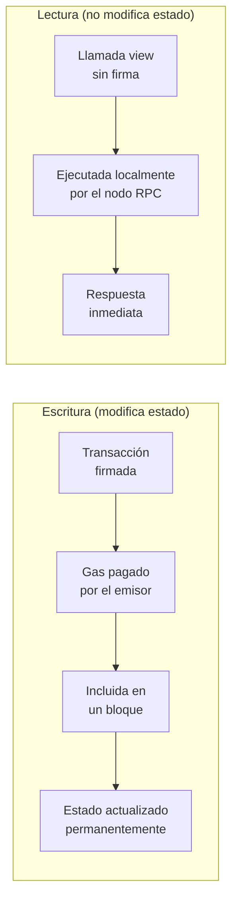
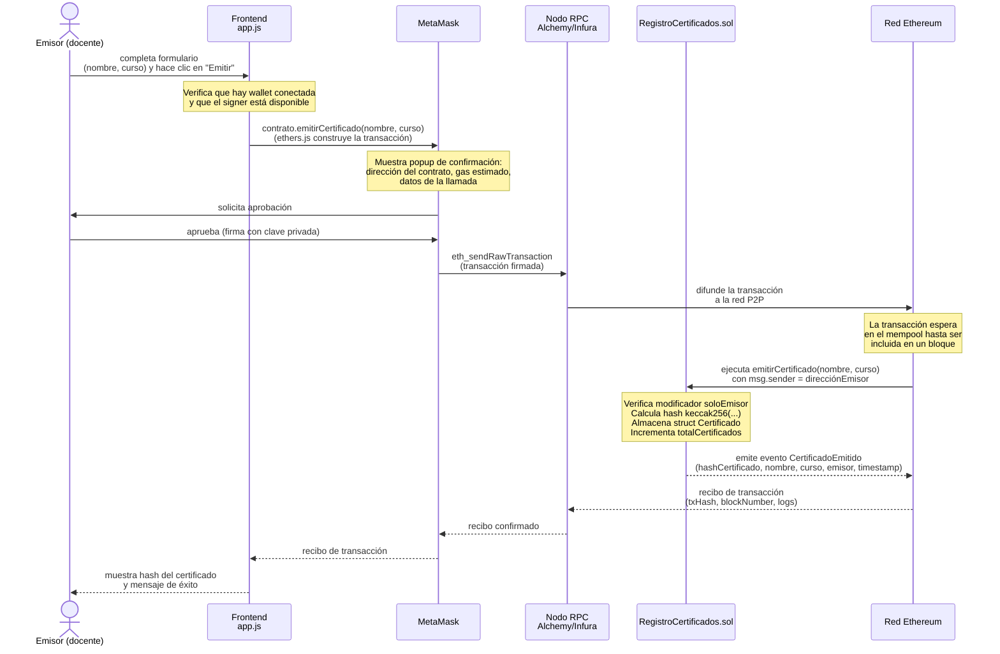
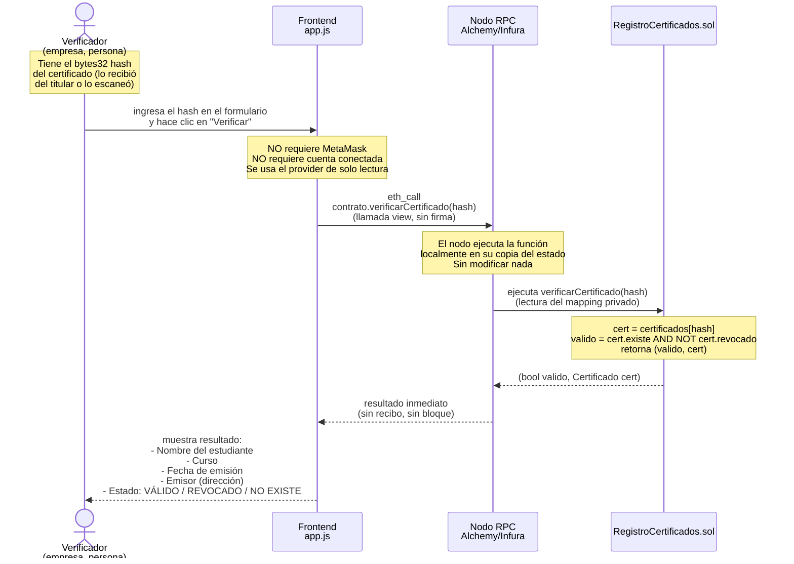
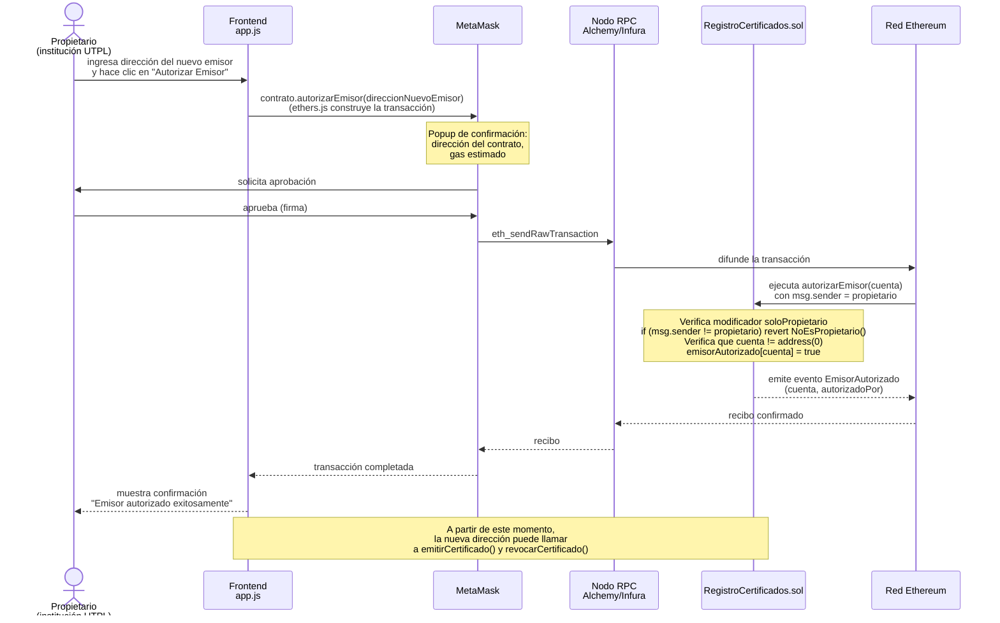
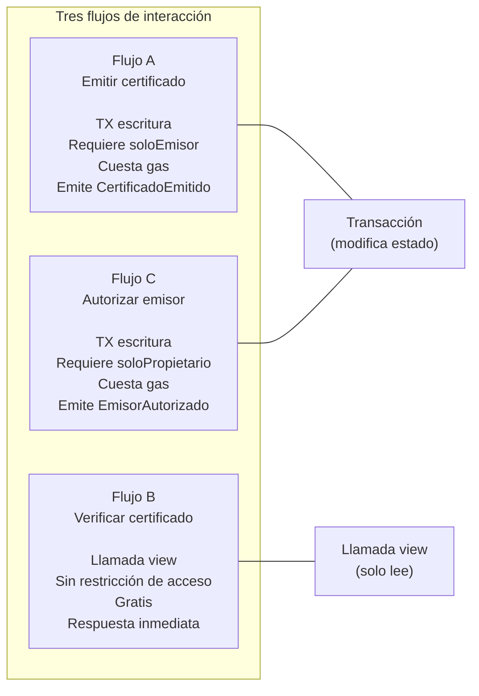

# 04 — Diagramas de Secuencia

> **Módulo:** Modelado y Arquitectura · Unidad 1 Blockchain DevOps · UTPL

---

## Concepto clave: Transacciones vs. Llamadas view

Antes de ver los diagramas, es fundamental entender la distinción más importante en la interacción con un contrato inteligente:

| Característica | Transacción (escritura) | Llamada view (lectura) |
|---|---|---|
| **Modifica estado** | Sí | No |
| **Cuesta gas** | Sí (pagado por el firmante) | No (ejecutada localmente por el nodo) |
| **Requiere firma** | Sí (con clave privada via MetaMask) | No |
| **Es asíncrona** | Sí (espera confirmación de la red) | No (respuesta inmediata) |
| **Queda en la blockchain** | Sí (permanente e inmutable) | No |
| **Funciones del contrato** | `emitirCertificado`, `revocarCertificado`, `autorizarEmisor`, `revocarEmisor` | `verificarCertificado` |

---

## Flujo A — Emitir un certificado

Este es el flujo más complejo: implica una transacción que modifica el estado del contrato
y emite un evento que el frontend puede capturar.

### Puntos pedagógicos del flujo A

1. **MetaMask como guardián de claves:** el usuario nunca expone su clave privada a `app.js`. MetaMask firma la transacción de forma aislada.
2. **Latencia de red:** hay un tiempo de espera entre el envío y la confirmación (segundos en Sepolia, hasta minutos en mainnet congestionada). `ethers.js` espera con `tx.wait()`.
3. **El hash se genera on-chain:** `keccak256(abi.encodePacked(nombre, curso, msg.sender, block.timestamp, totalCertificados))`. Esto garantiza unicidad y que el emisor no pueda predecir el hash antes de la transacción.
4. **El evento `CertificadoEmitido`** sirve como recibo semántico: el frontend lo captura para mostrar confirmación y el log de la blockchain lo preserva para siempre.

---

## Flujo B — Verificar un certificado

Este flujo es completamente diferente: es una **llamada view**, sin firma, sin gas, instantánea.
Cualquier persona en el mundo puede verificar un certificado.

### Puntos pedagógicos del flujo B

1. **Sin MetaMask ni gas:** la verificación es gratuita y pública. Esto implementa directamente el valor de confianza descentralizada de blockchain: no se necesita confiar en ninguna institución para verificar.
2. **El nodo RPC ejecuta localmente:** `eth_call` no crea una transacción; el nodo ejecuta el código del contrato sobre su copia local del estado y devuelve el resultado.
3. **El mapping es privado, la función es pública:** `certificados` tiene visibilidad `private` en Solidity, lo que significa que no se puede leer directamente por su clave. Pero `verificarCertificado` es `public view` y sí devuelve los datos. El contrato controla qué se expone.
4. **Latencia nula:** el verificador obtiene la respuesta en milisegundos, no en segundos.

---

## Flujo C — Autorizar un emisor

Este flujo es exclusivo del propietario del contrato (la institución).
También es una transacción (modifica estado), similar al flujo A.

### Puntos pedagógicos del flujo C

1. **El modificador actúa como guardián:** si `msg.sender != propietario`, la transacción revierte con el error `NoEsPropietario()` antes de ejecutar ninguna lógica. El gas ya consumido para llegar a ese punto se pierde, pero el estado no se modifica.
2. **Transitividad de confianza:** el propietario autoriza emisores; los emisores emiten certificados. Esta cadena de confianza es auditable en la blockchain a través de los eventos `EmisorAutorizado`.
3. **`address(0)` como validación:** el contrato verifica que no se autorice la dirección cero (equivalente a un puntero nulo), que es una dirección inválida en Ethereum.

---

## Comparación de los tres flujos

| Flujo | Tipo | Actor | Modificador | Gas | Evento emitido |
|---|---|---|---|---|---|
| Emitir certificado | Transacción | Emisor autorizado | `soloEmisor` | ~120 000 gas | `CertificadoEmitido` |
| Verificar certificado | Llamada view | Cualquiera (público) | Ninguno | 0 | Ninguno |
| Autorizar emisor | Transacción | Propietario | `soloPropietario` | ~50 000 gas | `EmisorAutorizado` |
| Revocar certificado | Transacción | Emisor autorizado | `soloEmisor` | ~30 000 gas | `CertificadoRevocado` |
| Revocar emisor | Transacción | Propietario | `soloPropietario` | ~30 000 gas | `EmisorRevocado` |

---

## Navegación del módulo

- Anterior: [03-modelo-de-datos.md](03-modelo-de-datos.md)
- Siguiente: [05-modelo-roles-seguridad.md](05-modelo-roles-seguridad.md)
- Ver también: [../04-devsecops/](../04-devsecops/) donde estos flujos son analizados desde la perspectiva de seguridad
