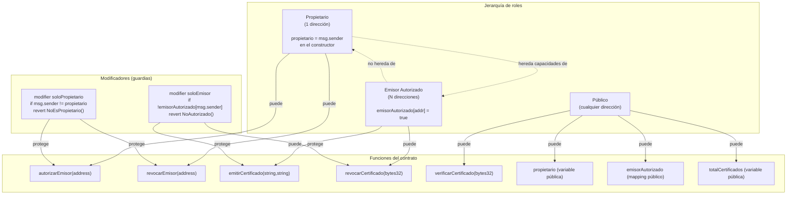
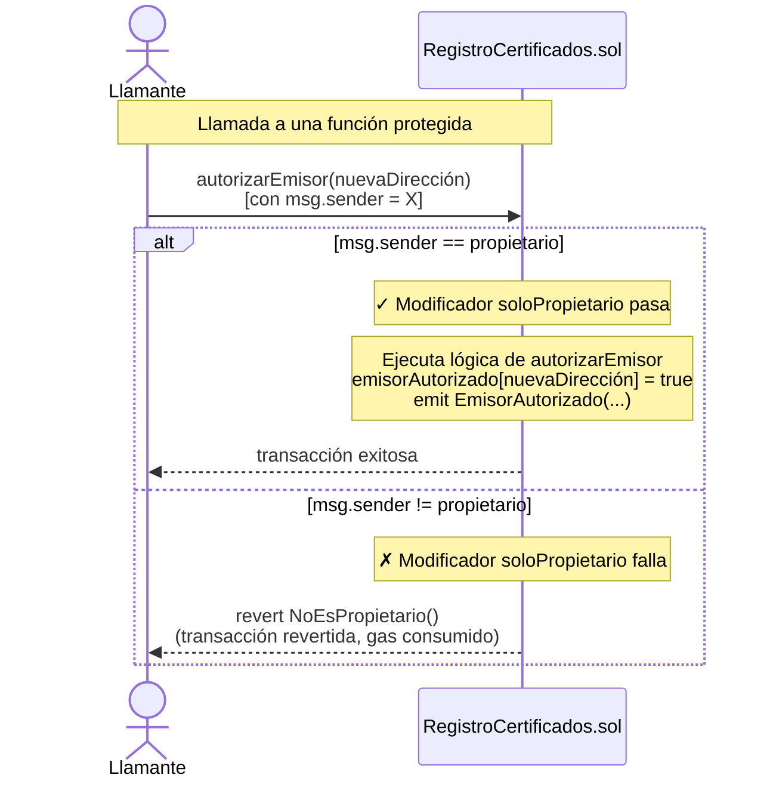
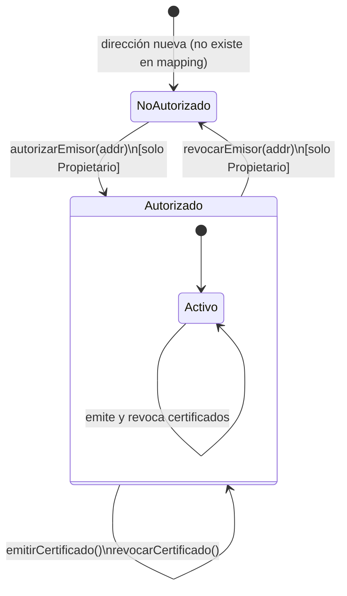
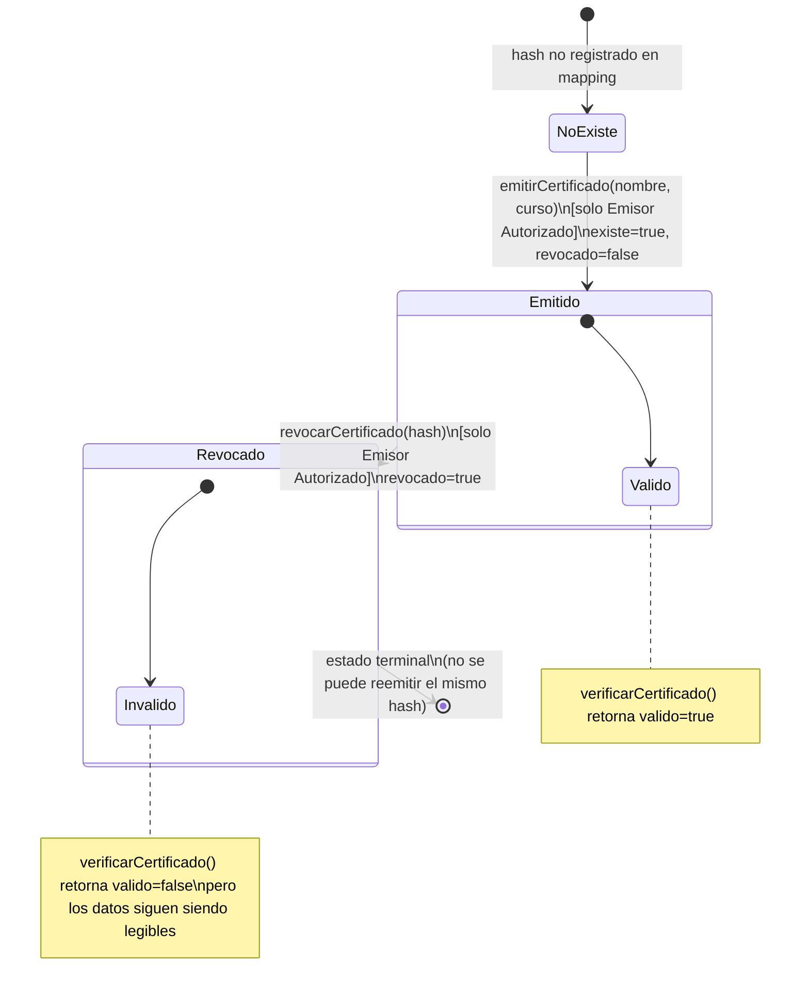

# 05 — Modelo de Roles y Seguridad

> **Módulo:** Modelado y Arquitectura · Unidad 1 Blockchain DevOps · UTPL

---

## Control de acceso basado en roles (RBAC) en blockchain

En los sistemas tradicionales, el control de acceso se implementa en una capa de middleware
(servidor de autenticación, JWT, sesiones).
En blockchain, no existe esa capa intermedia: **cada llamada al contrato lleva embebida la identidad del llamante**
en la variable global `msg.sender`, que es la dirección Ethereum que firmó la transacción.

Esto significa que:
- No se puede falsificar `msg.sender` (está criptográficamente vinculada a la firma).
- No se necesita un servidor de autenticación: la blockchain es el proveedor de identidad.
- Los roles deben estar modelados **dentro del contrato**, no en una capa externa.

---

## Diagrama de roles y capacidades



> **Nota sobre herencia de roles:** el propietario es también el primer emisor autorizado
> (el constructor ejecuta `emisorAutorizado[msg.sender] = true`).
> Sin embargo, si el propietario revoca su propia autorización como emisor, pierde esa capacidad
> pero conserva la de propietario. Los roles son ortogonales.

---

## Matriz de permisos (Rol × Función)

| Función | Propietario | Emisor Autorizado | Público (sin rol) |
|---|:---:|:---:|:---:|
| `autorizarEmisor(address)` | SI | NO | NO |
| `revocarEmisor(address)` | SI | NO | NO |
| `emitirCertificado(string, string)` | SI* | SI | NO |
| `revocarCertificado(bytes32)` | SI* | SI | NO |
| `verificarCertificado(bytes32)` | SI | SI | SI |
| Leer `propietario` | SI | SI | SI |
| Leer `emisorAutorizado[addr]` | SI | SI | SI |
| Leer `totalCertificados` | SI | SI | SI |

> *El propietario puede emitir y revocar certificados **solo si está en la lista de emisores autorizados**.
> El constructor lo agrega automáticamente, pero si fuera removido como emisor, perdería esas capacidades.

---

## Implementación de los modificadores



### ¿Por qué `revert` con error personalizado en lugar de `require`?

```solidity
// Opción 1: require con string (patrón antiguo)
require(msg.sender == propietario, "Solo el propietario puede ejecutar esta funcion");
// Costo: almacena el string en la transacción → más gas

// Opción 2: error personalizado (patrón moderno, implementado)
if (msg.sender != propietario) revert NoEsPropietario();
// Costo: solo el selector de 4 bytes del error → menos gas
```

El ahorro es de aproximadamente 50–200 gas por verificación fallida, dependiendo de la longitud del string.
En el contrato se define `error NoEsPropietario();` y todos los errores personalizados análogos.

---

## Diagrama de estados de un emisor



---

## Diagrama de estados de un certificado



> **Punto clave:** el estado `Revocado` es **terminal**. No existe una función `reemitirCertificado`.
> Si se necesita reemitir, se emite uno nuevo con un hash diferente (el `totalCertificados` diferente
> garantiza que el nuevo hash sea distinto incluso con los mismos datos de entrada).

---

## Conexión con DevSecOps

Este modelo de roles tiene implicaciones directas en los controles automatizados de seguridad
documentados en [`../04-devsecops/`](../04-devsecops/):

| Riesgo de seguridad | Control arquitectónico | Validación DevSecOps |
|---|---|---|
| Emisión no autorizada de certificados | Modificador `soloEmisor` | Slither verifica que funciones sensibles tengan modificadores de acceso |
| Escalada de privilegios (emisor → propietario) | Los roles son ortogonales y solo el propietario puede gestionar emisores | Pruebas automatizadas (`npm test`) validan que un emisor no puede llamar `autorizarEmisor` |
| Dirección cero como emisor | `if (cuenta == address(0)) revert DireccionInvalida()` | Prueba unitaria `test/RegistroCertificados.js` cubre este caso |
| Transferencia de propiedad no controlada | No existe función `transferirPropiedad` (decisión deliberada) | Slither / revisión manual confirman ausencia de la función |
| Reentrancia | No hay llamadas externas tras modificar estado (patrón CEI) | Slither detecta violaciones del patrón Checks-Effects-Interactions |

---

## Comparación con patrones estándar de la industria

El modelo implementado es similar a **OpenZeppelin Ownable** (propietario único) pero más simple:

| Característica | Este contrato | OpenZeppelin Ownable | OpenZeppelin AccessControl |
|---|---|---|---|
| Propietario único | SI | SI | Parcial (DEFAULT_ADMIN_ROLE) |
| Roles adicionales | SI (emisores) | NO (solo owner) | SI (roles arbitrarios) |
| Transferencia de propiedad | NO | SI (`transferOwnership`) | Parcial |
| Renunciar a la propiedad | NO | SI (`renounceOwnership`) | Parcial |
| Complejidad | Baja (didáctica) | Baja | Media |
| Adecuado para producción | Limitado | Proyectos simples | Proyectos complejos |

> **Para producción** se recomendaría usar `OpenZeppelin AccessControl` o `Ownable2Step`
> (que requiere que el nuevo propietario acepte explícitamente, evitando transferencias accidentales).
> Para este repositorio didáctico, la implementación propia es superior porque el estudiante
> ve y entiende exactamente qué pasa en el código.

---

## Navegación del módulo

- Anterior: [04-diagramas-secuencia.md](04-diagramas-secuencia.md)
- Siguiente: [06-vista-despliegue.md](06-vista-despliegue.md)
- Ver también: [`../04-devsecops/`](../04-devsecops/) para los controles de seguridad automatizados sobre este modelo
