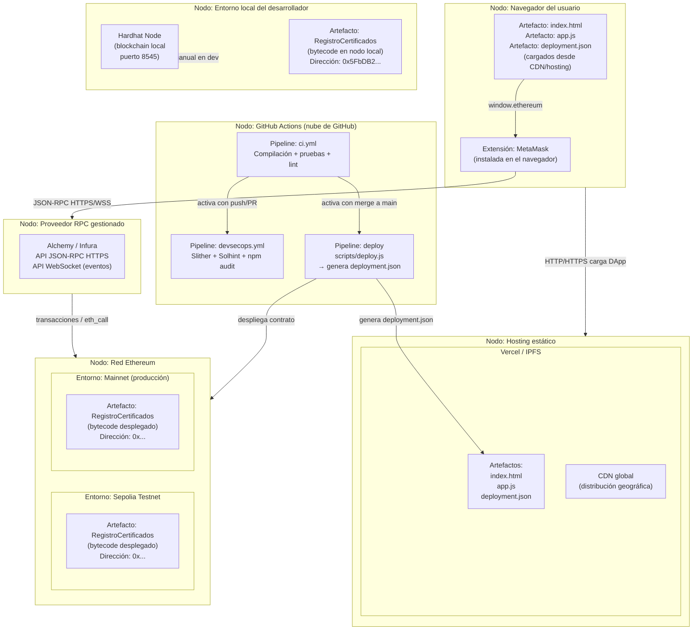
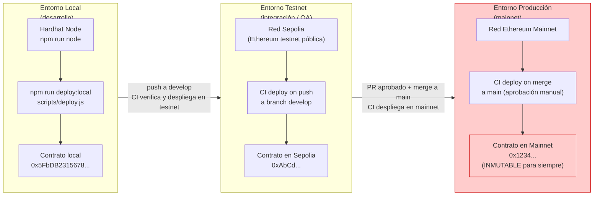
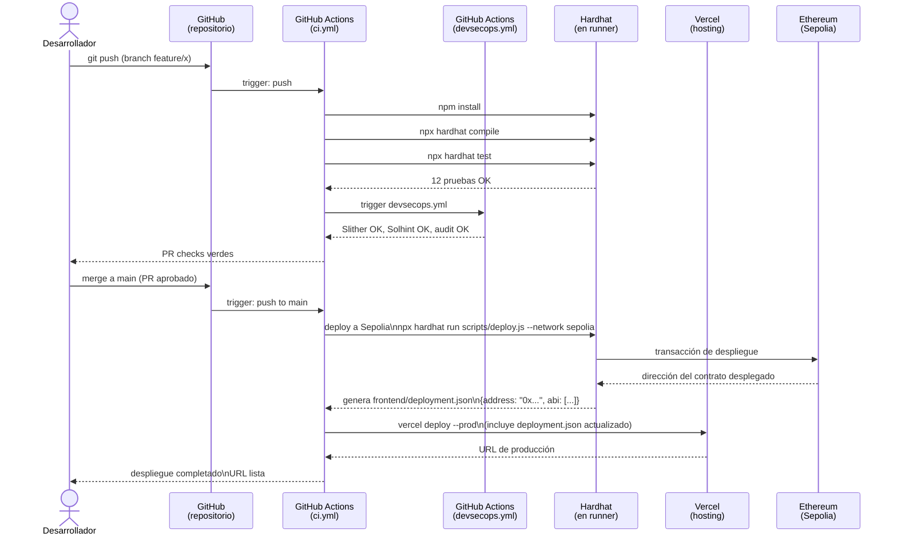
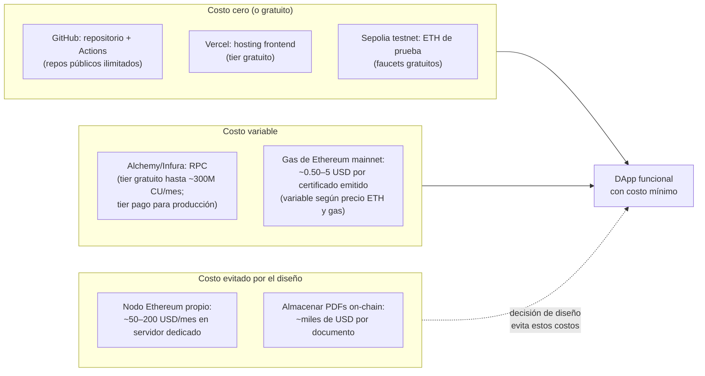

# 06 — Vista de Despliegue

> **Módulo:** Modelado y Arquitectura · Unidad 1 Blockchain DevOps · UTPL

---

## ¿Por qué una vista de despliegue?

El código fuente y el sistema en producción son cosas distintas.
La vista de despliegue responde: **¿dónde vive cada artefacto cuando el sistema está ejecutando?**
En una DApp, esta pregunta tiene una complejidad especial porque los artefactos están distribuidos
en infraestructuras muy diferentes: un navegador, un servidor de hosting, la blockchain global, y pipelines en la nube.

---

## Diagrama de despliegue — Vista de artefactos y nodos

---

## Los tres entornos y la promoción entre ellos

### Criterios de promoción entre entornos

| Criterio | Local → Testnet | Testnet → Mainnet |
|---|---|---|
| Pruebas unitarias | Deben pasar (CI bloquea) | Deben pasar (CI bloquea) |
| Análisis Slither | Opcional (local) | Sin findings críticos |
| Revisión de código | No requerida | PR aprobado por revisor |
| Gas estimado | No aplica | Verificado y aceptable |
| Dirección del contrato | Temporal (cada deploy cambia) | Fija para siempre |
| Aprobación manual | No requerida | Requerida (environment protection en GitHub) |

---

## Diagrama de despliegue — Flujo del pipeline CI/CD

---

## Artefactos y su ubicación por entorno

| Artefacto | Entorno local | Testnet Sepolia | Mainnet |
|---|---|---|---|
| `RegistroCertificados.sol` (fuente) | `contracts/` en el repo | `contracts/` en el repo | `contracts/` en el repo |
| Bytecode compilado | `artifacts/` (generado) | `artifacts/` (generado en CI) | `artifacts/` (generado en CI) |
| Dirección del contrato | `frontend/deployment.json` (local) | `frontend/deployment.json` (CI) | `frontend/deployment.json` (CI) |
| ABI del contrato | `frontend/deployment.json` | `frontend/deployment.json` | `frontend/deployment.json` |
| Frontend (`index.html`, `app.js`) | Local (servidor estático) | Vercel (preview URL) | Vercel (URL de producción) |
| Logs de eventos | Nodo Hardhat local | Explorador Sepolia Etherscan | Explorador Etherscan |

---

## Decisiones arquitectónicas y trade-offs

| Decisión | Alternativa | Ventaja de la decisión tomada | Trade-off / Limitación |
|---|---|---|---|
| **Vercel para hosting del frontend** | IPFS / Filecoin | Despliegue simple, previsualizaciones de PR, dominio personalizado gratis | Centralizado: si Vercel falla, la UI no está disponible (pero el contrato sí) |
| **IPFS como opción alternativa** | Solo Vercel | Descentralizado: el frontend sobrevive aunque el dominio falle | Más complejo de actualizar; sin previsualizaciones automáticas |
| **Alchemy/Infura como nodo RPC** | Nodo propio (geth/reth) | Sin infraestructura propia que mantener; SLA gestionado | Dependencia de tercero; si la API cambia, hay que actualizar |
| **Hardhat para entorno local** | Foundry / Ganache | Toolchain madura, bien integrada con ethers.js; el mismo framework para CI y local | Hardhat Node no persiste estado entre reinicios (intencional en dev) |
| **GitHub Actions para CI/CD** | Jenkins / GitLab CI | Gratuito en repos públicos; integrado con el repositorio; amplia documentación | Dependencia de GitHub; límites de minutos en repos privados |
| **Un solo contrato sin upgrades** | Patrón Proxy (EIP-1967) | Simplicidad: el estudiante ve exactamente lo que se despliega | No actualizable; un bug crítico requeriría redespliegue y migración |
| **Deployment.json generado en CI** | ABI hardcodeado en app.js | La DApp siempre apunta al contrato correcto del entorno | Si el CI falla antes de generar el JSON, el frontend podría apuntar a la versión anterior |

---

## Consideraciones de costo en la nube

---

## Relación con otros módulos del curso

- El pipeline CI/CD está documentado en detalle en [`../03-devops/`](../03-devops/).
- Los controles de seguridad del pipeline (Slither, Solhint, auditoría) están en [`../04-devsecops/`](../04-devsecops/).
- La arquitectura en la nube (Vercel, Alchemy, IPFS, costos detallados) está en [`../05-nube/`](../05-nube/).

---

## Navegación del módulo

- Anterior: [05-modelo-roles-seguridad.md](05-modelo-roles-seguridad.md)
- Volver al índice: [README.md](README.md)
