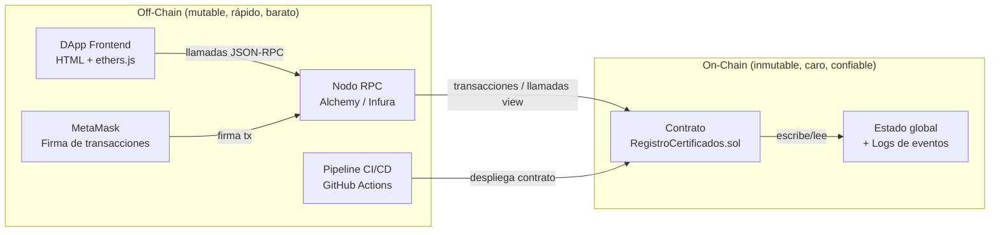

# Módulo 02 — Modelado y Arquitectura

> **Unidad 1: Blockchain DevOps · UTPL · Abril–Agosto 2026**
> Agente: Diseño / Arquitectura

---

## ¿Por qué modelar antes de codificar en blockchain?

En el desarrollo de software tradicional, un error de diseño puede corregirse en la siguiente versión.
En blockchain, **el código del contrato inteligente es inmutable una vez desplegado en mainnet**: no existe un botón de "actualizar" ni un `git push` que sobrescriba la lógica que ya vive en miles de nodos.
Esto convierte el modelado previo —diagramas de clases, secuencias, roles, capas— en una disciplina de primer orden, no en un paso opcional.

### Consecuencias concretas del principio de inmutabilidad

| Decisión de diseño | Si se omite el modelado | Con modelado previo |
|---|---|---|
| Selección de tipos de datos (`bytes32` vs `string`) | Costo de gas elevado o imposibilidad de indexar | Tipo óptimo elegido desde el primer despliegue |
| Modelo de roles (propietario/emisor) | Privilegios mal asignados, inauditables | Control de acceso correcto y documentado |
| Patrón de revocación vs. borrado | Pérdida de trazabilidad en la cadena | Historial inmutable preservado |
| Separación on-chain / off-chain | Lógica costosa almacenada en la cadena | Solo el estado esencial vive on-chain |

---

## Separación on-chain / off-chain: el principio arquitectónico central

**Regla de oro:** almacenar un `bool` on-chain cuesta gas real (dinero).
Almacenar una imagen de un certificado en la cadena costaría miles de dólares.
El diseño correcto guarda **solo el hash** y los **metadatos mínimos** en el contrato,
y deja los archivos pesados en sistemas off-chain (IPFS, bases de datos).

---

## Contenido de este módulo

| Archivo | Tema | Qué aprenderás |
|---------|------|----------------|
| [01-vista-general.md](01-vista-general.md) | Arquitectura en capas | Responsabilidades de cada capa y su justificación |
| [02-modelo-c4.md](02-modelo-c4.md) | Modelo C4 (3 niveles) | Cómo representar sistemas blockchain con C4 |
| [03-modelo-de-datos.md](03-modelo-de-datos.md) | Modelo de datos on-chain | Struct, mappings, diseño de claves, costo en gas |
| [04-diagramas-secuencia.md](04-diagramas-secuencia.md) | Flujos de interacción | Transacciones vs. llamadas view, rol de MetaMask |
| [05-modelo-roles-seguridad.md](05-modelo-roles-seguridad.md) | Control de acceso | Roles, modificadores, matriz de permisos |
| [06-vista-despliegue.md](06-vista-despliegue.md) | Vista de despliegue | Entornos, artefactos, trade-offs |

---

## Relación con el resto del curso

- Los controles de seguridad descritos en el modelo de roles se implementan como pipeline automatizado en [`../04-devsecops/`](../04-devsecops/).
- La vista de despliegue conecta directamente con la arquitectura en la nube documentada en [`../05-nube/`](../05-nube/).
- Los diagramas de este módulo complementan la teoría DevOps de [`../03-devops/`](../03-devops/).

---

## Convenciones de este módulo

- **Mermaid**: todos los diagramas usan sintaxis Mermaid estándar (renderizable en GitHub y VS Code).
- **Niveles de detalle**: se sigue la filosofía C4 —primero el contexto general, luego el zoom progresivo.
- **Tono**: los comentarios en los diagramas reflejan la terminología del contrato real (`propietario`, `emisorAutorizado`, `bytes32`).
