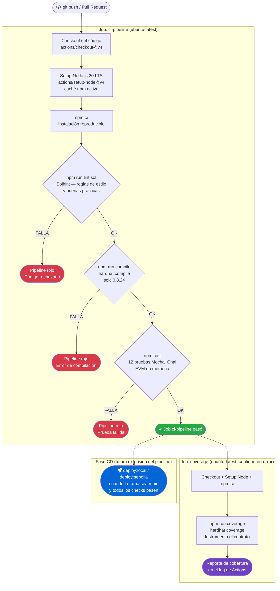
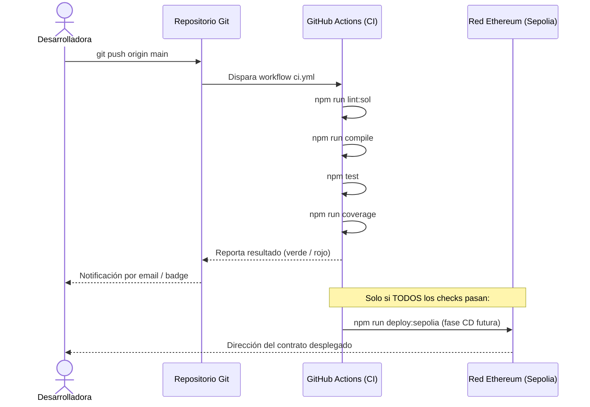

# 01 — El Ciclo CI/CD Aplicado a Este Proyecto

> **Módulo:** 03 DevOps Práctico · UTPL Blockchain 2026
> **Prerequisito:** haber leído [`../01-investigacion/`](../01-investigacion/) para los conceptos base de DevOps.

---

## 1. ¿Qué es el ciclo CI/CD?

**CI (Integración Continua)** significa que cada cambio de código se integra al repositorio
principal de forma frecuente y que, al hacerlo, se ejecuta automáticamente una batería de
verificaciones (lint, compilación, pruebas). El objetivo es detectar errores en minutos, no
en días.

**CD (Entrega/Despliegue Continuo)** extiende CI: si todas las verificaciones pasan, el
artefacto resultante se entrega (o incluso se despliega) automáticamente.

```
Desarrollador                Servidor CI/CD                     Destino
──────────                   ──────────────                     ───────
  git push  ──────────────►  lint + compile + test  ──────►  deploy (si todo pasa)
               (automático)         (automático)
```

---

## 2. Diagrama del pipeline de este proyecto

El siguiente diagrama muestra el pipeline **real** definido en `.github/workflows/ci.yml`.
Cada nodo se corresponde con un paso o job concreto del archivo YAML.



---

## 3. Etapas del pipeline y su script npm

Cada etapa del diagrama tiene un script `npm` equivalente que puedes correr **localmente**
para obtener el mismo resultado que el servidor de CI.

| # | Etapa en CI | Script npm local | Herramienta | ¿Qué verifica? |
|---|---|---|---|---|
| 1 | Checkout | — | `git` / Actions | Obtiene los archivos del repositorio |
| 2 | Setup Node | — | `actions/setup-node` | Entorno reproducible (Node 20 LTS) |
| 3 | Instalar deps | `npm ci` | npm | Instala dependencias idénticas a `package-lock.json` |
| 4 | Lint | `npm run lint:sol` | Solhint | Estilo, seguridad y convenciones de Solidity |
| 5 | Compilar | `npm run compile` | Hardhat + solc | El contrato compila sin errores ni warnings fatales |
| 6 | Pruebas | `npm test` | Mocha + Chai + Hardhat | Las 12 pruebas del comportamiento del contrato pasan |
| 7 | Cobertura | `npm run coverage` | hardhat-coverage | Porcentaje de líneas/ramas cubiertas por las pruebas |

> **Clave didáctica:** si un paso falla, los siguientes **no se ejecutan**. No tiene
> sentido probar código que ni siquiera compila. Esta secuencia tiene lógica deliberada.

---

## 4. CI vs. CD — diferencias clave

| Concepto | CI | CD |
|---|---|---|
| **Significado** | Integración Continua | Entrega / Despliegue Continuo |
| **Frecuencia** | Cada push o PR | Cuando CI pasa (puede ser automático o con aprobación manual) |
| **Objetivo** | Detectar errores rápido | Reducir el tiempo entre código listo y código en producción |
| **Artefacto** | Código validado | Contrato desplegado / Frontend publicado |
| **En este proyecto** | Lint + Compile + Test | `npm run deploy:local` / `deploy:sepolia` (fases futuras) |
| **Responsable** | El servidor de CI automáticamente | El pipeline CD (o el desarrollador con aprobación manual) |

---

## 5. Por qué en blockchain el despliegue es irreversible

En una aplicación web tradicional, si detectas un bug después del despliegue puedes hacer
*rollback*: volver a la versión anterior en segundos. En blockchain, **no existe rollback**.

```
Web tradicional              Blockchain (Ethereum/Sepolia)
───────────────              ────────────────────────────
deploy v1  ──►  rollback     deploy v1  ──►  ¡permanente en la cadena!
               a v0           si hay bug, deploy v2 (nuevo contrato,
               en 30 seg      nueva dirección, migrar usuarios)
```

**Consecuencias prácticas para el pipeline:**

1. **El CI debe ser exhaustivo.** Un bug que llega a la red pública es visible para siempre
   en el explorador de bloques (Etherscan). No hay forma de borrarlo.

2. **El lint no es opcional.** Un error de control de acceso detectado por Solhint antes
   del deploy cuesta 0 €. El mismo error en producción puede costar todo lo que hay en el
   contrato.

3. **Las pruebas son la última barrera.** Las 12 pruebas de `RegistroCertificados.test.js`
   cubren todos los flujos de control de acceso (propietario, emisor autorizado, atacante).
   Si una de ellas falla, el deploy no avanza.

4. **La cobertura importa.** Un porcentaje bajo de cobertura significa que hay caminos de
   código no probados. En Solidity, esos caminos sin probar pueden contener
   vulnerabilidades críticas.

```
Costo de corregir un bug:
   En desarrollo local       →   segundos
   En el pipeline de CI      →   minutos
   En testnet (Sepolia)      →   horas (reeploy + migración)
   En mainnet (producción)   →   potencialmente irrecuperable
```

> **Regla de oro:** en un proyecto blockchain, **nada se despliega a la red hasta que
> todos los checks de CI pasan en verde**. El `ci.yml` de este proyecto hace cumplir
> esa regla automáticamente.

---

## 6. El ciclo completo: desde el editor hasta la cadena



---

## Lecturas relacionadas

- [`02-pipeline-github-actions.md`](./02-pipeline-github-actions.md) — Análisis detallado del archivo `ci.yml`.
- [`03-automatizacion-local.md`](./03-automatizacion-local.md) — Cómo replicar el CI en tu máquina.
- [`04-laboratorio-devops.md`](./04-laboratorio-devops.md) — Practica rompiendo y arreglando el pipeline.
- [`../04-devsecops/`](../04-devsecops/) — Cómo añadir análisis de seguridad (Slither, `npm audit`) al pipeline.
