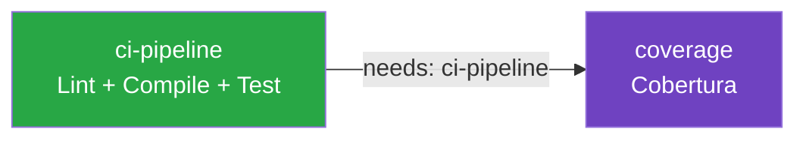
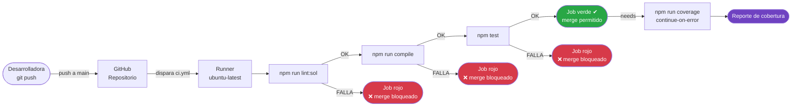

# 02 — El Pipeline en GitHub Actions: Guía Línea por Línea

> **Módulo:** 03 DevOps Práctico · UTPL Blockchain 2026
> **Archivo analizado:** `.github/workflows/ci.yml`
> **Prerequisito:** leer [`01-ciclo-cicd.md`](./01-ciclo-cicd.md) para entender el flujo general.

---

## 1. Anatomía de un archivo de workflow

Un workflow de GitHub Actions es un archivo YAML con cuatro bloques principales:

```
name:         Nombre visible en la pestaña "Actions"
on:           Disparadores — cuándo se activa
permissions:  Qué puede hacer el runner (principio de mínimo privilegio)
jobs:         Unidades de trabajo — qué se ejecuta y en qué orden
  steps:      Pasos dentro de cada job — comandos concretos
```

---

## 2. Sección `name` — identificación del workflow

```yaml
name: CI — Integración Continua
```

Este nombre aparece en:
- La pestaña **Actions** del repositorio en GitHub.
- Las notificaciones de email cuando el pipeline falla.
- El badge de estado que puedes incrustar en el `README.md`.

---

## 3. Sección `on` — disparadores

```yaml
on:
  push:
    branches:
      - main
      - master
  pull_request:
    branches:
      - main
      - master
```

| Evento | Cuándo ocurre | Por qué lo incluimos |
|---|---|---|
| `push` | Al hacer `git push` a `main` o `master` | Verifica el estado actual de la rama principal |
| `pull_request` | Al abrir, actualizar o sincronizar un PR hacia `main`/`master` | Verifica que los cambios del PR no rompan nada **antes** del merge |

> **Buena práctica:** proteger la rama `main` con reglas de GitHub (ver sección 6)
> de forma que no se pueda hacer merge de un PR con checks fallidos.

---

## 4. Sección `permissions` — mínimo privilegio

```yaml
permissions:
  contents: read
```

Por defecto, GitHub Actions tiene permisos de escritura. Reducirlos explícitamente a
solo-lectura es una práctica DevSecOps: si el workflow fuera comprometido (ej: ataque a
una dependencia), no podría modificar el repositorio, crear releases ni publicar paquetes.

---

## 5. Sección `jobs` — los dos trabajos del pipeline

El pipeline tiene dos jobs que se ejecutan secuencialmente:



---

### 5.1 Job `ci-pipeline` — el núcleo del CI

```yaml
ci-pipeline:
  name: Lint · Compilar · Probar
  runs-on: ubuntu-latest
```

- `runs-on: ubuntu-latest`: el código corre en una **máquina virtual Linux** gestionada
  por GitHub. Cada ejecución parte de una imagen limpia — no hay estado residual de runs
  anteriores.

#### Step 1 — Checkout

```yaml
- name: Descargar código fuente
  uses: actions/checkout@v4
```

`actions/checkout@v4` es una **acción oficial** de GitHub. Hace `git clone` del repositorio
en el sistema de archivos del runner. Sin este step, los siguientes pasos no tendrían
acceso al código.

> El sufijo `@v4` fija la versión. Nunca uses `@main` de acciones de terceros: un
> mantenedor malicioso podría cambiar el comportamiento en cualquier momento.

#### Step 2 — Setup Node.js con caché

```yaml
- name: Configurar Node.js 20 LTS (con caché npm)
  uses: actions/setup-node@v4
  with:
    node-version: "20"
    cache: "npm"
```

- `node-version: "20"`: instala Node.js 20 LTS, la misma versión que se usa en desarrollo
  local (alineado con la recomendación en `plan.md`).
- `cache: "npm"`: guarda `~/.npm` entre ejecuciones del workflow. La primera vez que corre
  tarda ~30 s descargando paquetes. Desde la segunda, si `package-lock.json` no cambió,
  la instalación tarda ~3 s.

#### Step 3 — `npm ci`

```yaml
- name: Instalar dependencias (npm ci)
  run: npm ci
```

`npm ci` (Clean Install) difiere de `npm install` en aspectos críticos para CI:

| Característica | `npm install` | `npm ci` |
|---|---|---|
| Lee `package-lock.json` | Parcialmente | Siempre (estricto) |
| Modifica `package-lock.json` | Puede hacerlo | Nunca |
| Borra `node_modules` primero | No | Sí |
| Falla si hay divergencia | No | Sí |
| Velocidad | Normal | Más rápido en CI |

> Si `package-lock.json` no está commiteado en el repositorio, `npm ci` fallará.
> Este comportamiento es deseable: garantiza que todos (humanos y bots) instalan
> exactamente las mismas versiones.

#### Step 4 — Lint Solidity

```yaml
- name: Lint Solidity (Solhint)
  run: npm run lint:sol
```

Ejecuta `solhint 'contracts/**/*.sol'` (definido en `package.json`). Solhint lee las
reglas de `.solhint.json` en la raíz del proyecto. Verifica:

- Convenciones de nomenclatura.
- Uso de modificadores de visibilidad.
- Patrones de seguridad básicos (reentrancy, `tx.origin`, etc.).

Si hay violaciones, el paso retorna código de salida diferente de 0 y el job falla.

#### Step 5 — Compilar

```yaml
- name: Compilar contratos Solidity
  run: npm run compile
```

Ejecuta `hardhat compile`. Hardhat invoca `solc 0.8.24` (versión especificada en
`hardhat.config.js`) con el optimizador activado a 200 runs. Genera los artefactos
en `artifacts/` (ABI + bytecode). Si hay errores de tipos, declaraciones duplicadas
o imports no encontrados, este step falla.

#### Step 6 — Pruebas

```yaml
- name: Ejecutar pruebas automatizadas (Mocha + Chai)
  run: npm test
```

Ejecuta `hardhat test`. Hardhat:
1. Levanta una EVM Ethereum en memoria (sin nodo externo).
2. Despliega el contrato en esa EVM.
3. Corre los 12 casos de prueba de `test/RegistroCertificados.test.js`.
4. Reporta resultados con el formato Mocha (dots o spec).

Si cualquier prueba falla (assertion error), el step retorna código 1 y el job falla.

---

### 5.2 Job `coverage` — cobertura de código

```yaml
coverage:
  name: Cobertura de pruebas (hardhat coverage)
  runs-on: ubuntu-latest
  needs: ci-pipeline
  continue-on-error: true
```

Palabras clave importantes:

| Clave | Valor | Efecto |
|---|---|---|
| `needs` | `ci-pipeline` | Este job espera a que `ci-pipeline` termine en verde antes de arrancar |
| `continue-on-error` | `true` | Si este job falla, el workflow global **no** se marca como fallido |

¿Por qué `continue-on-error: true`? La cobertura en Solidity usa instrumentación del
bytecode que puede causar incompatibilidades ocasionales o timeouts en entornos de CI.
Queremos que la información de cobertura esté disponible cuando funcione, pero sin
bloquear el proceso de code review por un fallo de infraestructura.

El step principal es:

```yaml
- name: Calcular cobertura de código
  run: npm run coverage
```

Ejecuta `hardhat coverage`. El reporte incluye porcentajes de:
- **Statements** (sentencias individuales)
- **Branches** (ramas if/else, ternarios)
- **Functions** (funciones definidas en el contrato)
- **Lines** (líneas de código)

---

## 6. Cómo leer los resultados en la pestaña Actions

### Ver los jobs y steps

1. Abre tu repositorio en GitHub.
2. Haz clic en la pestaña **Actions**.
3. Selecciona el workflow **"CI — Integración Continua"** en el panel izquierdo.
4. Haz clic en cualquier ejecución de la lista.

Verás una vista similar a esta:

```
┌─────────────────────────────────────────────────────────┐
│  CI — Integración Continua  #12  ● main                 │
│  Triggered by push · 2 minutes ago                      │
├──────────────────────────┬──────────────────────────────┤
│  ci-pipeline  ✔          │  coverage  ✔                 │
│  1m 47s                  │  2m 03s                      │
│  ● Descargar código       │  ● Descargar código          │
│  ● Setup Node.js          │  ● Setup Node.js             │
│  ● npm ci                 │  ● npm ci                   │
│  ● Lint Solidity          │  ● Calcular cobertura        │
│  ● Compilar contratos     │                              │
│  ● Ejecutar pruebas       │                              │
└──────────────────────────┴──────────────────────────────┘
```

Haz clic en cualquier step para expandir su log completo.

### Colores y símbolos

| Símbolo | Significado |
|---|---|
| ● (verde) | Step / job completado con éxito |
| ✗ (rojo) | Step / job fallido — el pipeline se detiene aquí |
| ○ (gris) | Step / job cancelado (porque uno anterior falló) |
| ↻ (amarillo) | En ejecución |

### Localizar el error rápidamente

Cuando el pipeline falla, GitHub marca en rojo el step problemático y colapsa los demás.
Haz clic en el step rojo para ver el mensaje de error. Ejemplos:

**Fallo en lint:**
```
Error: 1 error(s) found
  contracts/RegistroCertificados.sol
    16:1  error  Explicitly mark visibility of state  state-visibility
```

**Fallo en prueba:**
```
  1 passing (234ms)
  1 failing
  1) RegistroCertificados Verificación y revocación
       permite revocar y marca el certificado como inválido:
     AssertionError: expected false to equal true
```

---

## 7. Status checks — proteger la rama `main`

Un **status check** es el resultado de un job reportado a GitHub como "requerido" para que
un Pull Request pueda hacerse merge. Configurarlo es la forma más efectiva de garantizar
que nadie integre código roto a `main`.

### Cómo configurarlo

1. Ve a **Settings → Branches → Branch protection rules**.
2. Haz clic en **Add rule**.
3. En "Branch name pattern" escribe `main`.
4. Activa **"Require status checks to pass before merging"**.
5. En el buscador que aparece, escribe `Lint · Compilar · Probar` (el nombre del job).
6. Guarda la regla.

```
┌────────────────────────────────────────────────────────────┐
│  Branch protection rule: main                              │
│                                                            │
│  ✔ Require status checks to pass before merging           │
│    Required checks:                                        │
│      ● Lint · Compilar · Probar                            │
│                                                            │
│  ✔ Require branches to be up to date before merging       │
│  ✔ Do not allow bypassing the above settings               │
└────────────────────────────────────────────────────────────┘
```

Con esta regla activa, GitHub bloquea el botón "Merge pull request" hasta que el job
`ci-pipeline` reporte verde. En un proyecto blockchain, esto es crítico: **solo código
lintado, compilado y probado puede llegar a la rama de la que se despliegan contratos**.

### Badge de estado en el README

Puedes mostrar el estado del pipeline en la portada del repositorio con este fragmento
(ajusta `USUARIO` y `REPO`):

```markdown

```

---

## 8. Resumen visual del flujo completo



---

## Lecturas relacionadas

- [`01-ciclo-cicd.md`](./01-ciclo-cicd.md) — El ciclo completo CI/CD con diagrama de secuencia.
- [`03-automatizacion-local.md`](./03-automatizacion-local.md) — Reproducir el pipeline en local.
- [`04-laboratorio-devops.md`](./04-laboratorio-devops.md) — Laboratorio práctico.
- [`../04-devsecops/`](../04-devsecops/) — Cómo añadir el workflow de seguridad `devsecops.yml`.
