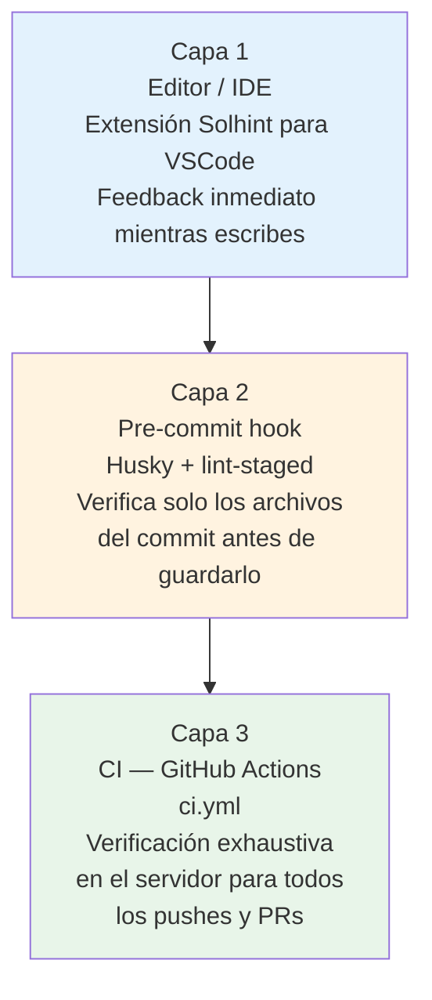

# 03 — Automatización Local: Scripts, Hooks y Reproducibilidad

> **Módulo:** 03 DevOps Práctico · UTPL Blockchain 2026
> **Prerequisito:** tener el proyecto instalado (`npm ci` ejecutado al menos una vez).

---

## Introducción

El servidor de CI ejecuta exactamente los mismos comandos que tú puedes correr en tu
máquina local. Entender esos comandos es la base para:

1. Verificar el código **antes** de hacer push (y evitar pipelines rojos).
2. Depurar fallos de CI reproduciendo el entorno localmente.
3. Automatizar la verificación con *pre-commit hooks* para que ocurra sin esfuerzo.

---

## 1. Scripts npm disponibles

El archivo `package.json` define todos los comandos del proyecto. La siguiente tabla
documenta cada uno con su propósito, cuándo usarlo y a qué paso del CI corresponde.

| Script | Comando real | Cuándo usarlo | Paso en CI |
|---|---|---|---|
| `npm run compile` | `hardhat compile` | Al cambiar el contrato `.sol`. Genera ABI y bytecode en `artifacts/` | Step 5 de `ci-pipeline` |
| `npm test` | `hardhat test` | Para verificar que el comportamiento del contrato es correcto | Step 6 de `ci-pipeline` |
| `npm run test:gas` | `REPORT_GAS=true hardhat test` | Para comparar el costo en gas de distintas implementaciones | Solo local |
| `npm run coverage` | `hardhat coverage` | Para medir qué porcentaje del contrato está cubierto por pruebas | Job `coverage` |
| `npm run lint:sol` | `solhint 'contracts/**/*.sol'` | Antes de hacer commit de cambios en `.sol` | Step 4 de `ci-pipeline` |
| `npm run lint:sol:fix` | `solhint 'contracts/**/*.sol' --fix` | Para aplicar correcciones automáticas de lint | Solo local |
| `npm run format` | `prettier --write ...` | Para formatear contratos, tests y scripts con estilo uniforme | Solo local |
| `npm run node` | `hardhat node` | Para levantar un nodo local Ethereum (en terminal separada) | Solo local |
| `npm run deploy:local` | `hardhat run scripts/deploy.js --network localhost` | Para desplegar el contrato en el nodo local | Solo local |
| `npm run security:slither` | `slither .` | Para análisis estático de seguridad (requiere Python + Slither) | Workflow DevSecOps |

### Flujo recomendado antes de hacer `git push`

```bash
# 1. Asegúrate de que el lint pasa
npm run lint:sol

# 2. Asegúrate de que compila
npm run compile

# 3. Asegúrate de que las pruebas pasan
npm test

# (Opcional) 4. Revisa la cobertura
npm run coverage
```

Si los cuatro pasos pasan localmente, el pipeline de CI casi con certeza pasará también.

---

## 2. Reproducibilidad: `npm ci` vs `npm install`

La reproducibilidad es un valor central del DevOps: el mismo código debe producir el
mismo resultado en cualquier máquina y en cualquier momento.

### El papel de `package-lock.json`

`package-lock.json` registra la versión exacta de cada dependencia instalada (incluyendo
dependencias de dependencias). Cuando lo commiteas al repositorio:

- Tu compañera instala exactamente las mismas versiones que tú.
- El servidor de CI instala exactamente las mismas versiones que tú.
- En seis meses, al retomar el proyecto, las versiones son las mismas.

### `npm ci` en lugar de `npm install`

```bash
# En CI y en onboarding de nuevos miembros — siempre:
npm ci

# Solo para actualizar dependencias intencionalmente:
npm install
npm install paquete@version
```

La diferencia crítica:

```
npm install              npm ci
─────────────────        ─────────────────────────────
Lee package.json         Lee package-lock.json (estricto)
Puede actualizar         NO actualiza package-lock.json
  package-lock.json
No borra node_modules    Borra node_modules antes de instalar
No falla si hay          FALLA si package.json y
  divergencias             package-lock.json divergen
```

> **Regla:** si tienes que hacer `npm install` para que algo funcione, hay un problema
> de sincronización que debes resolver antes de hacer push. Usa siempre `npm ci` para
> reproducir el entorno del CI.

---

## 3. Gestión de entornos y secretos con `.env`

### El problema: los secretos no van al repositorio

El archivo `hardhat.config.js` necesita una clave privada (`PRIVATE_KEY`) y una URL RPC
(`SEPOLIA_RPC_URL`) para poder desplegar a Sepolia. Estas son credenciales sensibles que
**nunca deben commitearse** al repositorio.

Si aparecieran en el historial de Git:
- Cualquier persona con acceso al repo (incluso lector) las vería.
- Git preserva el historial: aunque las borres, seguirían en commits anteriores.
- Herramientas como `git-secrets` o `truffleHog` las detectarían.

### La solución: `.env` + `.env.example`

El repositorio incluye un archivo de plantilla `.env.example`:

```bash
# Contenido de .env.example (este archivo SÍ va al repositorio)
SEPOLIA_RPC_URL=
PRIVATE_KEY=
REPORT_GAS=false
```

Pasos para configurar el entorno local:

```bash
# 1. Copia la plantilla a .env (este archivo NO va al repositorio)
cp .env.example .env

# 2. Edita .env con tus valores reales
#    (usa un editor, no lo pegues en la terminal)
nano .env   # o code .env / vim .env

# 3. Verifica que .env está en .gitignore
grep '\.env' .gitignore
```

El `.gitignore` del proyecto ya contiene:

```
.env
.env.local
.env.*.local
```

### Secretos en GitHub Actions

Para que el workflow de CI pueda acceder a variables de entorno en el servidor:

1. Ve a **Settings → Secrets and variables → Actions**.
2. Haz clic en **New repository secret**.
3. Crea `SEPOLIA_RPC_URL` y `PRIVATE_KEY` con los valores de producción.

En el archivo YAML los usarías así (no necesario para el CI actual, pero sí para el CD):

```yaml
- name: Desplegar a Sepolia
  run: npm run deploy:sepolia
  env:
    SEPOLIA_RPC_URL: ${{ secrets.SEPOLIA_RPC_URL }}
    PRIVATE_KEY: ${{ secrets.PRIVATE_KEY }}
```

> Los secrets aparecen como `***` en los logs de GitHub. Nunca se exponen en texto plano.

---

## 4. Pre-commit hooks (concepto y ejemplo)

### ¿Qué es un pre-commit hook?

Un *hook* de Git es un script que se ejecuta automáticamente cuando ocurre un evento de
Git. El hook `pre-commit` corre **justo antes** de que se cree un commit. Si el script
retorna error, el commit se cancela.

```
git commit -m "mensaje"
        │
        ▼
  ¿Existe .git/hooks/pre-commit?
        │
        ├─ Sí → Ejecuta el script
        │           ├─ Exit 0 → commit continúa
        │           └─ Exit 1 → commit CANCELADO (sin mensaje de error confuso)
        │
        └─ No → commit continúa directamente
```

Esto garantiza que **nunca se commitea código que no pasa el lint**, incluso si el
desarrollador olvida correr `npm run lint:sol` manualmente.

### Herramienta recomendada: Husky + lint-staged

[Husky](https://typicode.github.io/husky/) instala hooks de Git de forma declarativa
y multiplataforma. [lint-staged](https://github.com/lint-staged/lint-staged) los hace
eficientes: solo analiza los archivos que forman parte del commit actual.

#### Instalación (opcional para este proyecto)

```bash
# Instalar las herramientas
npm install --save-dev husky lint-staged

# Inicializar husky
npx husky init
```

#### Configuración en `package.json`

```json
{
  "scripts": {
    "prepare": "husky"
  },
  "lint-staged": {
    "contracts/**/*.sol": [
      "solhint",
      "prettier --write"
    ],
    "test/**/*.js": [
      "prettier --write"
    ]
  }
}
```

#### Archivo `.husky/pre-commit`

```bash
#!/bin/sh
# Hook pre-commit: lint de archivos staged
npx lint-staged
```

#### ¿Por qué es "opcional" en este proyecto?

Husky requiere que cada colaborador corra `npm install` (que ejecuta `prepare`) para que
los hooks queden registrados en su copia local de `.git/`. En un entorno didáctico donde
los estudiantes pueden clonar sin instalar completamente, no queremos que un hook
faltante bloquee el trabajo. El CI sigue siendo la barrera definitiva.

---

## 5. Resumen: las tres capas de automatización



Cada capa atrapa errores más tarde pero es más robusta y centralizada. La capa 3 (CI) es
la única que no se puede saltear: aplica para todos los colaboradores, incluyendo aquellos
que no configuraron las capas 1 y 2.

---

## Lecturas relacionadas

- [`02-pipeline-github-actions.md`](./02-pipeline-github-actions.md) — Cómo funciona el CI en GitHub.
- [`04-laboratorio-devops.md`](./04-laboratorio-devops.md) — Pon en práctica todo lo de este documento.
- [`../04-devsecops/`](../04-devsecops/) — Automatización de seguridad: Slither, `npm audit`, escaneo de secretos.
- Documentación de Husky: https://typicode.github.io/husky/
- Documentación de lint-staged: https://github.com/lint-staged/lint-staged
