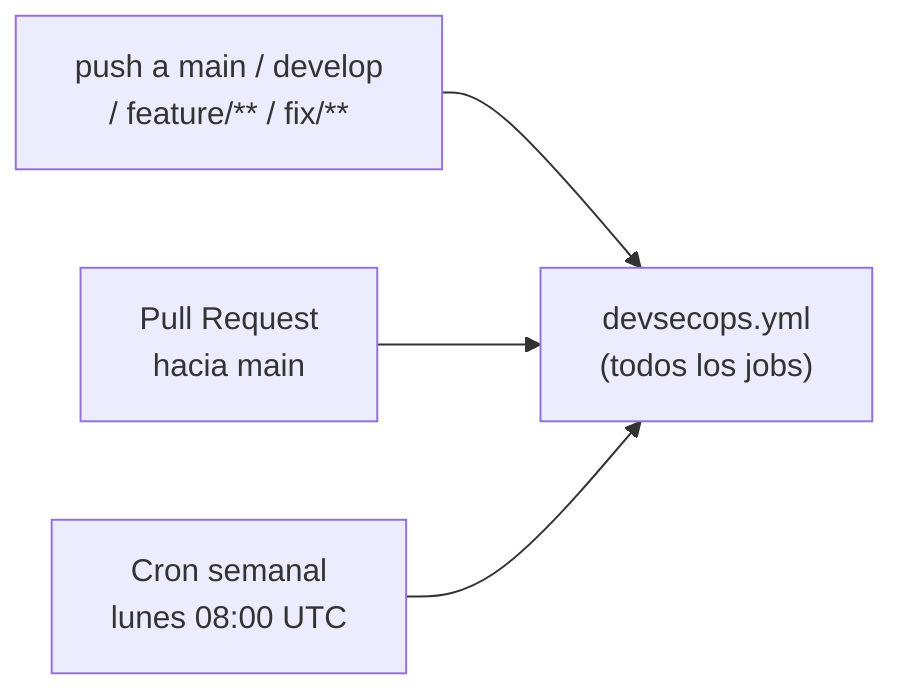

# 01 — El Pipeline DevSecOps de este Repositorio

> **Módulo:** 04 DevSecOps · **Sección:** 1.2 Fundamentos DevSecOps
> **Archivo de referencia:** `.github/workflows/devsecops.yml`
> **Marco teórico:** [docs/01-investigacion/1.2-fundamentos-devsecops.md](../01-investigacion/1.2-fundamentos-devsecops.md)

---

## 1. Visión general: seguridad en cada fase

El pipeline de este repositorio integra cuatro controles de seguridad automatizados que actúan sobre distintas capas del sistema. El siguiente diagrama muestra cómo cada herramienta se encaja en el ciclo de vida del desarrollo.

```mermaid
flowchart TD
    DEV["💻 Desarrollador\nescribe código Solidity"]
    COMMIT["git commit + git push"]

    subgraph GATE_LOCAL["Control local (antes del commit)"]
        ESLINT["Solhint en el editor\n(extensión VS Code)"]
    end

    subgraph PIPELINE["Pipeline DevSecOps · devsecops.yml"]
        direction TB

        subgraph JOB1["Job: sast-slither"]
            S1["actions/checkout@v4"]
            S2["setup-node@v4 + npm ci"]
            S3["hardhat compile"]
            S4["crytic/slither-action@v0.4.0\nSAST — análisis del AST/bytecode"]
            S5["upload-sarif → Code Scanning"]
            S1 --> S2 --> S3 --> S4 --> S5
        end

        subgraph JOB2["Job: lint-solhint"]
            L1["actions/checkout@v4"]
            L2["setup-node@v4 + npm ci"]
            L3["npm run lint:sol\nSolhint con .solhint.json"]
            L1 --> L2 --> L3
        end

        subgraph JOB3["Job: sca-npm-audit"]
            A1["actions/checkout@v4"]
            A2["setup-node@v4 + npm ci"]
            A3["npm audit --audit-level=high\nSCA — dependencias"]
            A1 --> A2 --> A3
        end

        subgraph JOB4["Job: secret-scanning-gitleaks"]
            G1["actions/checkout@v4\nfetch-depth: 0 (historial completo)"]
            G2["gitleaks/gitleaks-action@v2\nSecret scanning — todo el historial"]
            G1 --> G2
        end

        subgraph JOB5["Job: tests-cobertura"]
            T1["actions/checkout@v4"]
            T2["setup-node@v4 + npm ci"]
            T3["npm test\nSuite de seguridad funcional"]
            T4["npm run coverage\nCobertura de ramas"]
            T1 --> T2 --> T3 --> T4
        end
    end

    RESULTADO["Resultado: hallazgos en\nGitHub Security / Actions"]

    DEV --> GATE_LOCAL --> COMMIT --> PIPELINE
    JOB1 --> RESULTADO
    JOB2 --> RESULTADO
    JOB3 --> RESULTADO
    JOB4 --> RESULTADO
    JOB5 --> RESULTADO
```



---

## 2. Cuándo se dispara el pipeline



El schedule semanal es importante aunque no haya cambios en el código: detecta **nuevas vulnerabilidades** (CVE) publicadas en dependencias que se usaban la semana anterior sin problemas conocidos.

---

## 3. SAST — Análisis Estático con Slither

### ¿Qué es SAST?

**SAST** (Static Application Security Testing) analiza el código fuente o el bytecode compilado **sin ejecutarlo**. Para Solidity, Slither analiza el AST (árbol sintáctico abstracto) y el CFG (grafo de flujo de control) del contrato en busca de patrones conocidos de vulnerabilidades.

### ¿Qué detecta Slither?

| Detector | Severidad | Qué busca |
|----------|-----------|-----------|
| `reentrancy-eth` | Alta | Llamadas externas antes de actualizar estado |
| `suicidal` | Alta | Funciones que permiten destruir el contrato a cualquiera |
| `arbitrary-send-eth` | Alta | ETH enviable a dirección arbitraria |
| `controlled-delegatecall` | Alta | `delegatecall` con destino controlado por el usuario |
| `tx-origin` | Media | Uso de `tx.origin` para autenticación |
| `incorrect-equality` | Media | Comparaciones estrictas con balances/timestamps |
| `uninitialized-local` | Media | Variables locales no inicializadas |
| `missing-zero-check` | Baja | Falta validación de dirección cero |
| `events-maths` | Informativo | Operaciones aritméticas sin eventos |

### Fragmento del job en devsecops.yml

```yaml
sast-slither:
  name: "SAST — Slither (Solidity)"
  runs-on: ubuntu-latest
  continue-on-error: true   # Didáctico; en producción: false

  steps:
    - uses: actions/checkout@v4
      with:
        fetch-depth: 0

    - uses: actions/setup-node@v4
      with:
        node-version: "20"
        cache: "npm"

    - run: npm ci
    - run: npx hardhat compile  # Genera artefactos necesarios para Slither

    - uses: crytic/slither-action@v0.4.0
      with:
        target: "contracts/"
        slither-args: "--exclude-dependencies"
        sarif: results.sarif
        fail-on: none

    - uses: github/codeql-action/upload-sarif@v3
      if: always()
      with:
        sarif_file: results.sarif
      continue-on-error: true
```

### Ejecución local equivalente

```bash
# Instalar (una vez)
pip install slither-analyzer

# Correr sobre el proyecto
cd /ruta/al/repositorio
slither . --exclude-dependencies

# Ver solo hallazgos de alta severidad
slither . --filter-paths "node_modules" --json slither-output.json
```

---

## 4. Lint de Seguridad con Solhint

### ¿Qué es el lint de seguridad?

El lint de seguridad es una categoría especial de análisis estático que opera a nivel de **texto fuente** (antes de compilar) y aplica reglas de estilo y seguridad configurables. En Solidity, Solhint extiende la configuración definida en `.solhint.json`:

```json
{
  "extends": "solhint:recommended",
  "rules": {
    "compiler-version":  ["error", "^0.8.24"],
    "func-visibility":   ["error", { "ignoreConstructors": true }],
    "not-rely-on-time":  "off",
    "no-global-import":  "error",
    "reason-string":     ["warn", { "maxLength": 64 }]
  }
}
```

### Reglas de seguridad clave en `solhint:recommended`

| Regla | Impacto de seguridad |
|-------|----------------------|
| `avoid-call-value` | Alerta sobre `.call{value:}` sin verificación de retorno |
| `no-tx-origin` | Prohíbe `tx.origin` (vulnerable a phishing de contratos) |
| `reentrancy` | Detecta patrones de reentrancy por orden de operaciones |
| `func-visibility` | Fuerza visibilidad explícita (evita funciones públicas no intencionadas) |
| `compiler-version` | Fija la versión del compilador (evita comportamientos inesperados) |
| `no-global-import` | Prohíbe `import "X.sol"` sin nombre (evita colisiones de namespace) |

### Fragmento del job en devsecops.yml

```yaml
lint-solhint:
  name: "Lint de Seguridad — Solhint"
  runs-on: ubuntu-latest

  steps:
    - uses: actions/checkout@v4
    - uses: actions/setup-node@v4
      with:
        node-version: "20"
        cache: "npm"
    - run: npm ci
    - run: npm run lint:sol    # Definido en package.json como: solhint 'contracts/**/*.sol'
```

---

## 5. SCA — Análisis de Dependencias con npm audit

### ¿Qué es SCA?

**SCA** (Software Composition Analysis) audita los componentes de terceros incluidos en el proyecto. Aunque el contrato Solidity es el activo principal, el toolchain (Hardhat, plugins, Solhint) también puede contener vulnerabilidades que comprometan el entorno de compilación o despliegue.

### Ejemplo de salida de npm audit

```
# npm audit --audit-level=high

found 0 vulnerabilities

# Si hubiera un hallazgo, se vería así:
┌─────────────────────────────────────────────┐
│                    Manual Review             │
│  Some vulnerabilities require your attention │
├────────────┬────────────────────────────────┤
│ high       │ Prototype Pollution             │
│ Package    │ @nomicfoundation/hardhat-chai.. │
│ Patched in │ >=2.0.1                         │
│ More info  │ https://npmsec.io/GHSA-xxx      │
└────────────┴────────────────────────────────┘
```

### Fragmento del job en devsecops.yml

```yaml
sca-npm-audit:
  name: "SCA — npm audit (dependencias)"
  runs-on: ubuntu-latest
  continue-on-error: true   # Didáctico; en producción: false

  steps:
    - uses: actions/checkout@v4
    - uses: actions/setup-node@v4
      with:
        node-version: "20"
        cache: "npm"
    - run: npm ci
    - run: npm audit --audit-level=high --json || npm audit --audit-level=high
```

---

## 6. Secret Scanning con Gitleaks

### ¿Por qué es el control más crítico en blockchain?

Una clave privada de Ethereum filtrada en GitHub no solo compromete una credencial: permite a cualquier persona **transferir todos los fondos** y **ejecutar transacciones arbitrarias** desde esa cuenta. La blockchain es pública e irreversible: no hay soporte técnico que pueda deshacer el robo.

Gitleaks escanea **todo el historial de git** (no solo el commit actual) porque un secreto puede haber sido introducido y luego "borrado" con otro commit. En git, el contenido borrado sigue siendo accesible en el historial.

```yaml
secret-scanning-gitleaks:
  name: "Secret Scanning — Gitleaks"
  runs-on: ubuntu-latest

  steps:
    - uses: actions/checkout@v4
      with:
        fetch-depth: 0      # CRÍTICO: historial completo, no solo HEAD

    - uses: gitleaks/gitleaks-action@v2
      env:
        GITHUB_TOKEN: ${{ secrets.GITHUB_TOKEN }}
```

### Patrones que detecta Gitleaks (ejemplos relevantes para Ethereum)

| Patrón | Regex de ejemplo | Riesgo |
|--------|-----------------|--------|
| Ethereum private key | `(?:0x)?[0-9a-fA-F]{64}` | Pérdida total de fondos |
| Alchemy API key | `alch_[A-Za-z0-9]{32}` | Abuso de cuota RPC |
| Infura project secret | `[0-9a-f]{32}` (en contexto) | Abuso de cuota RPC |
| GitHub token | `ghp_[0-9a-zA-Z]{36}` | Acceso no autorizado al repo |
| AWS secret key | `[A-Za-z0-9+/]{40}` (en contexto) | Costo y acceso a infraestructura |

---

## 7. Tests de Seguridad Funcional

Las pruebas automatizadas con Hardhat validan el **comportamiento de seguridad** del contrato:

- Un emisor NO autorizado no puede emitir certificados (debe revertir con `NoAutorizado`).
- Solo el propietario puede autorizar/revocar emisores (debe revertir con `NoEsPropietario`).
- La dirección cero es rechazada (debe revertir con `DireccionInvalida`).
- Un certificado ya revocado no puede revocarse dos veces (`CertificadoYaRevocado`).

```bash
# Ejecutar pruebas localmente
npm test

# Generar cobertura de código del contrato
npm run coverage
```

---

## 8. Resumen: mapeo herramienta → job → propósito

| Herramienta | Job en devsecops.yml | Tipo | Bloquea en prod. |
|-------------|----------------------|------|-----------------|
| Slither | `sast-slither` | SAST | Sí (fail-on: high) |
| Solhint | `lint-solhint` | Lint seguridad | Sí |
| npm audit | `sca-npm-audit` | SCA | Sí (--audit-level=high) |
| Gitleaks | `secret-scanning-gitleaks` | Secret scan | Sí (siempre) |
| Hardhat test | `tests-cobertura` | DAST funcional | Sí |

> **Nota didáctica:** Los jobs de Slither y npm audit tienen `continue-on-error: true` en este repositorio para facilitar el aprendizaje sin bloquear el pipeline. En un proyecto de producción, todos los jobs deben fallar el pipeline si encuentran hallazgos de alta severidad.

---

*Siguiente: [02-vulnerabilidades-smart-contracts.md](./02-vulnerabilidades-smart-contracts.md) — Las 8 vulnerabilidades más frecuentes en contratos Solidity.*
