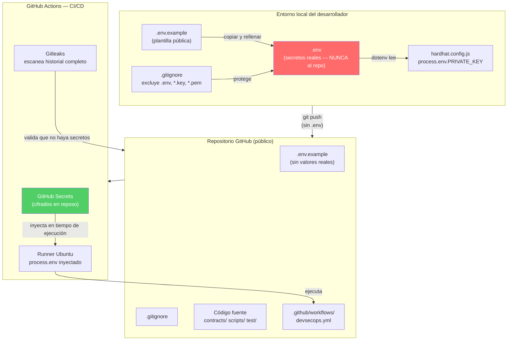

# 03 — Gestión de Secretos en Proyectos Blockchain

> **Módulo:** 04 DevSecOps · **Sección:** 1.2 Fundamentos DevSecOps
> **Archivos de referencia:** `.env.example` · `.gitignore` · `.github/workflows/devsecops.yml`
> **Marco teórico:** [docs/01-investigacion/1.2-fundamentos-devsecops.md](../01-investigacion/1.2-fundamentos-devsecops.md)

---

## 1. El riesgo específico de blockchain: no hay marcha atrás

En el desarrollo web tradicional, si una clave API se filtra a un repositorio público, se revoca y se genera una nueva. El impacto es controlable. En blockchain, el riesgo es cualitativamente diferente:

> **Una clave privada de Ethereum filtrada en GitHub equivale a publicar el PIN y el número de tu cuenta bancaria en un cartel en Times Square, de forma permanente e irreversible.**

Las razones por las que blockchain amplifica este riesgo:

| Característica de blockchain | Consecuencia de filtrar una private key |
|-------------------------------|------------------------------------------|
| **Transacciones irreversibles** | Los fondos robados no pueden recuperarse |
| **Sin intermediario central** | No hay banco ni soporte que pueda congelar la cuenta |
| **Historial público y permanente** | La clave filtrada sigue en el historial de git para siempre |
| **Automatización 24/7** | Un bot puede drenar la cuenta en segundos tras detectar la clave |
| **Contratos inmutables** | Si el despliegue se hizo con una clave comprometida, el contrato también lo está |

---

## 2. ¿Qué es un secreto en este proyecto?

| Secreto | Descripción | Riesgo si se filtra |
|---------|-------------|---------------------|
| `PRIVATE_KEY` | Clave privada Ethereum de la cuenta de despliegue | Pérdida total de fondos de esa cuenta |
| `SEPOLIA_RPC_URL` | URL con API key de Alchemy/Infura | Abuso de cuota, costos inesperados |
| `ETHERSCAN_API_KEY` | Clave de la API de Etherscan | Abuso de cuota de verificación |
| Tokens de acceso (GitHub, CI) | Credenciales de automatización | Acceso no autorizado al repositorio/pipeline |

---

## 3. La regla de oro: secretos fuera del repositorio

```
NUNCA             → .env, *.key, *.pem en el repositorio
NUNCA             → Claves hardcoded en hardhat.config.js, scripts o contratos
SIEMPRE           → Variables de entorno que se inyectan en tiempo de ejecución
SIEMPRE           → .env.example para documentar qué variables son necesarias
```

### Cómo lo implementa este repositorio

**Paso 1 — `.gitignore` excluye los secretos:**

```gitignore
# Variables de entorno y secretos (NUNCA subir al repositorio - DevSecOps)
.env
.env.local
*.key
*.pem
```

**Paso 2 — `.env.example` documenta la estructura sin valores reales:**

```bash
# Copia este archivo a `.env` y rellena los valores.
# El archivo .env está en .gitignore y NUNCA debe subirse.

# URL del nodo RPC para Sepolia (ej: Alchemy, Infura)
SEPOLIA_RPC_URL=

# Clave privada de la cuenta de despliegue (¡SOLO una cuenta de pruebas!)
PRIVATE_KEY=

# Activar el reporte de gas en las pruebas (true/false)
REPORT_GAS=false
```

**Paso 3 — `hardhat.config.js` lee del entorno, nunca hardcodea:**

```javascript
// hardhat.config.js — patrón correcto
require("dotenv").config();

module.exports = {
  networks: {
    sepolia: {
      url: process.env.SEPOLIA_RPC_URL || "",      // Desde variable de entorno
      accounts: process.env.PRIVATE_KEY             // Desde variable de entorno
        ? [process.env.PRIVATE_KEY]
        : [],
    },
  },
};
```

---

## 4. Flujo completo de secretos



---

## 5. GitHub Secrets: secretos en el pipeline

Para que el pipeline pueda hacer despliegues reales (por ejemplo, a Sepolia), las claves se configuran como **GitHub Secrets**, que son:

- Cifrados en reposo con libsodium
- Nunca visibles en logs (se muestran como `***`)
- Solo inyectados como variables de entorno durante la ejecución del workflow
- No accesibles para forks en pull requests de terceros

### Cómo configurar un GitHub Secret

```
1. Ir al repositorio en GitHub
2. Settings → Secrets and variables → Actions
3. "New repository secret"
4. Nombre: PRIVATE_KEY (sin el valor con 0x)
5. Valor: la clave privada real
```

### Cómo referenciarlos en el workflow

```yaml
# .github/workflows/devsecops.yml
- name: Desplegar a Sepolia
  run: npx hardhat run scripts/deploy.js --network sepolia
  env:
    PRIVATE_KEY: ${{ secrets.PRIVATE_KEY }}        # Inyectado desde GitHub Secrets
    SEPOLIA_RPC_URL: ${{ secrets.SEPOLIA_RPC_URL }}
```

> **Nota:** El job `secret-scanning-gitleaks` en `devsecops.yml` solo usa `GITHUB_TOKEN`, que es un token temporal generado automáticamente por GitHub para cada ejecución del workflow. No requiere configuración manual.

---

## 6. Detección automática: Gitleaks en el pipeline

Gitleaks es la última línea de defensa. Incluso si un desarrollador comete el error de incluir una clave en un commit (que luego borra en otro commit), Gitleaks lo detecta porque escanea **todo el historial**:

```yaml
# Fragmento de devsecops.yml — job de secret scanning
- name: Obtener código fuente (historial completo)
  uses: actions/checkout@v4
  with:
    fetch-depth: 0  # CRÍTICO: 0 = historial completo, no solo el último commit

- name: Escanear secretos con Gitleaks
  uses: gitleaks/gitleaks-action@v2
  env:
    GITHUB_TOKEN: ${{ secrets.GITHUB_TOKEN }}
```

### Qué pasa si Gitleaks detecta un secreto

```
CRIT  leaks found: 1

Finding:     PRIVATE_KEY=0xac0974bec39a17e36ba4a6b4d238ff944bacb478cbed5efcae784d7bf4f2ff80
Secret:      0xac0974bec39a17e36ba4a6b4d238ff944bacb478cbed5efcae784d7bf4f2ff80
RuleID:      ethereum-private-key
Entropy:     3.81
File:        .env
Line:        4
Commit:      a3f2b1c...
Author:      estudiante@utpl.edu.ec
Date:        2026-05-01T10:23:45Z
```

El job falla, el PR no puede fusionarse y el equipo recibe una notificación.

---

## 7. Rotación de secretos

La rotación periódica de secretos minimiza el impacto de una filtración no detectada:

| Secreto | Frecuencia de rotación recomendada | Cómo rotar |
|---------|-----------------------------------|------------|
| Clave privada de despliegue | Cada 90 días o al cambiar de personal | Generar nueva cuenta, transferir rol de propietario, revocar la anterior |
| API key de Alchemy/Infura | Cada 90 días | Panel web del proveedor → Regenerar clave → Actualizar GitHub Secret |
| Token de GitHub (PAT) | Cada 30–60 días | GitHub Settings → Developer settings → PATs → Regenerate |

### Transferir el rol de propietario del contrato (rotación de clave)

```solidity
// Si se necesita transferir el control del contrato a una nueva dirección,
// el contrato actual NO tiene una función de transferencia de propietario.
// Esto es una limitación didáctica intencional: en producción se usaría
// OpenZeppelin Ownable con transferOwnership().

// Para este repositorio, la rotación de clave implica:
// 1. Revocar todos los emisores actuales
// 2. Desplegar un nuevo contrato desde la nueva cuenta
// 3. Revocar los permisos del contrato antiguo (off-chain)
```

---

## 8. Errores comunes y cómo evitarlos

| Error | Consecuencia | Cómo evitarlo |
|-------|-------------|---------------|
| Commitear `.env` con valores reales | Clave expuesta públicamente | `.gitignore` + Gitleaks |
| Hardcodear `PRIVATE_KEY` en `hardhat.config.js` | Clave en el repositorio | Siempre usar `process.env` |
| Usar la misma cuenta para pruebas y mainnet | Pérdida de fondos reales en un accidente | Cuentas separadas por entorno |
| Subir capturas de pantalla con claves visibles | Exposición visual | Revisar imágenes antes de pushear |
| Compartir la clave por Slack/email | Rastro digital permanente | Solo GitHub Secrets o gestores de secretos |
| No revocar claves de ex-colaboradores | Acceso no autorizado indefinido | Proceso de offboarding con checklist |

---

*Siguiente: [04-laboratorio-devsecops.md](./04-laboratorio-devsecops.md) — Laboratorio paso a paso: instalar Slither, analizar el contrato e introducir una vulnerabilidad deliberada.*
