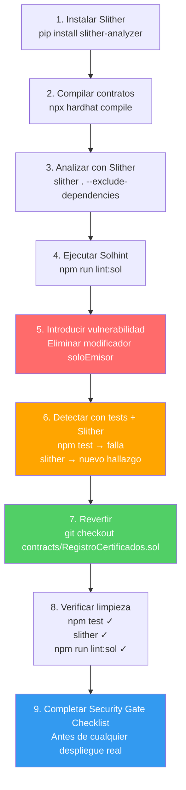

# 04 — Laboratorio DevSecOps: Análisis y Detección de Vulnerabilidades

> **Módulo:** 04 DevSecOps · **Sección:** 1.2 Fundamentos DevSecOps
> **Duración estimada:** 45–60 minutos
> **Prerrequisitos:** Node.js 20+, Python 3.8+, repositorio clonado y `npm ci` ejecutado
> **Archivos involucrados:** `contracts/RegistroCertificados.sol`, `test/`, `.solhint.json`

---

## Objetivos del laboratorio

Al completar este laboratorio, el estudiante habrá:

1. Instalado y ejecutado Slither sobre el contrato real del repositorio.
2. Interpretado la salida de Slither y clasificado sus hallazgos.
3. Ejecutado Solhint y comprendido cada regla activada.
4. Introducido deliberadamente una vulnerabilidad de control de acceso y verificado que las herramientas la detectan.
5. Revertido la vulnerabilidad y validado que el pipeline vuelve a estar limpio.
6. Completado el checklist de seguridad ("security gate") antes de un despliegue.

---

## Parte 1 — Análisis estático con Slither

### 1.1 Instalación de Slither

Slither requiere Python 3.8 o superior. Se recomienda usar un entorno virtual para no contaminar la instalación global de Python.

```bash
# Verificar versión de Python
python3 --version   # Debe ser >= 3.8

# Opción A: instalación directa (más sencilla para el laboratorio)
pip install slither-analyzer

# Opción B: entorno virtual (recomendado para producción)
python3 -m venv .venv
source .venv/bin/activate   # En macOS/Linux
# .venv\Scripts\activate    # En Windows
pip install slither-analyzer

# Verificar instalación
slither --version
```

### 1.2 Compilar los contratos antes de analizar

Slither necesita los artefactos compilados de Hardhat. Asegúrate de compilar primero:

```bash
# Desde la raíz del repositorio
npm ci                  # Instalar dependencias (si no lo has hecho)
npx hardhat compile     # Genera artifacts/ con el ABI y bytecode
```

### 1.3 Ejecutar Slither

```bash
# Análisis completo del proyecto
slither .

# Excluir dependencias de node_modules (reducir ruido)
slither . --exclude-dependencies

# Ver solo hallazgos de alta y media severidad
slither . --exclude-dependencies --filter-paths "node_modules"

# Exportar reporte en JSON (para integración con otras herramientas)
slither . --json slither-reporte.json

# Equivalente al script de npm definido en package.json:
npm run security:slither
```

### 1.4 Interpretar la salida de Slither

La salida de Slither tiene este formato:

```
INFO:Detectors:
RegistroCertificados.emitirCertificado(string,string) (contracts/RegistroCertificados.sol#128-153)
uses a weak PRNG: "hashCertificado = keccak256(abi.encodePacked(...))" (contracts/RegistroCertificados.sol#134-136)
- block.timestamp (contracts/RegistroCertificados.sol#135)
Reference: https://github.com/crytic/slither/wiki/Detector-Documentation#weak-prng
```

**Cómo leer cada campo:**

| Campo | Significado |
|-------|-------------|
| `INFO:Detectors:` | Categoría del hallazgo |
| Nombre de función | Dónde ocurre el patrón detectado |
| `(contracts/X.sol#L)` | Archivo y número de línea exacto |
| Descripción | Qué patrón detectó el analizador |
| `Reference:` | Enlace a la documentación del detector |

**Niveles de severidad en Slither:**

| Color / Etiqueta | Severidad | Acción recomendada |
|-----------------|-----------|-------------------|
| Rojo / `High` | Alta | Corregir antes de desplegar |
| Naranja / `Medium` | Media | Evaluar y corregir |
| Amarillo / `Low` | Baja | Documentar y evaluar |
| Azul / `Informational` | Informativo | Revisar para buenas prácticas |
| Gris / `Optimization` | Optimización | Considerar para eficiencia de gas |

### 1.5 Hallazgos esperados en RegistroCertificados.sol

Al correr Slither sobre el contrato del repositorio, es probable encontrar hallazgos de nivel **Informativo** o **Bajo** relacionados con:

- **`weak-prng`** — El uso de `block.timestamp` en `keccak256` para generar el hash del certificado. Es un hallazgo verdadero pero de impacto bajo en este contexto: no se usa para aleatoriedad sino para unicidad del certificado. Se puede suprimir documentándolo.
- **`timestamp`** — Dependencia de `block.timestamp` para registrar `fechaEmision`. Uso aceptable e intencional (por eso `.solhint.json` tiene `"not-rely-on-time": "off"`).

No debería haber hallazgos de **Alta** severidad en el contrato bien diseñado. Si los encuentras, es una señal de que algo cambió en el contrato.

---

## Parte 2 — Lint de seguridad con Solhint

### 2.1 Ejecutar Solhint

```bash
# Lint sobre todos los contratos (script definido en package.json)
npm run lint:sol

# Equivalente directo:
npx solhint 'contracts/**/*.sol'

# Ver las reglas activas sin analizar archivos
npx solhint --print-config contracts/RegistroCertificados.sol

# Corrección automática (solo reglas de estilo, no de seguridad)
npm run lint:sol:fix
```

### 2.2 Interpretar la salida de Solhint

```
contracts/RegistroCertificados.sol
  128:5  warning  Provide an error message for revert  reason-string

✖ 1 problem (0 errors, 1 warning)
```

| Símbolo | Nivel | Comportamiento |
|---------|-------|---------------|
| `error` | Error | Falla el proceso (exit code != 0), bloquea el pipeline |
| `warning` | Advertencia | Solo informa, no bloquea (a menos que se configure `--max-warnings 0`) |

### 2.3 Reglas de seguridad activas en este proyecto

Las reglas heredadas de `solhint:recommended` más importantes:

```
avoid-call-value           → error   → prohíbe .call{value:} sin verificación
no-tx-origin               → error   → prohíbe tx.origin
reentrancy                 → error   → detecta patrones de reentrancy
func-visibility            → error   → requiere visibilidad explícita
compiler-version           → error   → fija versión ^0.8.24
no-global-import           → error   → prohíbe imports sin nombre específico
reason-string              → warning → recomienda mensajes en require/revert
```

---

## Parte 3 — Introducir y detectar una vulnerabilidad deliberada

> **Propósito didáctico:** ver cómo las herramientas de seguridad detectan automáticamente un defecto de control de acceso. Este ejercicio simula un error real que podría ocurrir durante el desarrollo.

### 3.1 Crear una rama de trabajo

```bash
# Crear una rama separada para la vulnerabilidad (NUNCA hacer esto en main)
git checkout -b lab/vulnerabilidad-control-acceso
```

### 3.2 Modificar el contrato para introducir la vulnerabilidad

Abre `contracts/RegistroCertificados.sol` y **elimina el modificador `soloEmisor`** de la función `emitirCertificado`:

**ANTES (código correcto — línea 128):**

```solidity
function emitirCertificado(string calldata nombreEstudiante, string calldata curso)
    external
    soloEmisor          // <-- Este modificador protege la función
    returns (bytes32 hashCertificado)
```

**DESPUÉS (código vulnerable — quitar el modificador):**

```solidity
function emitirCertificado(string calldata nombreEstudiante, string calldata curso)
    external
    // soloEmisor    <-- Comentado/eliminado: ¡CUALQUIER dirección puede emitir!
    returns (bytes32 hashCertificado)
```

Guarda el archivo.

### 3.3 Verificar que Slither detecta la regresión

```bash
# Compilar con la versión vulnerable
npx hardhat compile

# Slither ahora debería reportar un hallazgo de control de acceso
slither . --exclude-dependencies
```

Slither reportará algo similar a:

```
INFO:Detectors:
RegistroCertificados.emitirCertificado(string,string) (contracts/RegistroCertificados.sol#128-153)
is an external function without access control
Reference: https://github.com/crytic/slither/wiki/Detector-Documentation#missing-zero-check
```

### 3.4 Verificar que los tests detectan la regresión

```bash
npm test
```

Los tests deben fallar. Busca en la salida algo similar a:

```
  Emisión de certificados
    ✓ Un emisor autorizado puede emitir un certificado
    1) Una dirección no autorizada NO puede emitir un certificado

  1 failing

  1) Una dirección no autorizada NO puede emitir un certificado:
     AssertionError: Expected transaction to be reverted with custom error
     'NoAutorizado', but it succeeded.
```

Esto confirma que el test de seguridad detecta el error: la transacción que debería revertir con `NoAutorizado` ahora tiene éxito porque quitamos el modificador.

### 3.5 Verificar que Solhint no bloquea (pero el pipeline sí)

```bash
npm run lint:sol
```

Solhint no detecta ausencia de modificadores (eso es labor de Slither), pero el pipeline completo en GitHub Actions fallaría por los tests y por Slither.

### 3.6 Revertir la vulnerabilidad

```bash
# Revertir todos los cambios en el archivo del contrato
git checkout contracts/RegistroCertificados.sol

# Verificar que el archivo fue restaurado
git diff contracts/RegistroCertificados.sol
# No debe mostrar diferencias
```

### 3.7 Confirmar que todo vuelve a estar limpio

```bash
# Los tests deben pasar todos
npm test

# Slither no debe reportar hallazgos de alta severidad
slither . --exclude-dependencies

# Solhint no debe reportar errores
npm run lint:sol
```

```bash
# Eliminar la rama del laboratorio (ya no la necesitamos)
git checkout main
git branch -D lab/vulnerabilidad-control-acceso
```

---

## Parte 4 — Auditoría de dependencias

```bash
# Auditar dependencias del proyecto
npm audit

# Solo mostrar vulnerabilidades de nivel alto o crítico
npm audit --audit-level=high

# Ver el reporte en formato JSON
npm audit --json

# Actualizar dependencias para corregir vulnerabilidades (con precaución)
npm audit fix

# Si la corrección requiere cambios de versión mayor (breaking changes):
npm audit fix --force  # ¡Revisar manualmente después!
```

---

## Parte 5 — Checklist de seguridad (Security Gate)

Antes de cualquier despliegue a una red real (testnet o mainnet), verifica este checklist completo:

```markdown
## Security Gate — Checklist Pre-Despliegue

### Análisis estático (SAST)
- [ ] `slither . --exclude-dependencies` no reporta hallazgos de severidad HIGH
- [ ] Todos los hallazgos MEDIUM están documentados y justificados
- [ ] No hay detectores de reentrancy activos en funciones que manejan ETH

### Lint de seguridad
- [ ] `npm run lint:sol` termina con 0 errores
- [ ] Las advertencias (warnings) están revisadas y son aceptables
- [ ] `.solhint.json` no tiene reglas de seguridad desactivadas sin justificación

### Análisis de dependencias (SCA)
- [ ] `npm audit --audit-level=high` reporta 0 vulnerabilidades HIGH o CRITICAL
- [ ] `package-lock.json` está committeado y coincide con `package.json`

### Secretos
- [ ] `git log --all -- .env` no muestra commits con el archivo `.env`
- [ ] Gitleaks no reporta ningún secreto en el historial: `gitleaks detect --source .`
- [ ] El archivo `.env` no aparece en `git status`
- [ ] Las claves privadas están en GitHub Secrets, no en el repositorio

### Tests
- [ ] `npm test` pasa al 100% (0 tests fallidos)
- [ ] `npm run coverage` muestra cobertura > 80% en funciones del contrato
- [ ] Los tests de control de acceso están presentes y pasan:
  - [ ] Test: emisor no autorizado no puede emitir
  - [ ] Test: no-propietario no puede autorizar emisores
  - [ ] Test: dirección cero es rechazada

### Revisión manual
- [ ] El contrato fue revisado por al menos otro miembro del equipo (4-eyes principle)
- [ ] No hay funciones `selfdestruct` no intencionadas
- [ ] No hay uso de `tx.origin`
- [ ] No hay llamadas externas antes de actualizar el estado (CEI pattern)
- [ ] Los eventos de auditoría cubren todas las operaciones sensibles

### Despliegue
- [ ] Se está desplegando a la red correcta (no mainnet accidentalmente)
- [ ] La dirección del contrato desplegado se registra en el equipo
- [ ] El constructor inicializa el propietario correctamente
- [ ] Se verificó el contrato en Etherscan (si aplica)
```

---

## Resumen del laboratorio



---

## Referencia rápida de comandos

```bash
# Slither
pip install slither-analyzer
slither . --exclude-dependencies
npm run security:slither         # Script de npm definido en package.json

# Solhint
npm run lint:sol                 # Analizar contratos
npm run lint:sol:fix             # Corrección automática (solo estilo)

# npm audit
npm audit                        # Todos los niveles
npm audit --audit-level=high     # Solo HIGH y CRITICAL

# Gitleaks (instalación local)
brew install gitleaks            # macOS
gitleaks detect --source .       # Escanear el repositorio local

# Tests y cobertura
npm test                         # Suite completa
npm run coverage                 # Cobertura de código del contrato
```

---

*Para más información sobre el pipeline que ejecuta estas herramientas automáticamente, ver: [01-pipeline-seguro.md](./01-pipeline-seguro.md)*

*Para entender las vulnerabilidades detectadas en detalle, ver: [02-vulnerabilidades-smart-contracts.md](./02-vulnerabilidades-smart-contracts.md)*
