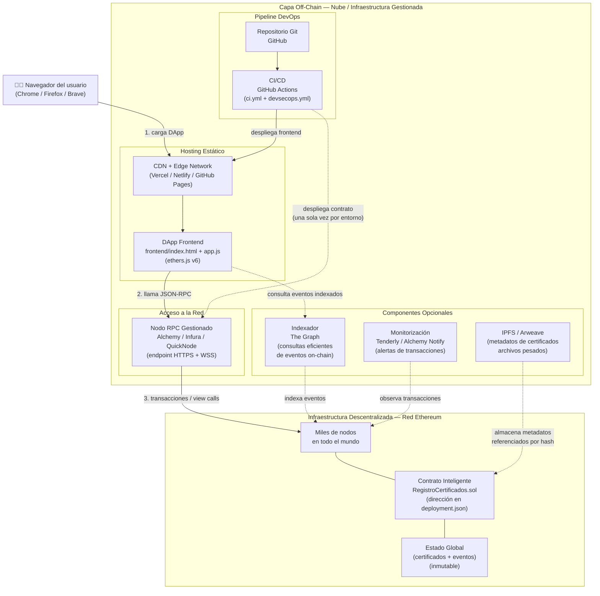
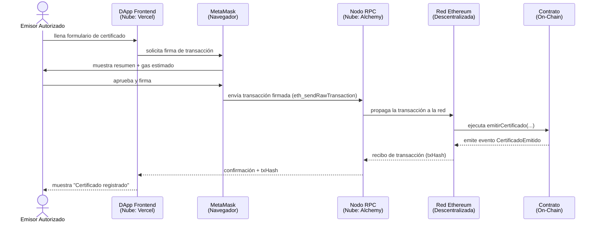

# 01 — Arquitectura en la Nube de la Solución

> **Módulo 05 · Unidad 1: Blockchain DevOps · UTPL · Abril–Agosto 2026**

---

## Introducción

Una DApp (Aplicación Descentralizada) tiene una arquitectura híbrida: parte de su lógica y estado viven en la blockchain (on-chain), mientras que el resto de los componentes viven fuera de ella (off-chain). La nube tradicional es el hogar natural de esa capa off-chain.

Este documento describe la arquitectura completa de la solución **Registro de Certificados**, identificando cada componente, su responsabilidad y dónde se aloja.

> **Referencia cruzada:** la vista de despliegue base (entornos, artefactos, nodos) está en [`../02-arquitectura/06-vista-despliegue.md`](../02-arquitectura/06-vista-despliegue.md). Este documento amplía esa vista desde la perspectiva de los servicios en la nube.

---

## Diagrama de arquitectura completo



### Leyenda del diagrama

- **Flechas sólidas (→):** flujo principal de la DApp en producción.
- **Flechas punteadas (-.→):** componentes opcionales o flujos de administración.
- **Caja azul (Nube):** infraestructura gestionada, actualizable, con costos en USD.
- **Caja naranja (Blockchain):** infraestructura descentralizada, inmutable, con costos en gas.

---

## Tabla de componentes

| Componente | Responsabilidad | Opciones de servicio | Tipo |
|---|---|---|---|
| **CDN / Hosting estático** | Servir `index.html`, `app.js` y `deployment.json` al navegador con baja latencia global | Vercel, Netlify, GitHub Pages, IPFS/Fleek | Nube (off-chain) |
| **Nodo RPC gestionado** | Traducir las llamadas de ethers.js a comunicación con la red Ethereum (JSON-RPC sobre HTTPS/WSS) | Alchemy, Infura, QuickNode, nodo propio | Nube (off-chain) |
| **Contrato inteligente** | Contener la lógica de negocio: emitir, verificar y revocar certificados | Ethereum Mainnet, Sepolia Testnet, Hardhat local | Blockchain (on-chain) |
| **Estado global** | Almacenar el mapping de certificados y el historial de eventos | Ethereum (inmutable) | Blockchain (on-chain) |
| **MetaMask / Wallet** | Firmar transacciones en el navegador del usuario; gestionar claves privadas del usuario | MetaMask, WalletConnect, Coinbase Wallet | Cliente (navegador) |
| **Pipeline CI/CD** | Ejecutar pruebas, análisis de seguridad y despliegue automático del frontend | GitHub Actions | Nube (off-chain) |
| **IPFS / Arweave** *(opcional)* | Almacenar archivos de certificados (PDF, imágenes) cuyo hash se registra on-chain | IPFS (Pinata, Fleek), Arweave | Almacenamiento descentralizado |
| **Indexador** *(opcional)* | Indexar eventos `CertificadoEmitido` para consultas eficientes sin iterar toda la cadena | The Graph, Moralis, Alchemy Subgraph | Nube (off-chain) |
| **Monitorización** *(opcional)* | Enviar alertas ante transacciones fallidas, consumo de gas anómalo o cambios de propietario | Tenderly, Alchemy Notify, OpenZeppelin Defender | Nube (off-chain) |

---

## El flujo de una transacción de extremo a extremo

Para registrar un certificado, el flujo atraviesa ambas capas:



**Observación clave:** el nodo RPC (nube) nunca toca las claves privadas del emisor. MetaMask firma localmente en el navegador. El nodo solo retransmite la transacción ya firmada.

---

## ¿Por qué no poner todo on-chain?

Es una pregunta natural. La respuesta es económica y técnica:

| Lo que se almacena | Costo estimado en gas (Ethereum mainnet) | Conclusión |
|---|---|---|
| Un hash de 32 bytes (`bytes32`) | ~20 000 gas ≈ $0.50–$2 USD | Viable on-chain |
| Un string corto (nombre, 50 chars) | ~50 000 gas ≈ $1–$5 USD | Caro, pero posible |
| Un archivo PDF de 1 MB | ~21 000 000 gas ≈ $500–$2 000 USD | Inviable on-chain |
| Una imagen de 5 MB | ~105 000 000 gas ≈ $2 500–$10 000 USD | Imposible en la práctica |

La arquitectura correcta almacena **solo el hash** del certificado on-chain y delega el archivo real a IPFS o almacenamiento en la nube.

---

## Componentes opcionales explicados

### IPFS para metadatos

IPFS (InterPlanetary File System) es un sistema de archivos distribuido direccionado por contenido. Cada archivo tiene un identificador único (CID) derivado de su hash. Al registrar un certificado, se puede guardar en el contrato el CID del PDF del certificado:

```
// Ejemplo conceptual en el contrato
struct Certificado {
    bytes32 idHash;       // hash del ID del certificado
    string  ipfsCid;      // CID del archivo en IPFS (ej: QmXyz...)
    uint256 timestamp;
    bool    revocado;
}
```

Ventaja: el archivo en IPFS es verificable (nadie puede cambiar un archivo sin cambiar su CID) y está fuera de la blockchain (barato de almacenar).

### Indexador: The Graph

Los eventos on-chain (`CertificadoEmitido`, `CertificadoRevocado`) son eficientes para notificaciones pero lentos para consultas históricas masivas. The Graph es un protocolo de indexación que:

1. Escucha los eventos de un contrato.
2. Los organiza en un almacén de consultas (GraphQL).
3. Permite responder preguntas como "todos los certificados emitidos a este estudiante" en milisegundos, sin iterar miles de bloques.

### Monitorización con Tenderly / Alchemy Notify

Permiten configurar alertas como:
- "Avísame si alguien llama a `revocarCertificado`."
- "Avísame si el propietario del contrato cambia."
- "Avísame si una transacción falla con out-of-gas."

Estas alertas son el equivalente blockchain de los monitores de CloudWatch o Datadog.

---

## Resumen

La arquitectura de la solución **no es ni puramente centralizada ni puramente descentralizada**: es una arquitectura **híbrida deliberada** que coloca cada componente donde es más apropiado. La nube es la capa que hace que la tecnología blockchain sea accesible a los usuarios finales.

> **Siguiente paso:** revisa [02-hosting-frontend.md](02-hosting-frontend.md) para ver cómo se despliega el frontend en la nube.
