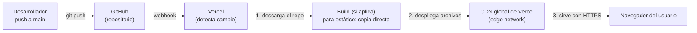
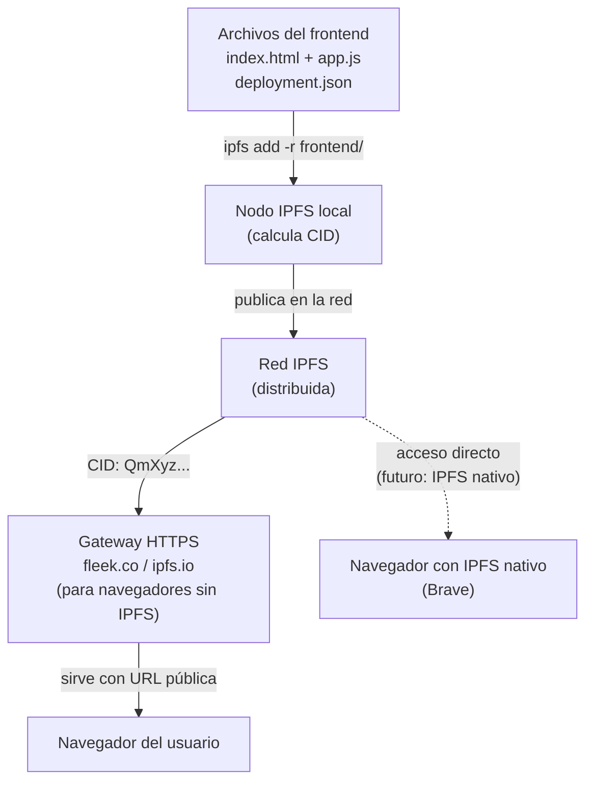

# 02 — Hosting del Frontend Estático

> **Módulo 05 · Unidad 1: Blockchain DevOps · UTPL · Abril–Agosto 2026**

---

## Introducción: un frontend que no necesita servidor

El frontend de nuestra DApp (`frontend/index.html` + `frontend/app.js`) es **completamente estático**: no hay Node.js, no hay PHP, no hay base de datos propia. Son archivos HTML y JavaScript que se ejecutan íntegramente en el navegador del usuario.

Esto simplifica enormemente el hosting:

- **No se necesita un servidor de aplicaciones** (no hay Express, no hay Django).
- **No hay estado propio** en el servidor: el estado vive on-chain (en el contrato) o en el navegador del usuario (MetaMask).
- **Se puede servir desde cualquier CDN** capaz de entregar archivos estáticos.

```
frontend/
├── index.html          # Interfaz de usuario
├── app.js              # Lógica de la DApp con ethers.js v6
└── deployment.json     # Dirección del contrato + ABI (generado por scripts/deploy.js)
```

El archivo `deployment.json` es el nexo entre el frontend y el contrato desplegado. Contiene la dirección del contrato en la red correspondiente y el ABI (interfaz binaria de la aplicación). Se genera automáticamente durante el proceso de despliegue.

---

## Opciones de hosting estático

### Comparativa de plataformas

| Plataforma | Costo base | Facilidad de uso | Deploy automático (CI) | Descentralización | HTTPS automático | CDN global | Caso de uso ideal |
|---|---|---|---|---|---|---|---|
| **Vercel** | Gratis (hobby) | Muy alta | Nativo (Git push) | Baja (centralizado) | Si | Si | Proyectos de aprendizaje y producción |
| **Netlify** | Gratis (starter) | Muy alta | Nativo (Git push) | Baja (centralizado) | Si | Si | Similar a Vercel |
| **GitHub Pages** | Gratis | Alta | Via Actions | Baja (centralizado) | Si | Si (limitado) | Proyectos open-source |
| **IPFS + Fleek** | Gratis (tier basico) | Media | Configurable | Alta (descentralizado) | Si (gateway) | Variable | DApps con requisito de descentralización |
| **Cloudflare Pages** | Gratis (hobby) | Alta | Nativo (Git push) | Baja (centralizado) | Si | Si (muy bueno) | Proyectos con tráfico alto |
| **AWS S3 + CloudFront** | Bajo (pago por uso) | Media-baja | Via Actions/CodePipeline | Baja (centralizado) | Si | Si | Entornos empresariales |

### Recomendación para este curso

Para aprendizaje: **Vercel** o **GitHub Pages** (simples, gratuitos, integración directa con GitHub).
Para ilustrar la descentralización completa: **IPFS/Fleek** (el propio hosting es descentralizado).

---

## Opción A: Despliegue en Vercel (recomendado para aprendizaje)

### Por qué Vercel

Vercel es una plataforma de hosting optimizada para frontends modernos. Detecta automáticamente proyectos estáticos, genera una URL pública en segundos y se integra de forma nativa con GitHub para despliegues automáticos.

### Pasos conceptuales



**Paso 1 — Conectar el repositorio:**
Acceder a [vercel.com](https://vercel.com), crear cuenta y conectar el repositorio de GitHub. Vercel detecta que `frontend/` contiene un sitio estático.

**Paso 2 — Configurar el directorio raíz:**
En la configuración del proyecto en Vercel, indicar que el directorio de publicación es `frontend/`. Esto le dice a Vercel que solo sirva ese subdirectorio.

```
# vercel.json (configuración opcional en la raíz del proyecto)
{
  "outputDirectory": "frontend",
  "builds": [
    {
      "src": "frontend/**",
      "use": "@vercel/static"
    }
  ]
}
```

**Paso 3 — Deploy automático:**
Cada `git push` a la rama `main` (o la rama configurada) dispara automáticamente un nuevo despliegue en Vercel. No se requieren comandos adicionales.

**Paso 4 — Actualizar `deployment.json`:**
Cuando se despliega el contrato en una nueva red, el archivo `deployment.json` se actualiza con la nueva dirección. Este archivo debe incluirse en el repositorio para que Vercel lo sirva. El pipeline CI/CD puede automatizar esta actualización.

> **Importante:** las variables de entorno del frontend (como la URL de RPC para el script de deploy) **no deben estar en `deployment.json`**. Ese archivo solo contiene la dirección del contrato y el ABI, que son datos públicos una vez desplegado el contrato.

### Integración con el pipeline CI/CD

El pipeline de GitHub Actions (documentado en [`../03-devops/`](../03-devops/)) puede incluir un paso que desencadena el redespliegue en Vercel usando su CLI o su API:

```yaml
# Fragmento conceptual del workflow .github/workflows/ci.yml
- name: Desplegar frontend en Vercel
  uses: amondnet/vercel-action@v25
  with:
    vercel-token: ${{ secrets.VERCEL_TOKEN }}
    vercel-org-id: ${{ secrets.ORG_ID }}
    vercel-project-id: ${{ secrets.PROJECT_ID }}
    working-directory: ./frontend
```

Así el ciclo completo queda automatizado:

```
git push → GitHub Actions (pruebas + seguridad) → Vercel (frontend actualizado)
```

---

## Opción B: Despliegue descentralizado en IPFS/Fleek

### ¿Por qué IPFS para el frontend?

Desplegar el frontend en IPFS lleva la filosofía de descentralización un paso más allá: no solo la lógica de negocio (contrato) es descentralizada, sino también la interfaz de usuario. Nadie puede "apagar" un sitio alojado en IPFS simplemente desconectando un servidor.

### Cómo funciona



**Paso 1 — Subir los archivos a IPFS:**
```bash
# Usando el CLI de IPFS
ipfs add -r frontend/
# Retorna un CID, por ejemplo: QmaBcDeFgHiJkLmNoPqRsTuVwXyZ123...
```

**Paso 2 — Pinning (asegurar persistencia):**
Por defecto, los archivos en IPFS pueden eliminarse si no hay nodos que los "pineen". Servicios como **Pinata** o **Fleek** garantizan que los archivos permanezcan disponibles:
```bash
# Con Pinata CLI
pinata pin Qm...CID
```

**Paso 3 — Usar Fleek para automatizar:**
[Fleek](https://fleek.co) es la versión "Vercel pero para IPFS". Conecta el repositorio de GitHub y:
- Detecta cambios en `frontend/`.
- Sube automáticamente a IPFS y genera un nuevo CID.
- Actualiza un ENS name o un subdominio para apuntar al nuevo CID.

### Limitaciones de IPFS para el frontend

| Aspecto | Descripción |
|---|---|
| **Inmutabilidad del CID** | Cada cambio genera un nuevo CID (dirección). Hay que usar IPNS o ENS para tener una URL estable. |
| **Velocidad** | Puede ser más lenta que un CDN centralizado (depende de cuántos nodos tienen el contenido). |
| **Acceso por navegadores** | La mayoría de los navegadores requieren un gateway HTTP para acceder. Solo Brave tiene IPFS nativo. |
| **Complejidad** | Más pasos de configuración que Vercel/Netlify. |

---

## Comparativa final de opciones

```mermaid
quadrantChart
    title Opciones de Hosting: Facilidad vs Descentralización
    x-axis Centralizado --> Descentralizado
    y-axis Complejo --> Simple
    quadrant-1 Simple + Descentralizado (ideal)
    quadrant-2 Simple + Centralizado (practico)
    quadrant-3 Complejo + Centralizado (empresarial)
    quadrant-4 Complejo + Descentralizado (avanzado)
    Vercel: [0.15, 0.90]
    Netlify: [0.15, 0.85]
    GitHub Pages: [0.20, 0.80]
    Cloudflare Pages: [0.15, 0.75]
    Fleek/IPFS: [0.80, 0.65]
    AWS S3+CloudFront: [0.10, 0.30]
    IPFS nodo propio: [0.90, 0.20]
```

---

## Consideración de seguridad: deployment.json

El archivo `deployment.json` contiene la dirección del contrato y el ABI. Esta información es **pública** (cualquiera puede leerla desde la blockchain), por lo que es seguro incluirla en el repositorio y servirla desde el CDN.

Lo que **nunca** debe estar en el frontend ni en archivos servidos públicamente:
- La `PRIVATE_KEY` del desplegador.
- La `SEPOLIA_RPC_URL` con la API key (si se usa en el script de deploy; el frontend de producción puede usar un endpoint público o una URL sin clave embebida).

Para la gestión de secretos, ver [`../04-devsecops/`](../04-devsecops/).

---

> **Siguiente paso:** entiende cómo el frontend se comunica con la blockchain a través del nodo RPC en [03-nodos-rpc.md](03-nodos-rpc.md).
