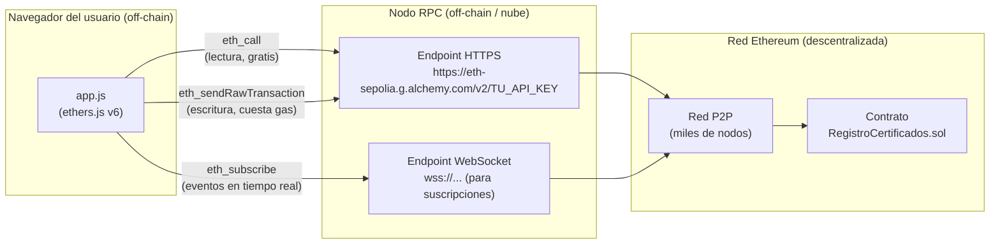
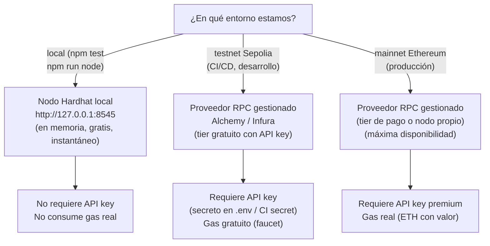

# 03 — Nodos RPC: la Puerta a la Blockchain

> **Módulo 05 · Unidad 1: Blockchain DevOps · UTPL · Abril–Agosto 2026**

---

## Introducción: el puente entre la nube y la blockchain

La red Ethereum es una red peer-to-peer de miles de nodos. Para que el frontend (que vive en la nube) pueda comunicarse con esa red, necesita un punto de acceso. Ese punto es el **nodo RPC**.

> **Concepto clave:** RPC (Remote Procedure Call) es un protocolo que permite a un programa ejecutar funciones en otro sistema remoto como si fueran locales. En Ethereum, el nodo RPC expone una API JSON-RPC que permite enviar transacciones, leer el estado del contrato y escuchar eventos.



---

## ¿Qué hace exactamente un nodo RPC?

Un nodo de Ethereum completo:

1. **Mantiene una copia completa** de la blockchain (todos los bloques, desde el bloque génesis).
2. **Valida transacciones y bloques** según las reglas del protocolo.
3. **Expone una API JSON-RPC** (por defecto en el puerto 8545) para que aplicaciones externas puedan interactuar con él.

Cuando `ethers.js` ejecuta algo como:

```javascript
// En frontend/app.js
const provider = new ethers.JsonRpcProvider(RPC_URL);
const contrato = new ethers.Contract(contractAddress, abi, provider);
const esValido = await contrato.verificarCertificado(idHash);
```

Lo que ocurre internamente es:

```json
// Solicitud JSON-RPC que ethers.js envía al nodo
{
  "jsonrpc": "2.0",
  "method": "eth_call",
  "params": [{
    "to": "0xDireccionDelContrato",
    "data": "0xABIEncodedCallData"
  }, "latest"],
  "id": 1
}
```

El nodo procesa esta llamada localmente (sin crear una transacción) y devuelve el resultado.

---

## Opción 1: Correr un nodo propio

Cualquier persona puede correr un nodo de Ethereum descargando el software cliente:

| Cliente | Lenguaje | Notas |
|---|---|---|
| **Geth** | Go | El más usado; cliente de referencia de Ethereum |
| **Nethermind** | C# | Alto rendimiento |
| **Besu** | Java | Popular en entornos empresariales |
| **Erigon** | Go | Optimizado para almacenamiento; nodo de archivo |

**Requisitos para un nodo completo (mainnet, 2024):**

| Recurso | Mínimo | Recomendado |
|---|---|---|
| CPU | 4 cores | 8+ cores |
| RAM | 16 GB | 32 GB |
| Almacenamiento | 1 TB SSD | 2 TB NVMe SSD |
| Ancho de banda | 25 Mbps | 100+ Mbps |
| Tiempo de sincronización | ~12-24 horas | - |

**Ventaja principal:** soberanía total, sin dependencia de terceros, privacidad de las consultas.
**Desventaja principal:** coste operativo elevado, requiere mantenimiento continuo.

Para este curso, correr un nodo propio en mainnet **no es práctico**. Sí es lo que hace `npm run node` localmente, pero para la red local de Hardhat (un nodo en memoria, no la red real).

---

## Opción 2: Proveedores RPC gestionados (recomendado para este curso)

Los proveedores RPC gestionados operan nodos de Ethereum en infraestructura cloud y exponen endpoints HTTPS/WSS con alta disponibilidad. El desarrollador obtiene una URL con una API key personal.

### Comparativa de proveedores

| Proveedor | Tier gratuito | Redes soportadas | Características destacadas | Latencia típica |
|---|---|---|---|---|
| **Alchemy** | 300M compute units/mes | Ethereum, Polygon, Arbitrum, Optimism, Base... | SDK propio, Notify (alertas), Dashboard detallado | Muy baja |
| **Infura** | 100K solicitudes/día | Ethereum, Polygon, Linea, IPFS... | El más antiguo, muy estable, API IPFS incluida | Baja |
| **QuickNode** | 10M créditos/mes | 50+ blockchains | Soporte multi-chain amplio, add-ons avanzados | Muy baja |
| **Ankr** | Nivel público gratuito (sin key) | 30+ blockchains | Endpoints públicos sin registro para pruebas | Media |
| **Chainstack** | 3M solicitudes/mes | Ethereum, Polygon, BNB Chain... | Interfaz amigable, soporte dedicado | Baja |
| **dRPC** | 5M solicitudes/mes | Ethereum y más | Modelo descentralizado de nodos | Media-baja |

### ¿Qué son los "compute units" y el rate limit?

Los proveedores no miden el acceso simplemente en "número de llamadas", sino en **unidades de cómputo** (compute units o CU). Cada método RPC tiene un costo diferente:

| Método RPC | Costo típico (CU) | Cuándo se usa |
|---|---|---|
| `eth_blockNumber` | 10 CU | Verificar altura del bloque |
| `eth_call` | 26 CU | Leer datos del contrato (view) |
| `eth_sendRawTransaction` | 250 CU | Enviar una transacción |
| `eth_getTransactionReceipt` | 15 CU | Verificar si una tx fue minada |
| `eth_getLogs` | 75 CU | Obtener eventos pasados |

El **rate limit** (límite de velocidad) es la cantidad máxima de solicitudes por segundo (RPS) que el proveedor acepta. Si se supera, devuelve un error HTTP 429 (Too Many Requests). Para una DApp académica con pocos usuarios, el tier gratuito es más que suficiente.

---

## Configuración de la URL RPC en este proyecto

En este proyecto, la URL del nodo RPC se configura mediante **variables de entorno**. Esto es un principio fundamental de DevSecOps: los secretos (como las API keys) nunca deben estar escritos en el código.

### En `.env.example`

```bash
# URL del nodo RPC para la testnet Sepolia (ej: Alchemy, Infura).
SEPOLIA_RPC_URL=
```

El desarrollador copia este archivo a `.env` (que está en `.gitignore`) y rellena el valor:

```bash
# Ejemplo de valor real (NUNCA subir al repositorio)
SEPOLIA_RPC_URL=https://eth-sepolia.g.alchemy.com/v2/abc123TuApiKeyAqui
```

### En `hardhat.config.js`

```javascript
// La URL RPC se lee de la variable de entorno
const SEPOLIA_RPC_URL = process.env.SEPOLIA_RPC_URL || "";

module.exports = {
  networks: {
    sepolia: {
      url: SEPOLIA_RPC_URL,  // Nunca hardcodeada
      accounts: [PRIVATE_KEY],
    },
  },
};
```

### En el frontend (`frontend/app.js`)

Para el frontend de producción, hay dos enfoques:

**Enfoque 1 — Endpoint público (para aprendizaje):**
```javascript
// Usar un endpoint público de Ankr (sin API key) para lectura
const provider = new ethers.JsonRpcProvider(
  "https://rpc.ankr.com/eth_sepolia"
);
```

**Enfoque 2 — API key en variable de entorno del CDN (para producción):**
```javascript
// La URL se inyecta en tiempo de build por Vercel/Netlify
// a través de variables de entorno del proyecto en la plataforma
const RPC_URL = "VITE_RPC_URL" in import.meta.env
  ? import.meta.env.VITE_RPC_URL
  : "https://rpc.ankr.com/eth_sepolia"; // fallback público
```

> **Advertencia:** nunca pongas la API key directamente en el código JavaScript del frontend. Es código público visible por cualquiera en el navegador. Usa las variables de entorno del panel de Vercel/Netlify o un proxy backend si necesitas ocultar la key.

---

## Diagrama de flujo: cómo se elige el nodo RPC según el entorno



---

## Las API keys son secretos: enlace con DevSecOps

Las API keys de Alchemy/Infura son **secretos de configuración**. Si se filtran, alguien podría consumir toda tu cuota gratuita o incurrir en costos inesperados.

El tratamiento correcto de estos secretos está documentado en detalle en [`../04-devsecops/`](../04-devsecops/). El resumen:

1. **Nunca** incluir la API key en el código fuente ni en archivos versionados.
2. **Siempre** usar `.env` local (ignorado por git) para desarrollo.
3. **En CI/CD:** usar los "Secrets" del repositorio de GitHub (disponibles como variables de entorno en el workflow).
4. **En el CDN (Vercel/Netlify):** usar las variables de entorno del proyecto en el panel de configuración.

| Contexto | Cómo almacenar la API key |
|---|---|
| Desarrollo local | `.env` (en `.gitignore`) |
| GitHub Actions | `Settings > Secrets and variables > Actions` |
| Vercel | `Project Settings > Environment Variables` |
| Netlify | `Site settings > Build & deploy > Environment` |

---

## Buenas prácticas con nodos RPC

| Practica | Motivo |
|---|---|
| Usar endpoints HTTPS (no HTTP) | Cifrado en tránsito de las solicitudes |
| Rotar las API keys periódicamente | Limitar el impacto si una key se filtra |
| Configurar alertas de uso en el proveedor | Detectar usos anómalos o abusos |
| Usar WebSocket solo cuando se necesitan eventos en tiempo real | Los WebSockets consumen más recursos que HTTPS polling |
| Implementar reintentos con backoff exponencial | Manejar errores transitorios de rate limiting |
| No incluir la API key en el código del frontend | Es código público en el navegador |

---

> **Siguiente paso:** ahora que sabes cómo se accede a la red en cada entorno, aprende la estrategia multi-entorno e Infraestructura como Código en [04-entornos-e-iac.md](04-entornos-e-iac.md).
