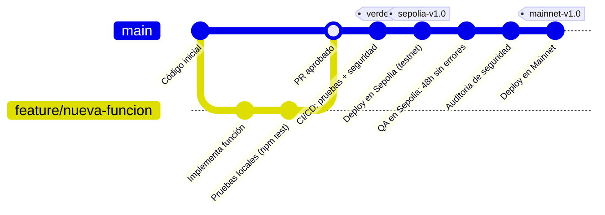
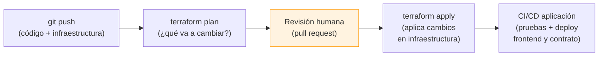

# 04 — Estrategia Multi-Entorno e Infraestructura como Código

> **Módulo 05 · Unidad 1: Blockchain DevOps · UTPL · Abril–Agosto 2026**

---

## Introducción: ¿por qué múltiples entornos?

En el desarrollo de software tradicional, se promueve el código a través de entornos progresivos: primero se prueba en local, luego en un entorno de integración/staging, y finalmente se despliega en producción. La razón es simple: los errores son más baratos de encontrar en los entornos tempranos.

En blockchain, esta práctica es aún más crítica: **un contrato inteligente desplegado en mainnet es inmutable y cualquier error tiene costo real (gas en ETH con valor monetario)**. La estrategia multi-entorno es la defensa más importante contra errores costosos.

---

## Los tres entornos de una DApp Ethereum

```mermaid
flowchart LR
    subgraph LOCAL["Entorno 1: Local\n(Hardhat Network)"]
        direction TB
        HH["Nodo Hardhat\nen memoria\nhttp://127.0.0.1:8545"]
        HH_SC["Contrato\n(redesplegado en\ncada prueba)"]
        HH_ACC["20 cuentas de prueba\n(10 000 ETH cada una)"]
    end

    subgraph TESTNET["Entorno 2: Testnet Sepolia\n(Nube + Blockchain pública de pruebas)"]
        direction TB
        SEP_RPC["RPC Gestionado\nAlchemy / Infura\n(tier gratuito)"]
        SEP_SC["Contrato en Sepolia\n(dirección fija después del deploy)"]
        SEP_ETH["ETH de prueba\n(conseguido en faucet, sin valor real)"]
    end

    subgraph MAINNET["Entorno 3: Mainnet Ethereum\n(Producción)"]
        direction TB
        MAIN_RPC["RPC Gestionado\n(tier de pago)"]
        MAIN_SC["Contrato en Mainnet\n(inmutable, definitivo)"]
        MAIN_ETH["ETH real\n(valor monetario)"]
    end

    LOCAL -->|"pruebas pasan\n(npm test)"| TESTNET
    TESTNET -->|"validación completa\n(auditoria + QA)"| MAINNET

    style LOCAL fill:#e8f5e9,stroke:#4caf50
    style TESTNET fill:#fff3e0,stroke:#ff9800
    style MAINNET fill:#ffebee,stroke:#f44336
```



### Tabla comparativa de entornos

| Aspecto | Local (Hardhat) | Testnet (Sepolia) | Mainnet (Producción) |
|---|---|---|---|
| **Red** | En memoria, en tu máquina | Pública de pruebas, global | Pública de producción, global |
| **ETH** | Falso (ilimitado) | Falso (faucet) | Real (tiene valor) |
| **Velocidad de bloque** | Instantánea (configurable) | ~12 segundos | ~12 segundos |
| **Costo de despliegue** | Cero | Cero | Gas real (ETH) |
| **Persistencia del contrato** | Se pierde al reiniciar el nodo | Persiste (blockchain pública) | Persiste para siempre |
| **Acceso** | Solo local | Global (con endpoint RPC) | Global (con endpoint RPC) |
| **Cómo obtener la RPC URL** | `http://127.0.0.1:8545` (hardcodeado) | Variable `SEPOLIA_RPC_URL` | Variable `MAINNET_RPC_URL` |
| **Uso principal** | Desarrollo y pruebas unitarias | Integración, pruebas de aceptación | Producción real |

---

## Diagrama de promoción entre entornos



**Regla de oro de la promoción:**
- Solo se promueve a mainnet lo que ha pasado exitosamente por testnet.
- El deploy en mainnet requiere aprobación manual (no automatizado en CI/CD sin revisión humana).

---

## Tabla de variables de configuración por entorno

| Variable | Local | Testnet Sepolia | Mainnet |
|---|---|---|---|
| `HARDHAT_NETWORK` | `hardhat` o `localhost` | `sepolia` | `mainnet` |
| `SEPOLIA_RPC_URL` | No aplica | `https://eth-sepolia.g.alchemy.com/v2/KEY` | No aplica |
| `MAINNET_RPC_URL` | No aplica | No aplica | `https://eth-mainnet.g.alchemy.com/v2/KEY` |
| `PRIVATE_KEY` | Cuenta de prueba Hardhat | Cuenta de prueba (sin fondos reales) | Cuenta de producción (multisig recomendado) |
| `CONTRACT_ADDRESS` | Generada en cada deploy local | Fija tras deploy en Sepolia | Fija tras deploy en Mainnet |
| `REPORT_GAS` | `true` (para optimizar) | `false` | `false` |
| `CDN_URL` | `http://localhost:PORT` | `https://staging-tu-proyecto.vercel.app` | `https://tu-proyecto.vercel.app` |

---

## Infraestructura como Código (IaC)

### ¿Qué es IaC?

La Infraestructura como Código es la práctica de **definir y gestionar la infraestructura en la nube usando archivos de configuración declarativos**, de la misma manera en que se gestiona el código de la aplicación: con control de versiones, revisión en pull requests, y despliegue automatizado.

Sin IaC:
```
Desarrollador → consola web de AWS → hace clic aquí y allá → crea recursos manualmente
→ Nadie sabe exactamente qué configuración tiene → Imposible de reproducir
```

Con IaC:
```
Desarrollador → escribe archivo Terraform/Pulumi → git push → pipeline aplica los cambios
→ La infraestructura queda documentada en el repositorio → Reproducible en cualquier cuenta
```

### ¿Por qué IaC?

| Problema sin IaC | Solución con IaC |
|---|---|
| "Funciona en mi entorno" de la infraestructura | El archivo de configuración es el entorno; idéntico en todos lados |
| Configuración manual propensa a errores | Cambios declarativos, validados antes de aplicar |
| Sin historial de cambios en infraestructura | `git log` muestra quién cambió qué y cuándo |
| Difícil de reproducir si hay un desastre | `terraform apply` recrea toda la infraestructura en minutos |
| Onboarding lento para nuevos equipos | Nuevo desarrollador clona el repo y despliega todo con un comando |

### Herramientas principales

| Herramienta | Lenguaje | Modelo | Mejor para |
|---|---|---|---|
| **Terraform** | HCL (HashiCorp Configuration Language) | Declarativo | Multi-cloud, muy adoptado en la industria |
| **Pulumi** | TypeScript, Python, Go, C# | Imperativo (código real) | Equipos que prefieren lenguajes de programación |
| **AWS CDK** | TypeScript, Python | Imperativo | Proyectos en AWS exclusivamente |
| **Ansible** | YAML | Declarativo (orientado a configuración) | Configuración de servidores, no tanto provisionamiento |
| **Bicep / ARM** | JSON / Bicep DSL | Declarativo | Azure exclusivamente |

Para el contexto de este curso, **Terraform** y **Pulumi** son los más relevantes por su soporte multi-cloud y su uso en proyectos blockchain reales.

---

## Ejemplo mínimo ilustrativo con Terraform

El siguiente ejemplo muestra cómo se definiría el hosting estático del frontend en Vercel usando Terraform. Es **conceptual e ilustrativo**; su propósito es mostrar la estructura y la filosofía, no ejecutarse tal cual.

```hcl
# infrastructure/main.tf
# Ejemplo conceptual: hosting del frontend en Vercel con Terraform

terraform {
  required_providers {
    vercel = {
      source  = "vercel/vercel"
      version = "~> 1.0"
    }
  }
}

# Proveedor: Vercel
provider "vercel" {
  api_token = var.vercel_api_token  # Secreto: viene de variable de entorno
}

# Recurso: Proyecto en Vercel para el frontend de la DApp
resource "vercel_project" "dapp_frontend" {
  name      = "registro-certificados-dapp"
  framework = null  # Sitio estático, sin framework

  # Configurar el directorio de publicación
  root_directory = "frontend"

  # Variables de entorno del proyecto (no secretas)
  environment = [
    {
      key    = "CONTRACT_NETWORK"
      value  = "sepolia"
      target = ["production", "preview"]
    }
  ]
}

# Recurso: Dominio personalizado para producción
resource "vercel_project_domain" "dapp_domain" {
  project_id = vercel_project.dapp_frontend.id
  domain     = var.production_domain  # ej: "registro.utpl.edu.ec"
}

# Variable: token de Vercel (secreto)
variable "vercel_api_token" {
  description = "Token de la API de Vercel"
  type        = string
  sensitive   = true  # No se muestra en los logs
}

# Variable: dominio de producción
variable "production_domain" {
  description = "Dominio personalizado para la DApp"
  type        = string
  default     = "registro-certificados.example.com"
}

# Output: URL del proyecto
output "deployment_url" {
  description = "URL del proyecto en Vercel"
  value       = "https://${vercel_project.dapp_frontend.name}.vercel.app"
}
```

**Flujo de uso de Terraform:**

```bash
# 1. Inicializar (descarga los providers)
terraform init

# 2. Planificar (muestra qué va a crear/modificar, SIN aplicar)
terraform plan

# 3. Aplicar (crea los recursos en Vercel)
terraform apply

# 4. Ver el estado actual
terraform show

# 5. Destruir (eliminar todos los recursos)
terraform destroy
```

### Ejemplo mínimo con Pulumi (TypeScript)

```typescript
// infrastructure/index.ts
// Ejemplo conceptual: mismo recurso pero con Pulumi en TypeScript

import * as vercel from "@pulumiverse/vercel";

// Crear el proyecto en Vercel
const dappFrontend = new vercel.Project("dapp-frontend", {
  name: "registro-certificados-dapp",
  rootDirectory: "frontend",
  environment: [
    {
      key: "CONTRACT_NETWORK",
      value: "sepolia",
      targets: ["production", "preview"],
    },
  ],
});

// Exportar la URL
export const deploymentUrl = dappFrontend.name.apply(
  (name) => `https://${name}.vercel.app`
);
```

**Ventaja de Pulumi:** el código es TypeScript real, con tipado estático, autocompletado en el IDE y la posibilidad de usar bucles, condiciones y funciones del lenguaje para generar infraestructura dinámicamente.

---

## Cómo IaC se conecta con DevOps

IaC es la extensión natural del pipeline DevOps a la infraestructura. El pipeline completo de este proyecto quedaría:



La diferencia con el pipeline de la aplicación:
- Los cambios de **código** de aplicación se despliegan automáticamente tras pasar las pruebas.
- Los cambios de **infraestructura** (IaC) normalmente requieren una revisión humana antes de aplicarse, especialmente en producción, porque pueden tener un impacto mayor (borrar una base de datos, cambiar permisos de red, etc.).

---

## Relación con el resto del curso

- El pipeline CI/CD que ejecuta los tests y despliega el frontend está en [`../03-devops/`](../03-devops/).
- La gestión segura de las variables de entorno y secretos de cada entorno está en [`../04-devsecops/`](../04-devsecops/).
- La vista de despliegue con los artefactos generados en cada entorno está en [`../02-arquitectura/06-vista-despliegue.md`](../02-arquitectura/06-vista-despliegue.md).

---

> **Siguiente paso:** entiende el modelo de costos completo (gas on-chain + nube) y las buenas prácticas de operación en [05-costos-y-buenas-practicas.md](05-costos-y-buenas-practicas.md).
