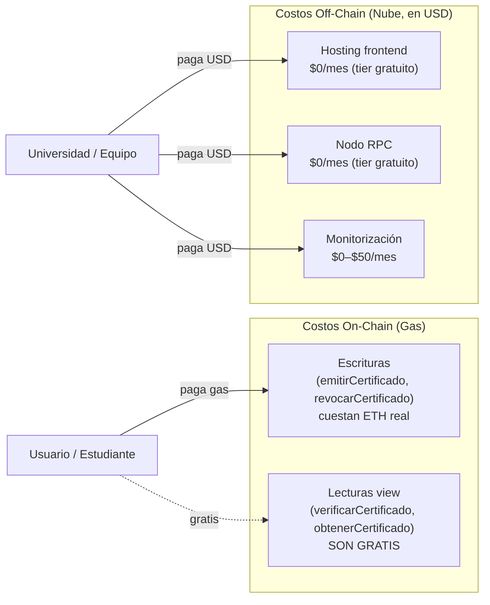
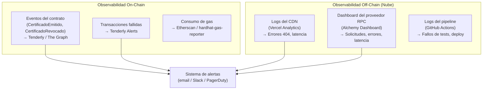

# 05 — Costos y Buenas Prácticas de Operación

> **Módulo 05 · Unidad 1: Blockchain DevOps · UTPL · Abril–Agosto 2026**

---

## Introducción: dos modelos de costo, una sola DApp

Una DApp tiene una dualidad de costos que no existe en las aplicaciones web tradicionales:

1. **Costos on-chain (gas):** pagados en ETH por cada transacción que modifica el estado de la blockchain. Son costos del **usuario o del operador**, dependiendo de quién firma la transacción.
2. **Costos off-chain (nube):** pagados en USD por los servicios que componen la capa de infraestructura (hosting, RPC, monitorización). Son costos del **equipo de desarrollo/operación**.



---

## Modelo de costos on-chain: el gas

### ¿Qué es el gas?

El gas es la unidad de medida del trabajo computacional en Ethereum. Cada operación que el contrato ejecuta consume una cantidad de gas. El usuario que envía la transacción paga ese gas multiplicado por el **precio del gas** (en Gwei, donde 1 Gwei = 0.000000001 ETH).

```
Costo total de una transacción (en ETH) = Gas usado × Precio del gas (Gwei) / 10^9
```

### ¿Por qué las funciones `view` son gratis?

Las funciones marcadas como `view` (o `pure`) en Solidity **no modifican el estado de la blockchain**. Solo leen datos que ya están almacenados. Por eso:

- No requieren una transacción.
- No se propagan a la red de mineros/validadores.
- El nodo RPC las ejecuta localmente y devuelve el resultado.
- **No cuestan gas al usuario.**

```solidity
// En RegistroCertificados.sol

// Esta función CUESTA GAS: modifica el estado on-chain
function emitirCertificado(bytes32 idHash, ...) external soloEmisorAutorizado {
    certificados[idHash] = Certificado(...);  // Escribe en storage
    emit CertificadoEmitido(idHash, ...);     // Emite un evento
}

// Esta función ES GRATIS: solo lee el estado
function verificarCertificado(bytes32 idHash) external view returns (bool) {
    return certificados[idHash].timestamp != 0 && !certificados[idHash].revocado;
    // Solo lee del storage, no escribe nada
}
```

### Tabla de costos estimados por operación

Los valores en USD son aproximados para Ethereum Mainnet en condiciones de mercado moderadas (precio ETH ~$3,000, gas price ~20 Gwei). En testnet, el costo siempre es cero en términos de valor real.

| Función | Gas estimado | Costo en ETH | Costo en USD (aprox.) | Quién paga |
|---|---|---|---|---|
| `emitirCertificado(...)` | ~80,000–120,000 gas | ~0.0016–0.0024 ETH | ~$5–$7 | La institución emisora |
| `revocarCertificado(...)` | ~30,000–50,000 gas | ~0.0006–0.001 ETH | ~$2–$3 | El propietario del contrato |
| `autorizarEmisor(...)` | ~45,000–65,000 gas | ~0.0009–0.0013 ETH | ~$3–$4 | El propietario del contrato |
| `verificarCertificado(...)` | **0 gas** | **0 ETH** | **$0** | Nadie (lectura gratuita) |
| `obtenerCertificado(...)` | **0 gas** | **0 ETH** | **$0** | Nadie (lectura gratuita) |
| Despliegue del contrato | ~1,500,000–2,000,000 gas | ~0.03–0.04 ETH | ~$90–$120 | El equipo de desarrollo (una sola vez) |

> **Insight pedagógico:** el diseño del contrato tiene impacto directo en el costo. Almacenar un `string` cuesta más que un `bytes32`. Emitir eventos cuesta menos que escribir en storage. El módulo de arquitectura ([`../02-arquitectura/03-modelo-de-datos.md`](../02-arquitectura/03-modelo-de-datos.md)) documenta estas decisiones de diseño.

### Gas en Sepolia Testnet

En la testnet Sepolia, las transacciones también consumen "gas", pero el ETH de Sepolia **no tiene valor real** y se obtiene gratuitamente en faucets:

- [sepoliafaucet.com](https://sepoliafaucet.com)
- [faucet.sepolia.dev](https://faucet.sepolia.dev)
- [alchemy.com/faucets/ethereum-sepolia](https://www.alchemy.com/faucets/ethereum-sepolia)

Esto hace que el ciclo de pruebas en testnet sea completamente gratuito en términos económicos.

---

## Modelo de costos off-chain (nube)

Para esta DApp académica, los costos de nube son **prácticamente cero** gracias a los tiers gratuitos disponibles.

### Tabla de costos de servicios en la nube

| Servicio | Proveedor | Tier gratuito | Tier de pago (referencia) | ¿Suficiente para este curso? |
|---|---|---|---|---|
| **Hosting frontend** | Vercel | Ilimitado para proyectos personales | Desde $20/mes (equipos) | Si, tier gratuito |
| **Hosting frontend** | GitHub Pages | Ilimitado (repositorios públicos) | Gratis | Si |
| **Hosting frontend** | Netlify | 100 GB de bandwidth/mes, 300 min build | Desde $19/mes | Si, tier gratuito |
| **Nodo RPC** | Alchemy | 300M compute units/mes | Desde $49/mes | Si, tier gratuito |
| **Nodo RPC** | Infura | 100K solicitudes/día | Desde $50/mes | Si, tier gratuito |
| **CI/CD** | GitHub Actions | 2,000 min/mes (repo público: ilimitado) | Desde $4/mes | Si, tier gratuito |
| **Monitorización** | Tenderly | 5M tx traza/mes | Desde $49/mes | Si para aprendizaje |
| **IPFS pinning** | Pinata | 1 GB almacenamiento, 100 solicitudes/mes | Desde $20/mes | Si para pruebas |
| **Indexador** | The Graph (hosted) | Limitado (decentralized network) | Variable (GRT tokens) | Opcional en este curso |

**Costo total estimado para el curso:** $0/mes usando exclusivamente tiers gratuitos.

---

## Buenas prácticas de operación y monitorización

### Observabilidad en una DApp: tres fuentes de datos



### Logs y trazabilidad on-chain

Los **eventos de Ethereum** son la herramienta de logging on-chain. En el contrato `RegistroCertificados.sol`, cada operación importante emite un evento:

```solidity
// Los eventos son el equivalente blockchain de console.log()
// pero quedan registrados de forma permanente en la cadena

event CertificadoEmitido(
    bytes32 indexed idHash,
    address indexed emisor,
    uint256 timestamp
);

event CertificadoRevocado(
    bytes32 indexed idHash,
    uint256 timestamp
);
```

Estos eventos se pueden consultar retroactivamente con ethers.js:

```javascript
// Consultar todos los certificados emitidos (histórico completo)
const filtro = contrato.filters.CertificadoEmitido();
const eventos = await contrato.queryFilter(filtro, 0, "latest");
eventos.forEach(e => {
    console.log(`Certificado: ${e.args.idHash}, Emisor: ${e.args.emisor}`);
});
```

### Alertas para una DApp en producción

| Alerta | Condición | Herramienta | Prioridad |
|---|---|---|---|
| **Transacción fallida** | `emitirCertificado` rechazada por la EVM | Tenderly / Alchemy Notify | Alta |
| **Cambio de propietario** | Evento `OwnershipTransferred` | Tenderly | Critica |
| **Tasa de error RPC alta** | >5% de solicitudes fallan en 5 min | Dashboard Alchemy | Alta |
| **Deploy fallido** | Pipeline CI/CD termina con error | GitHub Actions + email | Alta |
| **Frontend caído** | HTTP 5xx desde el CDN | Vercel Analytics / UptimeRobot | Alta |
| **Cuota RPC al 80%** | >80% del tier gratuito consumido | Dashboard Alchemy | Media |
| **Gas price anómalo** | Precio del gas >200 Gwei | Etherscan Gas Tracker | Baja (informativa) |

---

## Comparativa: blockchain vs. nube en términos operativos

| Aspecto operativo | Blockchain (on-chain) | Nube (off-chain) |
|---|---|---|
| **Actualizaciones** | Imposible (contrato inmutable) — requiere migración | En cualquier momento, con cero downtime |
| **Rollback** | Imposible (las transacciones son permanentes) | En segundos (Vercel mantiene historial de deploys) |
| **Escalabilidad** | Limitada por el throughput de la red (~15 TPS en Ethereum) | Ilimitada con CDN y auto-scaling |
| **Disponibilidad** | ~99.99%+ (red distribuida, nunca se "apaga") | ~99.9%+ (SLA del proveedor) |
| **Mantenimiento** | Ninguno (el protocolo se auto-mantiene) | Requiere actualizaciones, parches, etc. |
| **Auditoría** | Total y pública (cualquiera puede leer el historial) | Requiere logs + monitorización activa |
| **Costos en fallos** | Permanentes (gas gastado en tx fallidas no se devuelve) | Mínimos (solo el tiempo de downtime) |

---

## Checklist: "Listo para producción en la nube"

Antes de pasar a mainnet, verificar todos estos puntos:

### Seguridad

- [ ] No hay secretos (API keys, private keys) en el repositorio Git (`git log` limpio).
- [ ] Las variables de entorno de producción están configuradas en el panel del CDN (no en archivos).
- [ ] La API key del nodo RPC es de una cuenta de producción con rate limits adecuados.
- [ ] El contrato ha pasado análisis de seguridad con Slither y Solhint (ver [`../04-devsecops/`](../04-devsecops/)).
- [ ] La private key de la cuenta de despliegue en mainnet es una cuenta dedicada (no la de desarrollo).
- [ ] Se considera el uso de una multisig (Gnosis Safe) para el propietario del contrato en producción.

### Infraestructura

- [ ] El frontend está desplegado en producción (no localhost).
- [ ] El `deployment.json` en el CDN apunta a la dirección del contrato en mainnet.
- [ ] El endpoint RPC configurado apunta a mainnet (no a Sepolia).
- [ ] El dominio de producción tiene HTTPS habilitado.
- [ ] Se han probado todas las funciones del contrato en Sepolia exitosamente.
- [ ] El pipeline CI/CD produce deploys reproducibles (IaC si aplica).

### Monitorización

- [ ] Hay al menos una alerta configurada para transacciones fallidas en el contrato.
- [ ] Hay una alerta si el dashboard del RPC muestra alta tasa de errores.
- [ ] El equipo sabe cómo consultar eventos históricos del contrato (ethers.js o Etherscan).
- [ ] Se tiene un plan de contingencia si el proveedor RPC falla (¿hay un backup?).

### Costos

- [ ] Se ha estimado el costo de gas para las operaciones más frecuentes.
- [ ] Se ha configurado un presupuesto en el proveedor RPC de producción.
- [ ] Se ha evaluado si el tier gratuito es suficiente o se necesita un tier de pago.
- [ ] Se ha ejecutado el reporte de gas (`REPORT_GAS=true npm test`) para identificar funciones costosas.

### Documentación

- [ ] La dirección del contrato en mainnet está documentada y versionada.
- [ ] Hay un procedimiento documentado para cómo actualizar el frontend si cambia el ABI.
- [ ] El equipo conoce el proceso para "migrar" el contrato si se necesita una corrección crítica.

---

## Resumen del módulo 05

Este módulo ha documentado la capa off-chain de la DApp: cómo el frontend estático se sirve desde la nube, cómo el nodo RPC conecta esa capa con la red Ethereum, cómo se gestiona la configuración entre entornos y cómo se opera la solución en producción.

La idea central que atraviesa todo el módulo:

> **La blockchain es la fuente de verdad inmutable. La nube es el puente que la hace accesible.**

Ambas capas son necesarias, complementarias, y cada una se gestiona con sus propias herramientas y mejores prácticas.

---

## Relación con el resto del curso

- Arquitectura base y diagramas: [`../02-arquitectura/`](../02-arquitectura/)
- Pipeline CI/CD que automatiza el despliegue: [`../03-devops/`](../03-devops/)
- Seguridad, secretos y análisis de vulnerabilidades: [`../04-devsecops/`](../04-devsecops/)
- Vista de despliegue técnica: [`../02-arquitectura/06-vista-despliegue.md`](../02-arquitectura/06-vista-despliegue.md)
