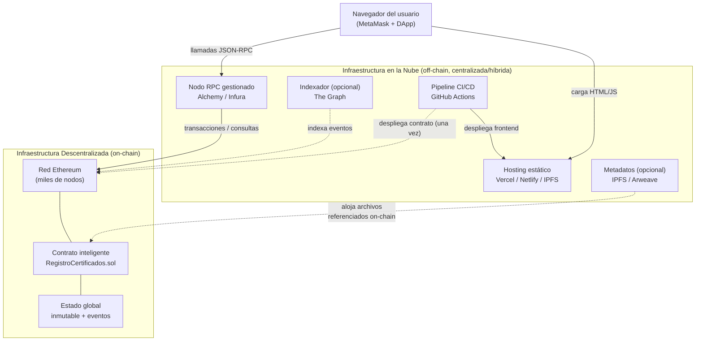

# Módulo 05 — Arquitectura en la Nube

> **Unidad 1: Blockchain DevOps · UTPL · Abril–Agosto 2026**
> Agente: Nube

---

## Objetivos de aprendizaje

Al completar este módulo, el estudiante será capaz de:

1. Distinguir la **infraestructura descentralizada** (blockchain/red Ethereum) de la **infraestructura en la nube tradicional** y explicar el rol complementario de cada una.
2. Identificar los componentes **off-chain** de una DApp (frontend, nodo RPC, indexadores, almacenamiento de metadatos) y dónde viven en la nube.
3. Seleccionar y justificar opciones de **hosting estático** para el frontend de una DApp (Vercel, Netlify, GitHub Pages, IPFS/Fleek).
4. Comprender qué es un **nodo RPC**, qué proveedores existen y cómo se configura de forma segura mediante variables de entorno.
5. Aplicar una **estrategia multi-entorno** (local → testnet → mainnet) y entender los fundamentos de **Infraestructura como Código (IaC)**.
6. Analizar el **modelo de costos** de una DApp: gas on-chain vs. servicios en la nube, y aplicar buenas prácticas de operación.

---

## El concepto central: ¿qué hace la nube en una DApp?

> **Idea clave:** en una DApp, la nube **no aloja la lógica de negocio**. Esa lógica vive on-chain, en el contrato inteligente desplegado en la red Ethereum, que es una infraestructura descentralizada mantenida por miles de nodos en todo el mundo.

La nube tradicional (AWS, GCP, Azure, Vercel, etc.) se encarga de la **capa off-chain**:

### Infraestructura descentralizada vs. nube tradicional

| Dimensión | Blockchain (on-chain) | Nube tradicional (off-chain) |
|---|---|---|
| **Control** | Ningún operador central; gobernada por el protocolo | Controlada por el proveedor (AWS, Vercel, etc.) |
| **Mutabilidad** | Inmutable una vez desplegado el contrato | Actualizable en cualquier momento |
| **Disponibilidad** | Alta por diseño (red distribuida) | Alta por SLA contractual |
| **Costo** | Gas (Wei/Gwei) pagado por cada escritura | Suscripción o pago por uso (USD) |
| **Confianza** | Sin confianza requerida ("trustless") | Requiere confiar en el proveedor |
| **Velocidad** | Segundos a minutos (por bloques) | Milisegundos |
| **Almacenamiento** | Carísimo; solo estado mínimo | Barato; archivos, bases de datos, etc. |
| **Lógica ejecutada** | Determinística, verificable por todos | Arbitraria, opaca para el exterior |

La complementariedad es la clave: **on-chain para lo que debe ser inmutable y confiable; off-chain/nube para lo que debe ser rápido, barato y flexible.**

---

## Contenido del módulo

| Archivo | Tema | Qué aprenderás |
|---------|------|----------------|
| [01-arquitectura-nube.md](01-arquitectura-nube.md) | Arquitectura completa de la solución en la nube | Componentes, responsabilidades y diagrama de referencia |
| [02-hosting-frontend.md](02-hosting-frontend.md) | Hosting del frontend estático | Opciones de despliegue, comparativa, integración con CI |
| [03-nodos-rpc.md](03-nodos-rpc.md) | Nodos RPC: puerta a la blockchain | Qué son, proveedores, configuración segura, rate limits |
| [04-entornos-e-iac.md](04-entornos-e-iac.md) | Multi-entorno e Infraestructura como Código | Estrategia local/testnet/mainnet, IaC con Terraform/Pulumi |
| [05-costos-y-buenas-practicas.md](05-costos-y-buenas-practicas.md) | Costos y buenas prácticas de operación | Gas on-chain, costos de nube, monitorización, checklist |

---

## Relación con el resto del curso

- La vista de despliegue y los diagramas de arquitectura base están en [`../02-arquitectura/06-vista-despliegue.md`](../02-arquitectura/06-vista-despliegue.md).
- El pipeline CI/CD que despliega el frontend está documentado en [`../03-devops/`](../03-devops/).
- La gestión segura de credenciales de proveedores RPC (API keys) se trata en [`../04-devsecops/`](../04-devsecops/).

---

> **Nota pedagógica:** este módulo complementa la teoría blockchain con la realidad operativa. Un contrato perfecto desplegado sin una infraestructura off-chain bien diseñada es una DApp que nadie puede usar. La nube es el puente entre la red descentralizada y el usuario final.
