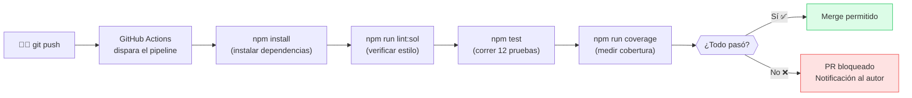

# Guía 03 — Laboratorio DevOps

> **Tiempo estimado:** 30 minutos
> **Nivel:** Principiante con el proyecto ya corriendo
> **Antes de esta guía:** Completa la [Guía 02 — Ejecutar el Proyecto](./02-ejecutar-el-proyecto.md)
> **Profundizar:** Lee [`../docs/03-devops/`](../docs/03-devops/) para el contexto teórico completo

En esta guía vas a explorar las herramientas DevOps del proyecto: el linter, la cobertura de
código y el pipeline de integración continua. DevOps no es solo "hacer funcionar el código":
es asegurarse de que el código sea **de calidad**, esté **bien probado** y que ese proceso sea
**automático** cada vez que alguien hace un cambio.

---

## Tabla de contenidos

1. [¿Qué es DevOps en este proyecto?](#1-qué-es-devops-en-este-proyecto)
2. [Explorar el package.json](#2-explorar-el-packagejson)
3. [Ejecutar el linter de Solidity](#3-ejecutar-el-linter-de-solidity)
4. [Medir la cobertura de las pruebas](#4-medir-la-cobertura-de-las-pruebas)
5. [Entender el pipeline de CI](#5-entender-el-pipeline-de-ci)
6. [Ejercicio: simular un flujo de pull request](#6-ejercicio-simular-un-flujo-de-pull-request)
7. [Reflexión y preguntas de consolidación](#7-reflexión-y-preguntas-de-consolidación)

---

## 1. ¿Qué es DevOps en este proyecto?

Antes de teclear comandos, tómate 2 minutos para leer esto.

**DevOps** (Development + Operations) es una cultura y un conjunto de prácticas que buscan
que el software se desarrolle, pruebe y despliegue de forma más rápida, frecuente y confiable.

En este proyecto, DevOps se expresa en tres cosas concretas:

```
Código Solidity
      │
      ▼
[1] Linter (Solhint)     ← ¿El código sigue las convenciones?
      │
      ▼
[2] Pruebas (Hardhat)    ← ¿El contrato funciona correctamente?
      │
      ▼
[3] Cobertura (nyc)      ← ¿Cuánto código está siendo probado?
      │
      ▼
[CI/CD - GitHub Actions] ← Todo lo anterior, automáticamente, en cada push
```

Cuando un desarrollador hace un `git push`, el pipeline corre los tres pasos automáticamente.
Si algo falla, el sistema avisa antes de que el código llegue a producción.

> Para el fundamento teórico (CALMS, ciclo DevOps, métricas DORA), consulta
> [`../docs/03-devops/`](../docs/03-devops/).

---

## 2. Explorar el package.json

El archivo `package.json` es el corazón de la configuración del proyecto. Vamos a leerlo.

**Abre el archivo** en VS Code o en la terminal:

```bash
# En la terminal (muestra el contenido):
cat package.json
```

O ábrelo directamente en VS Code con `code package.json`.

**Observa la sección `scripts`:**

```json
"scripts": {
  "compile":          "hardhat compile",
  "test":             "hardhat test",
  "test:gas":         "REPORT_GAS=true hardhat test",
  "coverage":         "hardhat coverage",
  "node":             "hardhat node",
  "deploy:local":     "hardhat run scripts/deploy.js --network localhost",
  "lint:sol":         "solhint 'contracts/**/*.sol'",
  "lint:sol:fix":     "solhint 'contracts/**/*.sol' --fix",
  "format":           "prettier --write ...",
  "security:slither": "slither . || echo 'Instala Slither: pip install slither-analyzer'"
}
```

**Ejercicio de lectura:** antes de ejecutar nada, responde:

- ¿Qué hace `npm run test:gas` diferente a `npm test`?
- ¿Qué hace `npm run lint:sol:fix` que `npm run lint:sol` no hace?
- ¿Por qué `security:slither` tiene ese `|| echo '...'` al final?

> Pista para la última pregunta: `||` en Bash significa "si el primer comando falla, ejecuta el segundo".

---

## 3. Ejecutar el linter de Solidity

Un **linter** es una herramienta que analiza tu código en busca de problemas de estilo,
convenciones y posibles errores *sin ejecutarlo*. Es como un corrector ortográfico para código.

En este proyecto usamos **Solhint**, el linter estándar para Solidity.

```bash
npm run lint:sol
```

### Salida esperada (sin errores)

```
Linting contracts/RegistroCertificados.sol...

  0 errors, 0 warnings found.
```

El contrato ya está escrito siguiendo las convenciones, así que no debería haber errores.

### Explorando las reglas del linter

Las reglas que Solhint aplica están definidas en `.solhint.json`. Ábrelo:

```bash
cat .solhint.json
```

Verás algo parecido a:

```json
{
  "extends": "solhint:recommended",
  "rules": {
    "compiler-version": ["error", "^0.8.0"],
    "func-visibility": ["warn", { "ignoreConstructors": true }]
  }
}
```

Esto significa: "usa las reglas recomendadas de Solhint, y además exige que la versión del
compilador sea 0.8.x o superior".

### Ejercicio: provocar un error de linting

Vamos a introducir un problema a propósito para ver cómo reacciona el linter.

**Paso 1:** Abre `contracts/RegistroCertificados.sol` en VS Code.

**Paso 2:** Busca la función `emitirCertificado` y cambia su visibilidad de `external` a `public`:

```solidity
// Cambiar esto:
function emitirCertificado(string calldata nombreEstudiante, string calldata curso)
    external
    soloEmisor

// Por esto (temporal, solo para el ejercicio):
function emitirCertificado(string calldata nombreEstudiante, string calldata curso)
    public
    soloEmisor
```

**Paso 3:** Ejecuta el linter:

```bash
npm run lint:sol
```

**Paso 4:** Observa el aviso o error que genera. Luego **deshaz el cambio** (`Ctrl+Z` en VS Code
o `git checkout contracts/RegistroCertificados.sol`).

```bash
git checkout contracts/RegistroCertificados.sol
```

> **Conclusión:** el linter atrapa problemas de estilo antes de que lleguen a revisión de código
> o a producción. En un pipeline CI, si el linter falla, el push se bloquea.

---

## 4. Medir la cobertura de las pruebas

La **cobertura de código** (code coverage) mide qué porcentaje de las líneas del contrato
son ejecutadas por las pruebas. Una cobertura alta da más confianza de que el contrato funciona
correctamente en todos sus casos.

```bash
npm run coverage
```

Este comando puede tardar 20–40 segundos. Al finalizar, verás una tabla como esta:

```
-----------------------------|----------|----------|----------|----------|
File                         |  % Stmts | % Branch |  % Funcs |  % Lines |
-----------------------------|----------|----------|----------|----------|
 contracts/                  |          |          |          |          |
  RegistroCertificados.sol   |    100   |    100   |    100   |    100   |
-----------------------------|----------|----------|----------|----------|
All files                    |    100   |    100   |    100   |    100   |
-----------------------------|----------|----------|----------|----------|
```

### ¿Qué significan las columnas?

| Columna | Significado |
|---------|-------------|
| `% Stmts` | Porcentaje de sentencias ejecutadas |
| `% Branch` | Porcentaje de ramas de decisión (if/else) cubiertos |
| `% Funcs` | Porcentaje de funciones llamadas al menos una vez |
| `% Lines` | Porcentaje de líneas de código ejecutadas |

Una cobertura del **100%** significa que cada línea del contrato es ejecutada por al menos una
prueba. Esto no garantiza que el contrato sea correcto en todos los escenarios, pero es un muy
buen indicador.

> **Cobertura perfecta no es el objetivo final.** Es una métrica, no una garantía. Un contrato
> puede tener 100% de cobertura y aun así tener un error lógico si las pruebas no verifican
> los resultados correctamente. Lo importante es que las pruebas sean *significativas*.

También se genera un reporte HTML en `coverage/index.html`. Ábrelo en el navegador para ver
qué líneas específicas están cubiertas (en verde) y cuáles no (en rojo).

---

## 5. Entender el pipeline de CI

Un **pipeline de CI** (Integración Continua) es una secuencia de pasos que se ejecutan
automáticamente cada vez que alguien hace `git push` al repositorio.



El archivo que define este pipeline está en `.github/workflows/ci.yml`. Ábrelo:

```bash
cat .github/workflows/ci.yml
```

Busca las secciones clave:
- `on:` — cuándo se dispara el pipeline (en cada `push` o `pull_request`)
- `jobs:` — los pasos que ejecuta
- `steps:` — los comandos individuales

> **Para profundizar en el diseño del pipeline,** lee [`../docs/03-devops/`](../docs/03-devops/).

---

## 6. Ejercicio: simular un flujo de pull request

En el trabajo real con Git y GitHub, el flujo es:

1. Creas una rama nueva para tu cambio.
2. Haces el cambio y lo pruebas localmente.
3. Abres un Pull Request (PR) en GitHub.
4. El pipeline de CI corre automáticamente.
5. Si todo pasa, el equipo revisa y aprueba el merge.

Vamos a simular los pasos locales de este flujo.

### Paso 1: crear una rama nueva

```bash
git checkout -b feature/mi-primer-cambio
```

Esto crea una nueva rama llamada `feature/mi-primer-cambio` y te mueve a ella.

### Paso 2: hacer un cambio significativo

Vamos a agregar un comentario al contrato que mejore su documentación.

Abre `contracts/RegistroCertificados.sol` en VS Code y busca la función `verificarCertificado`.
Agrega una línea de comentario descriptiva justo antes del return:

```solidity
// Devolvemos tanto el indicador de validez como todos los datos del certificado.
valido = cert.existe && !cert.revocado;
```

### Paso 3: ejecutar los checks localmente (simulando el pipeline)

Esto es exactamente lo que haría el CI en GitHub:

```bash
# Paso 1 del pipeline: instalar dependencias (ya instaladas)
# npm install  ← ya lo hiciste

# Paso 2: lint
npm run lint:sol

# Paso 3: pruebas
npm test

# Paso 4: cobertura
npm run coverage
```

Si todo pasa sin errores, tu cambio está listo para un PR real.

### Paso 4: preparar el commit

```bash
git add contracts/RegistroCertificados.sol
git status
git commit -m "docs: mejorar comentario de verificarCertificado"
```

### Paso 5: observar el flujo conceptual del PR

En un proyecto real con GitHub, ahora harías:

```bash
git push origin feature/mi-primer-cambio
```

Y luego en GitHub abrirías un PR. El pipeline CI correría automáticamente y verías los
resultados de cada step (lint, test, coverage) en la interfaz de GitHub con palomitas verdes
o equis rojas.

### Limpiar: volver a la rama principal

```bash
git checkout main
```

> **Concepto clave:** La gran ventaja de CI es que nadie tiene que *recordar* correr las pruebas
> antes de hacer merge. El sistema lo hace automáticamente y avisa si algo falla. Esto se
> llama "shift left" — detectar problemas lo más temprano posible en el ciclo de desarrollo.

---

## 7. Reflexión y preguntas de consolidación

Antes de continuar, piensa en estas preguntas. Puedes discutirlas con tu equipo o escribirlas:

1. **¿Por qué es importante que las pruebas sean automáticas y no manuales?**
   Piensa en un proyecto con 10 desarrolladores que hacen cambios constantemente.

2. **¿Qué pasaría si no hubiera linter y cada desarrollador escribiera Solidity con su propio
   estilo?** ¿Cómo afecta eso a la mantenibilidad del código?

3. **¿Por qué la cobertura del 100% no garantiza que el contrato sea correcto?**
   ¿Puedes pensar en un caso donde una prueba "cubre" una línea pero no verifica que el
   resultado sea el correcto?

4. **El pipeline corre en cada push.** Si hay 20 desarrolladores y cada uno hace 5 pushes
   al día, ¿cuántos pipelines se ejecutan por día? ¿Es eso un problema o una ventaja?

---

*Siguiente: [Guía 04 — Laboratorio DevSecOps](./04-laboratorio-devsecops.md)*

*Para más detalle sobre el pipeline CI/CD, consulta [`../docs/03-devops/`](../docs/03-devops/).*
