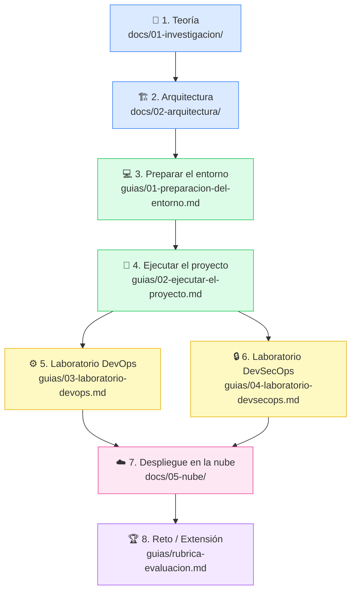

# Guías para el Estudiante — Unidad 1: Blockchain DevOps

> **Curso:** Blockchain · UTPL · Ciclo Abril–Agosto 2026
> **Unidad:** 1 — Blockchain DevOps (1.1 Fundamentos DevOps + 1.2 Fundamentos DevSecOps)
> **Directorio:** `guias/`

Bienvenido a las guías de la Unidad 1. Aquí encontrarás todo lo que necesitas para entender,
ejecutar y explorar el proyecto desde cero, aunque nunca hayas trabajado con blockchain antes.

---

## ¿A quién van dirigidas estas guías?

A **ti**: estudiante universitario con conocimientos básicos de programación que llega por primera
vez a un proyecto blockchain. No necesitas saber nada de Ethereum, MetaMask ni Solidity para
comenzar. Estas guías te llevan de la mano, paso a paso.

Lo que sí conviene tener antes de empezar:

- Haber usado la terminal/consola al menos una vez.
- Tener ganas de explorar y no asustarte si algo falla (los errores son parte del aprendizaje).

---

## Ruta de aprendizaje recomendada

Sigue este orden para aprovechar al máximo el material:

**Regla de oro:** lee la teoría antes de tocar el código. Cuando sepas *por qué* existe cada
herramienta, el *cómo* tiene mucho más sentido.

---

## Tabla de contenidos de las guías

| # | Archivo | Qué aprenderás | Tiempo estimado |
|---|---------|---------------|-----------------|
| — | Este archivo (`README.md`) | Ruta de aprendizaje y descripción de las guías | 5 min |
| 01 | [01-preparacion-del-entorno.md](./01-preparacion-del-entorno.md) | Instalar Node.js, Git, VS Code y MetaMask en Windows, macOS y Linux | 30–45 min |
| 02 | [02-ejecutar-el-proyecto.md](./02-ejecutar-el-proyecto.md) | Clonar, instalar dependencias, pasar las 12 pruebas y correr la DApp completa | 45–60 min |
| 03 | [03-laboratorio-devops.md](./03-laboratorio-devops.md) | Explorar el pipeline CI/CD, lint, cobertura de código y flujo de pull requests | 30 min |
| 04 | [04-laboratorio-devsecops.md](./04-laboratorio-devsecops.md) | Instalar Slither, analizar el contrato, gestionar secretos y revisar control de acceso | 30 min |
| — | [05-glosario-rapido.md](./05-glosario-rapido.md) | Glosario express de los términos más importantes | Consulta rápida |
| — | [preguntas-frecuentes.md](./preguntas-frecuentes.md) | Respuestas a las dudas más comunes de principiantes | Consulta rápida |
| — | [rubrica-evaluacion.md](./rubrica-evaluacion.md) | Criterios de evaluación de la unidad e ideas de reto | Referencia |

---

## Documentación técnica complementaria

Las guías de estudiante viven aquí (`guias/`), pero el repositorio tiene más material:

| Directorio | Contenido |
|------------|-----------|
| [`../docs/01-investigacion/`](../docs/01-investigacion/) | Marco teórico: DevOps, DevSecOps, glosario extendido y referencias |
| [`../docs/02-arquitectura/`](../docs/02-arquitectura/) | Diagramas C4, modelo de datos, vistas de despliegue |
| [`../docs/03-devops/`](../docs/03-devops/) | Pipeline CI/CD con GitHub Actions detallado |
| [`../docs/04-devsecops/`](../docs/04-devsecops/) | Seguridad automatizada: Slither, Solhint, npm audit |
| [`../docs/05-nube/`](../docs/05-nube/) | Hosting, IaC, arquitectura en la nube |
| [`../plan.md`](../plan.md) | Plan general del repositorio (para el docente o curiosos) |
| [`../README.md`](../README.md) | Punto de entrada del repositorio |

---

## Antes de empezar: tres advertencias importantes

> **ADVERTENCIA 1 — Nunca uses fondos reales.**
> En esta unidad trabajamos con una red local de prueba (Hardhat) y una wallet de prueba en
> MetaMask. Nunca debes usar tu wallet personal con dinero real para estas actividades.

> **ADVERTENCIA 2 — Tus claves privadas son tuyas.**
> Las claves privadas de tus cuentas de prueba las puedes compartir en el contexto del
> laboratorio, pero en la vida real NUNCA se comparten ni se suben a GitHub.

> **ADVERTENCIA 3 — Todo lo que haces es reversible.**
> En una red local puedes reiniciar todo cuantas veces quieras. No hay nada permanente.
> ¡Experimenta con confianza!

---

*Guías elaboradas para el repositorio didáctico UTPL — Blockchain DevOps 2026.*
