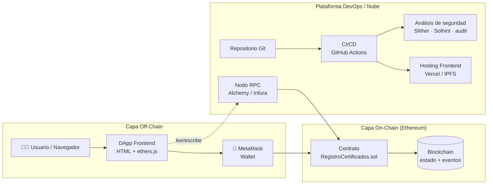

# Plan de la solución — Unidad 1: Blockchain DevOps

> Repositorio didáctico para el curso de **Blockchain** (UTPL · Abril–Agosto 2026).
> Caso de estudio: una **DApp de Registro de Certificados Académicos** sobre Ethereum,
> usada como hilo conductor para enseñar **DevOps (1.1)** y **DevSecOps (1.2)**.

---

## 1. Objetivos de aprendizaje

Al terminar la unidad, el estudiante será capaz de:

1. Explicar los **fundamentos de DevOps** (cultura, CALMS, ciclo CI/CD, IaC) y aplicarlos a un proyecto blockchain.
2. Explicar los **fundamentos de DevSecOps** ("shift-left security") e integrar controles de seguridad automatizados en el pipeline.
3. Comprender el **modelado y la arquitectura** de una solución blockchain (capas on-chain / off-chain) y su **arquitectura en la nube**.
4. Ejecutar el ciclo completo: escribir contrato → probar → analizar seguridad → desplegar → operar.

## 2. Caso de estudio: ¿por qué un Registro de Certificados?

- **Relevante**: caso real universitario (emisión y verificación de títulos).
- **Sencillo pero completo**: incluye control de acceso, eventos, estados y verificación pública — superficie ideal para enseñar seguridad (DevSecOps) sin lógica de negocio abrumadora.
- **Verificable**: cualquiera puede comprobar un certificado sin permisos, lo que ilustra el valor de la blockchain (confianza descentralizada).

## 3. Arquitectura de la solución (visión general)



La descripción detallada (vistas C4, modelo de datos, diagramas de secuencia y de despliegue) vive en [`docs/02-arquitectura/`](docs/02-arquitectura/).

## 4. Stack tecnológico

| Capa | Tecnología | Motivo didáctico |
|------|-----------|------------------|
| Contrato | Solidity `0.8.24` | Estándar de la industria; protecciones nativas contra overflow. |
| Entorno de desarrollo | Hardhat (JavaScript) | Toolchain madura, sin paso de compilación TS extra. |
| Pruebas | Mocha + Chai (`hardhat-toolbox`) | Pruebas legibles que documentan el comportamiento. |
| Frontend (DApp) | HTML + `ethers.js` v6 (CDN) | Sin bundler: el estudiante ve el código directamente. |
| CI/CD | GitHub Actions | Gratuito, declarativo, integrado con el repositorio. |
| Seguridad | Slither, Solhint, `npm audit`, escaneo de secretos | Pilares DevSecOps automatizables. |
| Nube | Vercel/IPFS (frontend), RPC gestionado, IaC | Despliegue real y reproducible. |

## 5. Equipo de agentes inteligentes

La construcción se orquesta con un equipo de agentes especializados; cada uno es
responsable de un directorio para evitar conflictos:

| Agente | Rol | Entregable | Directorio |
|--------|-----|-----------|------------|
| **Orquestador** (este) | Arquitectura general, código núcleo, integración | Contrato, pruebas, frontend, `plan.md`, `README.md` | raíz |
| **Investigación** | Marco teórico y referencias | Fundamentos DevOps/DevSecOps, glosario, bibliografía | `docs/01-investigacion/` |
| **Diseño / Arquitectura** | Modelado de la solución | Diagramas C4, modelo de datos, secuencia, despliegue | `docs/02-arquitectura/` |
| **DevOps** | Pipeline e integración continua | `ci.yml` + documentación CI/CD | `docs/03-devops/` + `.github/workflows/ci.yml` |
| **DevSecOps** | Seguridad automatizada | `devsecops.yml` + guía de seguridad | `docs/04-devsecops/` + `.github/workflows/devsecops.yml` |
| **Nube** | Arquitectura en la nube | Hosting, IaC, multi-entorno, costos | `docs/05-nube/` |
| **Guías** | Material para el estudiante | Guías paso a paso, laboratorios, evaluación | `guias/` |

## 6. Fases de ejecución

1. **Fase 0 — Núcleo técnico** ✅ *(completada)*: contrato, pruebas (12 ✓), scripts, frontend, configuración.
2. **Fase 1 — Documentación en paralelo**: los agentes producen la teoría, los diagramas, los pipelines y las guías.
3. **Fase 2 — Integración**: el orquestador escribe el `README.md` que enlaza todo y verifica la coherencia.

## 7. Estructura del repositorio

```
repoSemanaUno/
├── contracts/          Contrato Solidity
├── test/               Pruebas automatizadas
├── scripts/            Despliegue
├── frontend/           DApp (HTML + ethers.js)
├── .github/workflows/  Pipelines CI/CD y DevSecOps
├── docs/
│   ├── 01-investigacion/   Fundamentos DevOps y DevSecOps
│   ├── 02-arquitectura/    Modelado y diagramas
│   ├── 03-devops/          Práctica DevOps / CI-CD
│   ├── 04-devsecops/       Práctica de seguridad
│   └── 05-nube/            Arquitectura en la nube
├── guias/              Guías para el estudiante
├── plan.md             Este documento
└── README.md           Punto de entrada
```

## 8. Cómo empezar (resumen)

```bash
npm install          # Instala dependencias
npm test             # Ejecuta las 12 pruebas
npm run node         # En una terminal: nodo local
npm run deploy:local # En otra terminal: despliega el contrato
# Abre frontend/index.html con un servidor estático y conecta MetaMask
```

> **Nota:** se recomienda **Node.js LTS (20 o 22)**. Versiones más nuevas funcionan pero Hardhat muestra una advertencia.
